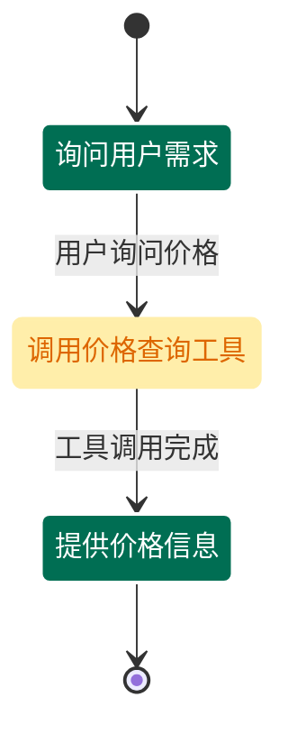

# API 层实现分析

## Guidelines API

### 端点概览

| 方法 | 路径 | 操作 | 说明 |
|------|------|------|------|
| POST | `/guidelines` | create_guideline | 创建新 Guideline |
| GET | `/guidelines` | list_guidelines | 列出所有 Guideline |
| GET | `/guidelines/{guideline_id}` | read_guideline | 获取 Guideline 详情 |
| PATCH | `/guidelines/{guideline_id}` | update_guideline | 更新 Guideline |
| DELETE | `/guidelines/{guideline_id}` | delete_guideline | 删除 Guideline |

### 数据传输对象 (DTO)

#### GuidelineDTO
```python
class GuidelineDTO(DefaultBaseModel):
    id: GuidelineId
    condition: str
    action: Optional[str]
    enabled: bool
    tags: Sequence[TagId]
    metadata: Mapping[str, JSONSerializable]
```

#### GuidelineCreationParamsDTO
```python
class GuidelineCreationParamsDTO(DefaultBaseModel):
    condition: str
    action: Optional[str] = None
    metadata: Optional[Mapping[str, JSONSerializable]] = None
    enabled: Optional[bool] = None
    tags: Optional[Sequence[TagId]] = None
```

#### GuidelineUpdateParamsDTO
```python
class GuidelineUpdateParamsDTO(DefaultBaseModel):
    condition: Optional[str] = None
    action: Optional[str] = None
    tool_associations: Optional[GuidelineToolAssociationUpdateParamsDTO] = None
    enabled: Optional[bool] = None
    tags: Optional[GuidelineTagsUpdateParamsDTO] = None
    metadata: Optional[GuidelineMetadataUpdateParamsDTO] = None
```

### 关键端点实现

#### 读取 Guideline（含关系和工具关联）
```python
@router.get("/{guideline_id}")
async def read_guideline(
    request: Request,
    guideline_id: GuidelineIdPath,
) -> GuidelineWithRelationshipsAndToolAssociationsDTO
```

**返回内容**:
- Guideline 基本信息
- 所有关系（直接和间接）
- 工具关联

## Journeys API

### 端点概览

| 方法 | 路径 | 操作 | 说明 |
|------|------|------|------|
| POST | `/journeys` | create_journey | 创建新 Journey |
| GET | `/journeys` | list_journeys | 列出所有 Journey |
| GET | `/journeys/{journey_id}` | read_journey | 获取 Journey 详情 |
| GET | `/journeys/{journey_id}/mermaid` | journey_mermaid | 获取 Mermaid 图表 |
| PATCH | `/journeys/{journey_id}` | update_journey | 更新 Journey |
| DELETE | `/journeys/{journey_id}` | delete_journey | 删除 Journey |

### 数据传输对象 (DTO)

#### JourneyDTO
```python
class JourneyDTO(DefaultBaseModel):
    id: JourneyId
    title: str
    description: str
    conditions: Sequence[GuidelineId]
    tags: Sequence[TagId] = []
```

#### JourneyCreationParamsDTO
```python
class JourneyCreationParamsDTO(DefaultBaseModel):
    title: str
    description: str
    conditions: Sequence[str]  # 条件文本，不是 ID
    tags: Optional[Sequence[TagId]] = None
```

#### JourneyUpdateParamsDTO
```python
class JourneyUpdateParamsDTO(DefaultBaseModel):
    title: Optional[str] = None
    description: Optional[str] = None
    conditions: Optional[JourneyConditionUpdateParamsDTO] = None
    tags: Optional[JourneyTagUpdateParamsDTO] = None
```

### 特殊功能：Mermaid 图表生成

#### 端点
```python
@router.get("/{journey_id}/mermaid")
async def journey_mermaid(
    request: Request,
    journey_id: JourneyIdPath,
) -> str  # PlainTextResponse
```

#### 图表生成逻辑
```python
async def _build_mermaid_chart(
    model: JourneyGraph,
) -> JourneyMermaidChartDTO
```

**功能**:
1. 将 Journey 图结构转换为 Mermaid stateDiagram-v2 语法
2. 区分节点类型（普通节点 vs 工具节点）
3. 应用不同的样式
4. 处理孤立节点

**样式定义**:
```python
NORMAL_STYLE = "fill:#006e53,stroke:#ffffff,stroke-width:2px,color:#ffffff"
TOOL_STYLE = "fill:#ffeeaa,stroke:#ffeeaa,stroke-width:2px,color:#dd6600"
```

**示例输出**:


### 授权策略

所有端点都通过 `AuthorizationPolicy` 进行授权检查:
```python
await authorization_policy.authorize(
    request=request, 
    operation=Operation.CREATE_JOURNEY
)
```

**操作类型**:
- `CREATE_GUIDELINE`, `READ_GUIDELINE`, `UPDATE_GUIDELINE`, `DELETE_GUIDELINE`, `LIST_GUIDELINES`
- `CREATE_JOURNEY`, `READ_JOURNEY`, `UPDATE_JOURNEY`, `DELETE_JOURNEY`, `LIST_JOURNEYS`
