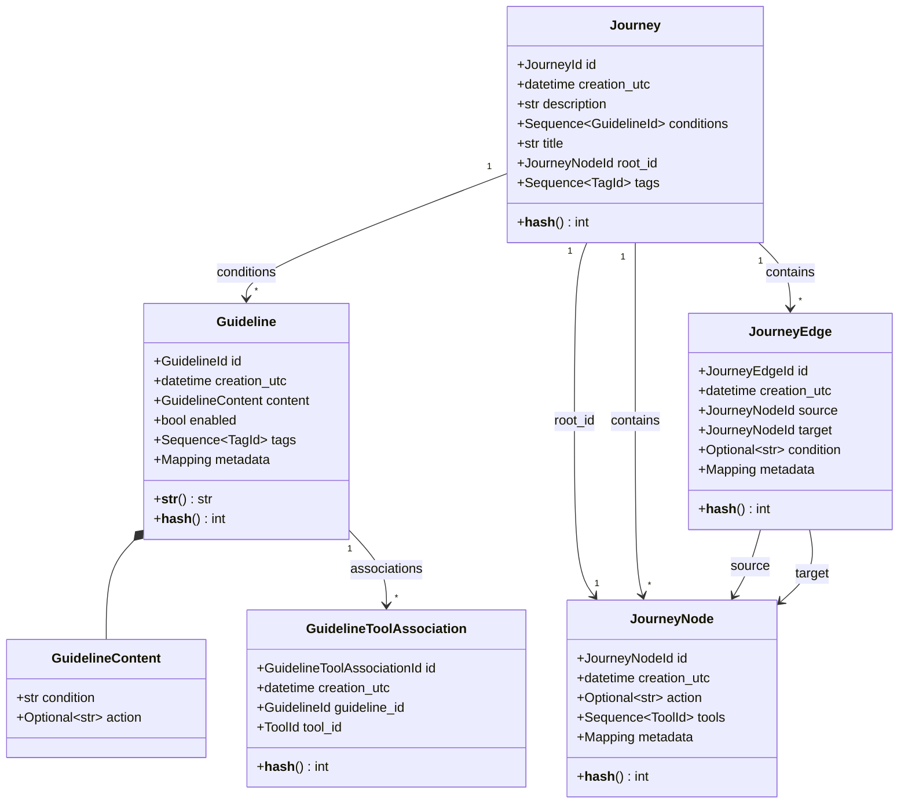
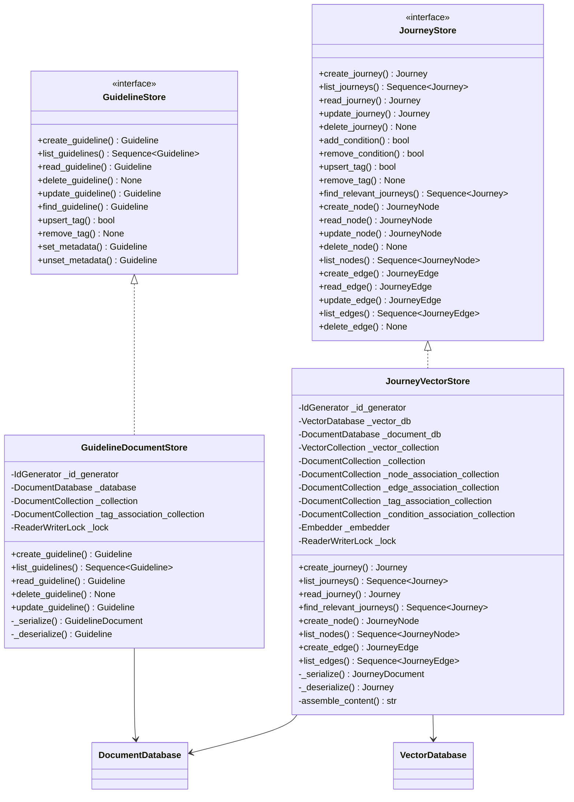
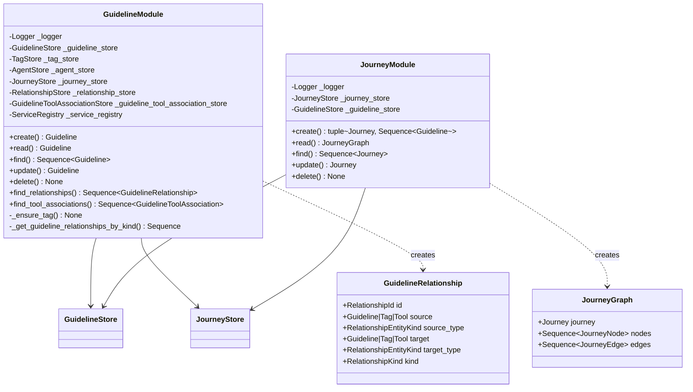
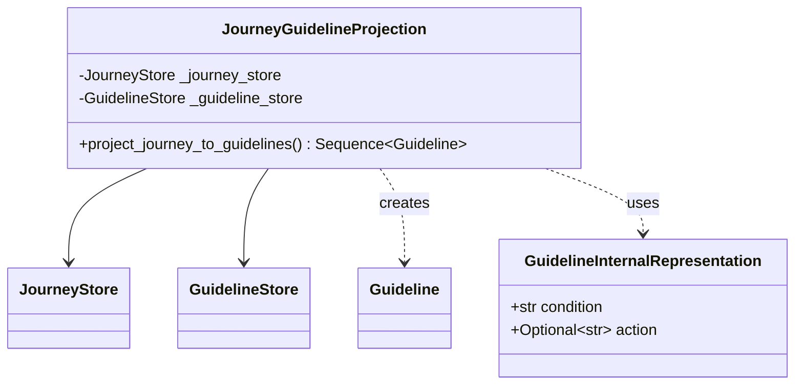
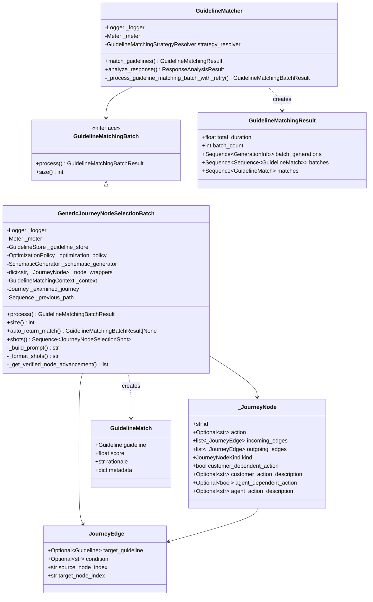
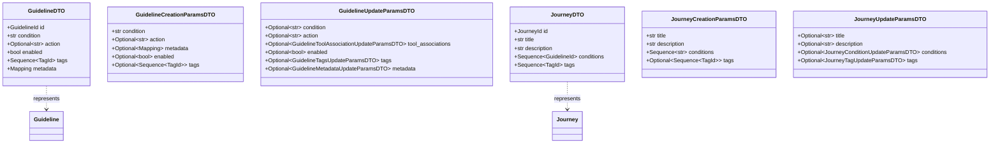
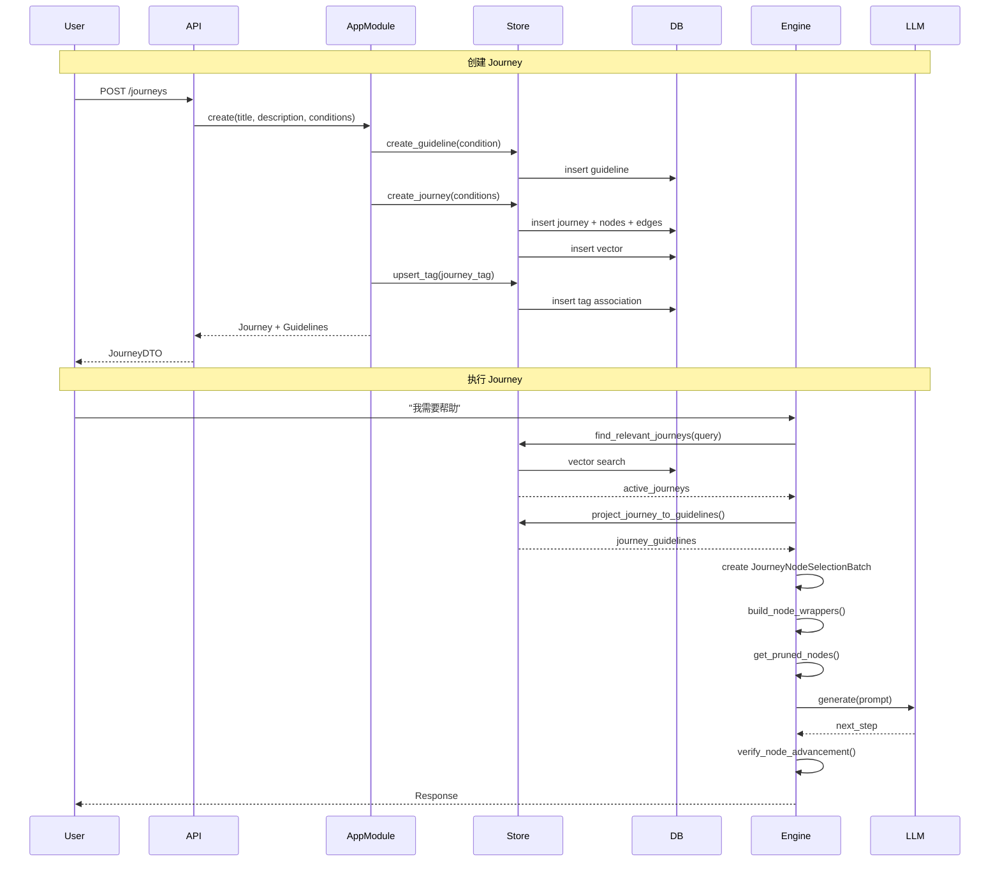
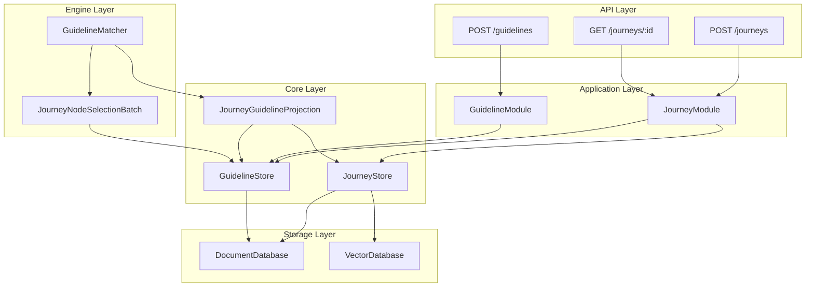
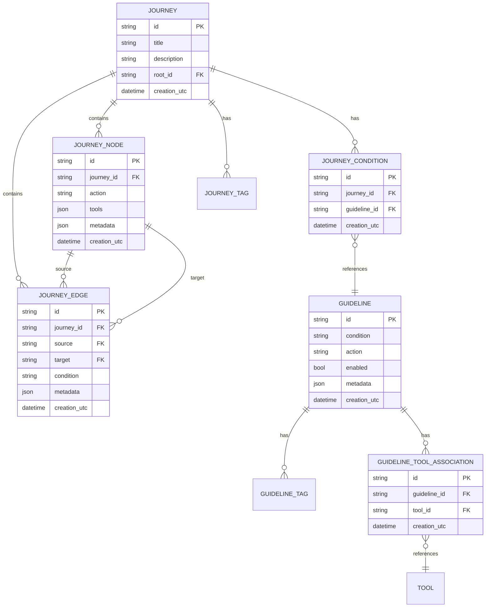

# 类图和关系图

## 核心数据模型类图

```mermaid
classDiagram
    class Guideline {
        +GuidelineId id
        +datetime creation_utc
        +GuidelineContent content
        +bool enabled
        +Sequence~TagId~ tags
        +Mapping metadata
        +__str__() str
        +__hash__() int
    }
    
    class GuidelineContent {
        +str condition
        +Optional~str~ action
    }
    
    class Journey {
        +JourneyId id
        +datetime creation_utc
        +str description
        +Sequence~GuidelineId~ conditions
        +str title
        +JourneyNodeId root_id
        +Sequence~TagId~ tags
        +__hash__() int
    }
    
    class JourneyNode {
        +JourneyNodeId id
        +datetime creation_utc
        +Optional~str~ action
        +Sequence~ToolId~ tools
        +Mapping metadata
        +__hash__() int
    }
    
    class JourneyEdge {
        +JourneyEdgeId id
        +datetime creation_utc
        +JourneyNodeId source
        +JourneyNodeId target
        +Optional~str~ condition
        +Mapping metadata
        +__hash__() int
    }
    
    class GuidelineToolAssociation {
        +GuidelineToolAssociationId id
        +datetime creation_utc
        +GuidelineId guideline_id
        +ToolId tool_id
        +__hash__() int
    }
    
    Guideline *-- GuidelineContent
    Journey "1" --> "*" Guideline : conditions
    Journey "1" --> "1" JourneyNode : root_id
    Journey "1" --> "*" JourneyNode : contains
    Journey "1" --> "*" JourneyEdge : contains
    JourneyEdge --> JourneyNode : source
    JourneyEdge --> JourneyNode : target
    Guideline "1" --> "*" GuidelineToolAssociation : associations
```

## 存储层类图

```mermaid
classDiagram
    class GuidelineStore {
        <<interface>>
        +create_guideline() Guideline
        +list_guidelines() Sequence~Guideline~
        +read_guideline() Guideline
        +delete_guideline() None
        +update_guideline() Guideline
        +find_guideline() Guideline
        +upsert_tag() bool
        +remove_tag() None
        +set_metadata() Guideline
        +unset_metadata() Guideline
    }
    
    class GuidelineDocumentStore {
        -IdGenerator _id_generator
        -DocumentDatabase _database
        -DocumentCollection _collection
        -DocumentCollection _tag_association_collection
        -ReaderWriterLock _lock
        +create_guideline() Guideline
        +list_guidelines() Sequence~Guideline~
        +read_guideline() Guideline
        +delete_guideline() None
        +update_guideline() Guideline
        -_serialize() GuidelineDocument
        -_deserialize() Guideline
    }
    
    class JourneyStore {
        <<interface>>
        +create_journey() Journey
        +list_journeys() Sequence~Journey~
        +read_journey() Journey
        +update_journey() Journey
        +delete_journey() None
        +add_condition() bool
        +remove_condition() bool
        +upsert_tag() bool
        +remove_tag() None
        +find_relevant_journeys() Sequence~Journey~
        +create_node() JourneyNode
        +read_node() JourneyNode
        +update_node() JourneyNode
        +delete_node() None
        +list_nodes() Sequence~JourneyNode~
        +create_edge() JourneyEdge
        +read_edge() JourneyEdge
        +update_edge() JourneyEdge
        +list_edges() Sequence~JourneyEdge~
        +delete_edge() None
    }
    
    class JourneyVectorStore {
        -IdGenerator _id_generator
        -VectorDatabase _vector_db
        -DocumentDatabase _document_db
        -VectorCollection _vector_collection
        -DocumentCollection _collection
        -DocumentCollection _node_association_collection
        -DocumentCollection _edge_association_collection
        -DocumentCollection _tag_association_collection
        -DocumentCollection _condition_association_collection
        -Embedder _embedder
        -ReaderWriterLock _lock
        +create_journey() Journey
        +list_journeys() Sequence~Journey~
        +read_journey() Journey
        +find_relevant_journeys() Sequence~Journey~
        +create_node() JourneyNode
        +list_nodes() Sequence~JourneyNode~
        +create_edge() JourneyEdge
        +list_edges() Sequence~JourneyEdge~
        -_serialize() JourneyDocument
        -_deserialize() Journey
        -assemble_content() str
    }
    
    GuidelineStore <|.. GuidelineDocumentStore
    JourneyStore <|.. JourneyVectorStore
    GuidelineDocumentStore --> DocumentDatabase
    JourneyVectorStore --> DocumentDatabase
    JourneyVectorStore --> VectorDatabase
```

## 应用层类图

```mermaid
classDiagram
    class GuidelineModule {
        -Logger _logger
        -GuidelineStore _guideline_store
        -TagStore _tag_store
        -AgentStore _agent_store
        -JourneyStore _journey_store
        -RelationshipStore _relationship_store
        -GuidelineToolAssociationStore _guideline_tool_association_store
        -ServiceRegistry _service_registry
        +create() Guideline
        +read() Guideline
        +find() Sequence~Guideline~
        +update() Guideline
        +delete() None
        +find_relationships() Sequence~GuidelineRelationship~
        +find_tool_associations() Sequence~GuidelineToolAssociation~
        -_ensure_tag() None
        -_get_guideline_relationships_by_kind() Sequence
    }
    
    class JourneyModule {
        -Logger _logger
        -JourneyStore _journey_store
        -GuidelineStore _guideline_store
        +create() tuple~Journey, Sequence~Guideline~~
        +read() JourneyGraph
        +find() Sequence~Journey~
        +update() Journey
        +delete() None
    }
    
    class JourneyGraph {
        +Journey journey
        +Sequence~JourneyNode~ nodes
        +Sequence~JourneyEdge~ edges
    }
    
    class GuidelineRelationship {
        +RelationshipId id
        +Guideline|Tag|Tool source
        +RelationshipEntityKind source_type
        +Guideline|Tag|Tool target
        +RelationshipEntityKind target_type
        +RelationshipKind kind
    }
    
    GuidelineModule --> GuidelineStore
    GuidelineModule --> JourneyStore
    JourneyModule --> JourneyStore
    JourneyModule --> GuidelineStore
    JourneyModule ..> JourneyGraph : creates
    GuidelineModule ..> GuidelineRelationship : creates
```

## 投影机制类图

```mermaid
classDiagram
    class JourneyGuidelineProjection {
        -JourneyStore _journey_store
        -GuidelineStore _guideline_store
        +project_journey_to_guidelines() Sequence~Guideline~
    }
    
    class GuidelineInternalRepresentation {
        +str condition
        +Optional~str~ action
    }
    
    JourneyGuidelineProjection --> JourneyStore
    JourneyGuidelineProjection --> GuidelineStore
    JourneyGuidelineProjection ..> Guideline : creates
    JourneyGuidelineProjection ..> GuidelineInternalRepresentation : uses
```

## 引擎集成类图

```mermaid
classDiagram
    class GuidelineMatcher {
        -Logger _logger
        -Meter _meter
        -GuidelineMatchingStrategyResolver strategy_resolver
        +match_guidelines() GuidelineMatchingResult
        +analyze_response() ResponseAnalysisResult
        -_process_guideline_matching_batch_with_retry() GuidelineMatchingBatchResult
    }
    
    class GuidelineMatchingBatch {
        <<interface>>
        +process() GuidelineMatchingBatchResult
        +size() int
    }
    
    class GenericJourneyNodeSelectionBatch {
        -Logger _logger
        -Meter _meter
        -GuidelineStore _guideline_store
        -OptimizationPolicy _optimization_policy
        -SchematicGenerator _schematic_generator
        -dict~str, _JourneyNode~ _node_wrappers
        -GuidelineMatchingContext _context
        -Journey _examined_journey
        -Sequence _previous_path
        +process() GuidelineMatchingBatchResult
        +size() int
        +auto_return_match() GuidelineMatchingBatchResult|None
        +shots() Sequence~JourneyNodeSelectionShot~
        -_build_prompt() str
        -_format_shots() str
        -_get_verified_node_advancement() list
    }
    
    class _JourneyNode {
        +str id
        +Optional~str~ action
        +list~_JourneyEdge~ incoming_edges
        +list~_JourneyEdge~ outgoing_edges
        +JourneyNodeKind kind
        +bool customer_dependent_action
        +Optional~str~ customer_action_description
        +Optional~bool~ agent_dependent_action
        +Optional~str~ agent_action_description
    }
    
    class _JourneyEdge {
        +Optional~Guideline~ target_guideline
        +Optional~str~ condition
        +str source_node_index
        +str target_node_index
    }
    
    class GuidelineMatch {
        +Guideline guideline
        +float score
        +str rationale
        +dict metadata
    }
    
    class GuidelineMatchingResult {
        +float total_duration
        +int batch_count
        +Sequence~GenerationInfo~ batch_generations
        +Sequence~Sequence~GuidelineMatch~~ batches
        +Sequence~GuidelineMatch~ matches
    }
    
    GuidelineMatchingBatch <|.. GenericJourneyNodeSelectionBatch
    GuidelineMatcher --> GuidelineMatchingBatch
    GuidelineMatcher ..> GuidelineMatchingResult : creates
    GenericJourneyNodeSelectionBatch --> _JourneyNode
    GenericJourneyNodeSelectionBatch --> _JourneyEdge
    GenericJourneyNodeSelectionBatch ..> GuidelineMatch : creates
    _JourneyNode --> _JourneyEdge
```

## API 层类图

```mermaid
classDiagram
    class GuidelineDTO {
        +GuidelineId id
        +str condition
        +Optional~str~ action
        +bool enabled
        +Sequence~TagId~ tags
        +Mapping metadata
    }
    
    class GuidelineCreationParamsDTO {
        +str condition
        +Optional~str~ action
        +Optional~Mapping~ metadata
        +Optional~bool~ enabled
        +Optional~Sequence~TagId~~ tags
    }
    
    class GuidelineUpdateParamsDTO {
        +Optional~str~ condition
        +Optional~str~ action
        +Optional~GuidelineToolAssociationUpdateParamsDTO~ tool_associations
        +Optional~bool~ enabled
        +Optional~GuidelineTagsUpdateParamsDTO~ tags
        +Optional~GuidelineMetadataUpdateParamsDTO~ metadata
    }
    
    class JourneyDTO {
        +JourneyId id
        +str title
        +str description
        +Sequence~GuidelineId~ conditions
        +Sequence~TagId~ tags
    }
    
    class JourneyCreationParamsDTO {
        +str title
        +str description
        +Sequence~str~ conditions
        +Optional~Sequence~TagId~~ tags
    }
    
    class JourneyUpdateParamsDTO {
        +Optional~str~ title
        +Optional~str~ description
        +Optional~JourneyConditionUpdateParamsDTO~ conditions
        +Optional~JourneyTagUpdateParamsDTO~ tags
    }
    
    GuidelineDTO ..> Guideline : represents
    JourneyDTO ..> Journey : represents
```

## 完整系统交互序列图

```mermaid
sequenceDiagram
    participant User
    participant API
    participant AppModule
    participant Store
    participant DB
    participant Engine
    participant LLM
    
    Note over User,LLM: 创建 Journey
    User->>API: POST /journeys
    API->>AppModule: create(title, description, conditions)
    AppModule->>Store: create_guideline(condition)
    Store->>DB: insert guideline
    AppModule->>Store: create_journey(conditions)
    Store->>DB: insert journey + nodes + edges
    Store->>DB: insert vector
    AppModule->>Store: upsert_tag(journey_tag)
    Store->>DB: insert tag association
    AppModule-->>API: Journey + Guidelines
    API-->>User: JourneyDTO
    
    Note over User,LLM: 执行 Journey
    User->>Engine: "我需要帮助"
    Engine->>Store: find_relevant_journeys(query)
    Store->>DB: vector search
    Store-->>Engine: active_journeys
    Engine->>Store: project_journey_to_guidelines()
    Store-->>Engine: journey_guidelines
    Engine->>Engine: create JourneyNodeSelectionBatch
    Engine->>Engine: build_node_wrappers()
    Engine->>Engine: get_pruned_nodes()
    Engine->>LLM: generate(prompt)
    LLM-->>Engine: next_step
    Engine->>Engine: verify_node_advancement()
    Engine-->>User: Response
```

## 数据流图

```mermaid
graph TB
    subgraph "API Layer"
        A1[POST /journeys]
        A2[GET /journeys/:id]
        A3[POST /guidelines]
    end
    
    subgraph "Application Layer"
        B1[JourneyModule]
        B2[GuidelineModule]
    end
    
    subgraph "Core Layer"
        C1[JourneyStore]
        C2[GuidelineStore]
        C3[JourneyGuidelineProjection]
    end
    
    subgraph "Storage Layer"
        D1[DocumentDatabase]
        D2[VectorDatabase]
    end
    
    subgraph "Engine Layer"
        E1[GuidelineMatcher]
        E2[JourneyNodeSelectionBatch]
    end
    
    A1 --> B1
    A2 --> B1
    A3 --> B2
    B1 --> C1
    B1 --> C2
    B2 --> C2
    C1 --> D1
    C1 --> D2
    C2 --> D1
    C3 --> C1
    C3 --> C2
    E1 --> C3
    E1 --> E2
    E2 --> C2
```

## 关系图

```mermaid
erDiagram
    JOURNEY ||--o{ JOURNEY_NODE : contains
    JOURNEY ||--o{ JOURNEY_EDGE : contains
    JOURNEY ||--o{ JOURNEY_CONDITION : has
    JOURNEY ||--o{ JOURNEY_TAG : has
    JOURNEY_NODE ||--o{ JOURNEY_EDGE : source
    JOURNEY_NODE ||--o{ JOURNEY_EDGE : target
    JOURNEY_CONDITION }o--|| GUIDELINE : references
    GUIDELINE ||--o{ GUIDELINE_TAG : has
    GUIDELINE ||--o{ GUIDELINE_TOOL_ASSOCIATION : has
    GUIDELINE_TOOL_ASSOCIATION }o--|| TOOL : references
    
    JOURNEY {
        string id PK
        string title
        string description
        string root_id FK
        datetime creation_utc
    }
    
    JOURNEY_NODE {
        string id PK
        string journey_id FK
        string action
        json tools
        json metadata
        datetime creation_utc
    }
    
    JOURNEY_EDGE {
        string id PK
        string journey_id FK
        string source FK
        string target FK
        string condition
        json metadata
        datetime creation_utc
    }
    
    JOURNEY_CONDITION {
        string id PK
        string journey_id FK
        string guideline_id FK
        datetime creation_utc
    }
    
    GUIDELINE {
        string id PK
        string condition
        string action
        bool enabled
        json metadata
        datetime creation_utc
    }
    
    GUIDELINE_TOOL_ASSOCIATION {
        string id PK
        string guideline_id FK
        string tool_id FK
        datetime creation_utc
    }
```

这些图表提供了系统的可视化视图，帮助理解各个组件之间的关系和交互。
