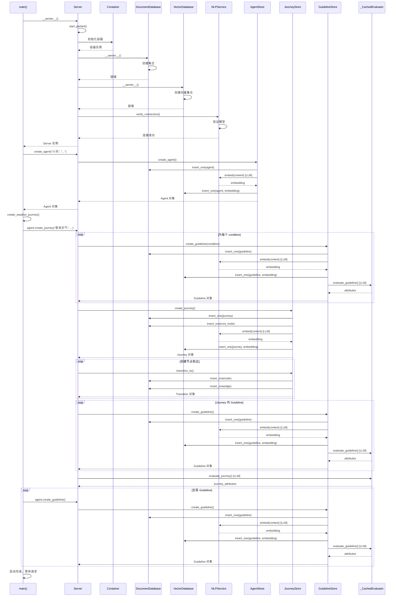
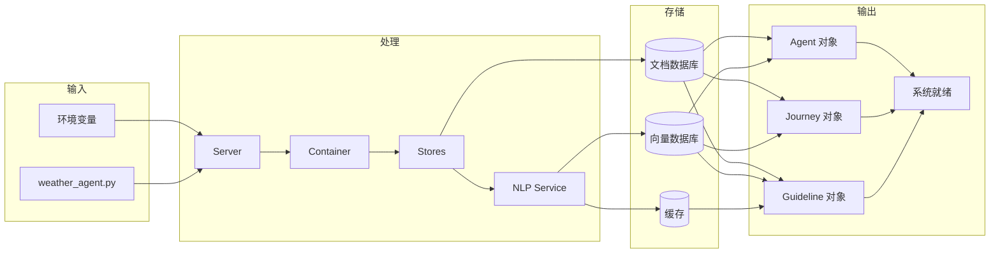

# Weather Agent 启动流程详解

## 概述

本文档详细分析 `weather_agent.py` 从启动到就绪的完整流程，包括：
- 环境准备和依赖检查
- 服务器初始化过程
- 数据库和 NLP 服务连接
- Agent、Journey 和 Guideline 的创建
- 评估和缓存机制
- 方法调用链和数据流转
- LLM 调用点分析

### 启动流程目标

1. **初始化 Parlant 服务器**: 启动核心服务和依赖注入容器
2. **连接外部服务**: 建立与 Ollama NLP 服务的连接
3. **初始化存储**: 准备文档数据库和向量数据库
4. **创建 Agent**: 定义天气助手的身份和能力
5. **构建对话流程**: 创建 Journey 和 Guideline 来指导对话
6. **评估和优化**: 对 Guideline 和 Journey 进行评估并缓存结果

### 涉及的主要组件

- **Server**: Parlant 服务器主类，管理整个系统生命周期
- **Container**: 依赖注入容器（基于 Lagom）
- **DocumentDatabase**: 文档数据库（JSON 文件或内存存储）
- **VectorDatabase**: 向量数据库（用于语义搜索）
- **NLPService**: 大语言模型服务接口（Ollama）
- **Agent**: 代理实体，管理 Journey 和 Guideline
- **Journey**: 对话流程图结构
- **Guideline**: 条件-动作规则
- **_CachedEvaluator**: 评估器，用于生成和缓存 Guideline/Journey 属性

## 环境准备

### 环境变量设置

在 `weather_agent.py` 启动前，需要设置以下环境变量：

```python
os.environ["OLLAMA_BASE_URL"] = "http://localhost:11434"
os.environ["OLLAMA_MODEL"] = "qwen2.5:latest"
os.environ["OLLAMA_EMBEDDING_MODEL"] = "nomic-embed-text:latest"
os.environ["OLLAMA_API_TIMEOUT"] = "300"
```

**环境变量说明**:

| 变量名 | 说明 | 默认值 | 必需 |
|--------|------|--------|------|
| `OLLAMA_BASE_URL` | Ollama 服务地址 | http://localhost:11434 | 是 |
| `OLLAMA_MODEL` | 用于推理的模型 | qwen2.5:latest | 是 |
| `OLLAMA_EMBEDDING_MODEL` | 用于向量化的模型 | nomic-embed-text:latest | 是 |
| `OLLAMA_API_TIMEOUT` | API 超时时间（秒） | 300 | 否 |

### 依赖检查

启动前需要确保：

1. **Ollama 服务运行**: 
   ```bash
   # 检查 Ollama 是否运行
   curl http://localhost:11434/api/tags
   ```

2. **模型已下载**:
   ```bash
   # 下载推理模型
   ollama pull qwen2.5:latest
   
   # 下载嵌入模型
   ollama pull nomic-embed-text:latest
   ```

3. **Python 依赖安装**:
   ```bash
   pip install parlant-sdk
   ```

### 工作目录

Parlant 会在当前目录下创建 `parlant-data` 目录用于存储：
- 数据库文件
- 缓存文件
- 日志文件


## 详细启动步骤

### 步骤 1: asyncio.run(main()) 调用

**入口点**: `weather_agent.py` 的 `__main__` 块

```python
if __name__ == "__main__":
    asyncio.run(main())
```

**作用**:
- 创建新的事件循环
- 运行 `main()` 协程直到完成
- 清理事件循环

**关键点**:
- 这是整个应用的入口
- 使用 `asyncio.run()` 确保正确的异步上下文管理

### 步骤 2: Server.__aenter__() 执行

**代码位置**: `main()` 函数中的 `async with` 语句

```python
async def main() -> None:
    async with p.Server(nlp_service=p.NLPServices.ollama) as server:
        # ... 后续操作
```

**Server 初始化参数**:
- `nlp_service`: 指定使用 Ollama 作为 NLP 服务提供者

**__aenter__() 执行流程**:

1. **读取环境变量**:
   - 从环境变量中获取 Ollama 配置
   - 验证必需的环境变量是否存在

2. **调用 start_parlant()**:
   - 初始化 Parlant 核心系统
   - 返回 Application 实例

3. **存储 Application 引用**:
   - 将 Application 实例保存到 Server 对象
   - 用于后续的 Agent 操作

**返回值**: Server 实例本身（支持 `async with` 语法）

### 步骤 3: 容器初始化（Container Setup）

**代码位置**: `start_parlant()` 函数内部

**依赖注入容器**:
Parlant 使用 Lagom 作为依赖注入框架，在启动时注册所有服务：

```python
container = Container()

# 注册核心服务
container[DocumentDatabase] = document_db
container[VectorDatabase] = vector_db
container[NLPService] = nlp_service
container[GuidelineStore] = guideline_store
container[JourneyStore] = journey_store
container[AgentStore] = agent_store
container[SessionStore] = session_store
# ... 更多服务
```

**注册的主要服务**:

| 服务类型 | 说明 | 生命周期 |
|---------|------|---------|
| `DocumentDatabase` | 文档数据库实例 | 单例 |
| `VectorDatabase` | 向量数据库实例 | 单例 |
| `NLPService` | NLP 服务（Ollama） | 单例 |
| `GuidelineStore` | Guideline 存储层 | 单例 |
| `JourneyStore` | Journey 存储层 | 单例 |
| `AgentStore` | Agent 存储层 | 单例 |
| `SessionStore` | Session 存储层 | 单例 |
| `Engine` | 对话引擎 | 单例 |
| `GuidelineMatcher` | Guideline 匹配器 | 单例 |
| `MessageGenerator` | 消息生成器 | 单例 |

**容器作用**:
- 管理服务的生命周期
- 自动解析依赖关系
- 支持服务的延迟初始化


### 步骤 4: 数据库初始化

#### 4.1 DocumentDatabase 初始化

**存储类型**: JSON 文件存储或内存存储

**初始化流程**:

```python
# 创建数据库实例
document_db = DocumentDatabase(
    home_dir=parlant_data_dir,
    storage_type="file"  # 或 "memory"
)

# 进入上下文（__aenter__）
await document_db.__aenter__()
```

**创建的集合**:

| 集合名称 | 说明 | 用途 |
|---------|------|------|
| `agents` | Agent 文档 | 存储 Agent 基本信息 |
| `guidelines` | Guideline 文档 | 存储 Guideline 规则 |
| `journeys` | Journey 文档 | 存储 Journey 基本信息 |
| `journey_nodes` | Journey 节点 | 存储 Journey 的节点 |
| `journey_edges` | Journey 边 | 存储 Journey 的转换边 |
| `journey_tags` | Journey 标签关联 | 关联 Journey 和标签 |
| `journey_conditions` | Journey 条件关联 | 关联 Journey 和 Guideline |
| `sessions` | Session 文档 | 存储对话会话 |
| `customers` | Customer 文档 | 存储用户信息 |
| `tools` | Tool 文档 | 存储工具定义 |

**文件位置**: `parlant-data/documents/`

#### 4.2 VectorDatabase 初始化

**存储类型**: 向量存储（用于语义搜索）

**初始化流程**:

```python
# 创建向量数据库实例
vector_db = VectorDatabase(
    home_dir=parlant_data_dir,
    nlp_service=nlp_service
)

# 进入上下文
await vector_db.__aenter__()
```

**创建的向量集合**:

| 集合名称 | 说明 | 向量维度 |
|---------|------|---------|
| `agents` | Agent 向量 | 取决于嵌入模型 |
| `guidelines` | Guideline 向量 | 取决于嵌入模型 |
| `journeys` | Journey 向量 | 取决于嵌入模型 |
| `sessions` | Session 向量 | 取决于嵌入模型 |

**向量化过程**:
1. 组装文本内容（title + description + 其他字段）
2. 调用 NLP 服务生成嵌入向量
3. 存储向量和元数据

**文件位置**: `parlant-data/vectors/`

### 步骤 5: NLP 服务连接（Ollama）

**代码位置**: `NLPServices.ollama` 工厂方法

**初始化流程**:

```python
# 创建 Ollama 服务实例
nlp_service = OllamaService(
    base_url=os.environ["OLLAMA_BASE_URL"],
    model=os.environ["OLLAMA_MODEL"],
    embedding_model=os.environ["OLLAMA_EMBEDDING_MODEL"],
    timeout=int(os.environ.get("OLLAMA_API_TIMEOUT", "300"))
)

# 验证连接
await nlp_service.verify_connection()

# 验证模型
await nlp_service.verify_models()
```

**验证步骤**:

1. **连接验证**:
   ```python
   # 发送 GET 请求到 /api/tags
   response = await http_client.get(f"{base_url}/api/tags")
   if response.status_code != 200:
       raise ConnectionError("Cannot connect to Ollama")
   ```

2. **模型验证**:
   ```python
   # 检查推理模型是否存在
   models = response.json()["models"]
   if model not in [m["name"] for m in models]:
       raise ModelNotFoundError(f"Model {model} not found")
   
   # 检查嵌入模型是否存在
   if embedding_model not in [m["name"] for m in models]:
       raise ModelNotFoundError(f"Embedding model {embedding_model} not found")
   ```

**日志输出**:
```
Initialized OllamaService with qwen2.5:latest at http://localhost:11434
```


### 步骤 6: Agent 创建

**代码位置**: `main()` 函数中

```python
agent = await server.create_agent(
    name="小天",
    description="友好的天气助手，用自然对话方式帮助用户查询天气"
)
```

**create_agent() 执行流程**:

1. **生成 Agent ID**:
   ```python
   agent_checksum = md5_checksum(f"{name}{description}")
   agent_id = AgentId(id_generator.generate(agent_checksum))
   ```

2. **创建 Agent 对象**:
   ```python
   agent = Agent(
       id=agent_id,
       name="小天",
       description="友好的天气助手，用自然对话方式帮助用户查询天气",
       creation_utc=datetime.utcnow(),
       tags=[],
       metadata={}
   )
   ```

3. **插入文档数据库**:
   ```python
   await document_db.agents.insert_one(
       document={
           "id": agent.id,
           "name": agent.name,
           "description": agent.description,
           "creation_utc": agent.creation_utc.isoformat(),
           "tags": agent.tags,
           "metadata": agent.metadata
       }
   )
   ```

4. **向量化并插入向量数据库**:
   ```python
   # 组装内容
   content = f"{agent.name} {agent.description}"
   
   # 生成嵌入向量
   embedding = await nlp_service.embed(content)
   
   # 插入向量数据库
   await vector_db.agents.insert_one(
       document={
           "id": agent.id,
           "embedding": embedding,
           "metadata": {
               "name": agent.name,
               "description": agent.description
           }
       }
   )
   ```

**返回值**: Agent 对象（包含 ID 和所有属性）

### 步骤 7: Journey 创建

**代码位置**: `create_weather_journey()` 函数

```python
journey = await agent.create_journey(
    title="查询天气",
    description="帮助用户查询城市天气",
    conditions=["用户想查询天气", "用户提到城市名称"]
)
```

**create_journey() 执行流程**:

#### 7.1 为条件创建 Guideline

对于每个 condition，创建一个 Guideline：

```python
guidelines = []
for condition in ["用户想查询天气", "用户提到城市名称"]:
    guideline = await guideline_store.create_guideline(
        condition=condition,
        action=None,  # 条件 Guideline 没有 action
        tags=[],
    )
    guidelines.append(guideline)
```

**Guideline 结构**:
```python
Guideline(
    id=GuidelineId("guideline_xxx"),
    condition="用户想查询天气",
    action=None,
    creation_utc=datetime.utcnow(),
    tags=[],
    metadata={}
)
```

#### 7.2 创建 Journey 主体

```python
# 生成 Journey ID
journey_checksum = md5_checksum(f"{title}{description}{conditions}")
journey_id = JourneyId(id_generator.generate(journey_checksum))

# 创建根节点
journey_root_id = JourneyNodeId(id_generator.generate(f"{journey_id}root"))
root = JourneyNode(
    id=journey_root_id,
    creation_utc=datetime.utcnow(),
    action=None,
    tools=[],
    metadata={}
)

# 创建 Journey
journey = Journey(
    id=journey_id,
    title="查询天气",
    description="帮助用户查询城市天气",
    root=journey_root_id,
    conditions=[guideline.id for guideline in guidelines],
    creation_utc=datetime.utcnow(),
    tags=[],
    metadata={}
)
```


#### 7.3 插入数据库

**文档数据库**:
```python
# 插入 Journey
await document_db.journeys.insert_one({
    "id": journey.id,
    "title": journey.title,
    "description": journey.description,
    "root": journey.root,
    "creation_utc": journey.creation_utc.isoformat(),
    "metadata": journey.metadata
})

# 插入根节点
await document_db.journey_nodes.insert_one({
    "id": root.id,
    "journey_id": journey.id,
    "action": root.action,
    "tools": root.tools,
    "creation_utc": root.creation_utc.isoformat(),
    "metadata": root.metadata
})

# 插入条件关联
for guideline_id in journey.conditions:
    await document_db.journey_conditions.insert_one({
        "journey_id": journey.id,
        "condition": guideline_id
    })
```

**向量数据库**:
```python
# 组装内容
content = f"{journey.title} {journey.description}"

# 生成嵌入向量
embedding = await nlp_service.embed(content)

# 插入向量数据库
await vector_db.journeys.insert_one({
    "id": journey.id,
    "embedding": embedding,
    "metadata": {
        "title": journey.title,
        "description": journey.description
    }
})
```

#### 7.4 为 Guideline 添加 Journey 标签

```python
for guideline in guidelines:
    await guideline_store.upsert_tag(
        guideline_id=guideline.id,
        tag_id=Tag.for_journey_id(journey.id)
    )
```

**标签格式**: `journey:{journey_id}`

**作用**: 标记这些 Guideline 属于特定的 Journey

#### 7.5 创建 Journey 节点和边

**weather_agent.py 中的节点创建**:

```python
# 转换 1: 用户已提供城市 -> 查询天气
t1 = await journey.initial_state.transition_to(
    tool_state=get_weather,
    condition="用户消息中包含城市名称"
)

# 转换 2: 用户未提供城市 -> 询问城市
t2 = await journey.initial_state.transition_to(
    chat_state="友好地询问用户想查询哪个城市的天气",
    condition="用户没有提到具体城市"
)

# 转换 3: 用户回复城市 -> 查询天气
t3 = await t2.target.transition_to(tool_state=get_weather)

# ... 更多转换
```

**transition_to() 执行流程**:

1. **创建目标节点**:
   ```python
   # 对于 tool_state
   target_node = JourneyNode(
       id=JourneyNodeId(id_generator.generate()),
       action=None,
       tools=[ToolId(get_weather.__name__)],
       creation_utc=datetime.utcnow(),
       metadata={"tool_name": "get_weather"}
   )
   
   # 对于 chat_state
   target_node = JourneyNode(
       id=JourneyNodeId(id_generator.generate()),
       action="友好地询问用户想查询哪个城市的天气",
       tools=[],
       creation_utc=datetime.utcnow(),
       metadata={}
   )
   ```

2. **创建边（转换）**:
   ```python
   edge = JourneyEdge(
       id=JourneyEdgeId(id_generator.generate()),
       source=source_node.id,
       target=target_node.id,
       condition="用户消息中包含城市名称",  # 可选
       creation_utc=datetime.utcnow(),
       metadata={}
   )
   ```

3. **插入数据库**:
   ```python
   # 插入节点
   await document_db.journey_nodes.insert_one({
       "id": target_node.id,
       "journey_id": journey.id,
       "action": target_node.action,
       "tools": target_node.tools,
       "creation_utc": target_node.creation_utc.isoformat(),
       "metadata": target_node.metadata
   })
   
   # 插入边
   await document_db.journey_edges.insert_one({
       "id": edge.id,
       "journey_id": journey.id,
       "source": edge.source,
       "target": edge.target,
       "condition": edge.condition,
       "creation_utc": edge.creation_utc.isoformat(),
       "metadata": edge.metadata
   })
   ```

4. **返回 Transition 对象**:
   ```python
   return Transition(
       edge=edge,
       target=JourneyState(node=target_node, journey=journey)
   )
   ```

**Weather Agent 的完整图结构**:

```
[ROOT]
  ├─(用户消息中包含城市名称)→ [get_weather]
  │                              ├─(查询成功)→ [展示天气]
  │                              │              └→ [询问继续]
  │                              │                  ├─(继续)→ [get_weather]
  │                              │                  └─(不继续)→ [END]
  │                              └─(查询失败)→ [提示可用城市]
  │                                              └→ [get_weather]
  └─(用户没有提到具体城市)→ [询问城市]
                              └→ [get_weather]
                                  ├─(查询成功)→ [展示天气]
                                  │              └→ [询问继续]
                                  │                  ├─(继续)→ [get_weather]
                                  │                  └─(不继续)→ [END]
                                  └─(查询失败)→ [提示可用城市]
                                                  └→ [get_weather]
```


### 步骤 8: Guideline 创建

**代码位置**: `main()` 函数和 `create_weather_journey()` 函数

#### 8.1 Journey 内的 Guideline

```python
await journey.create_guideline(
    condition="用户输入的城市名称不清晰或有歧义",
    action="礼貌地请用户确认具体是哪个城市"
)

await journey.create_guideline(
    condition="用户一次提到多个城市",
    action="逐个查询并对比展示各城市天气"
)
```

**特点**:
- 这些 Guideline 只在 Journey 激活时生效
- 自动添加 `journey:{journey_id}` 标签

#### 8.2 全局 Guideline

```python
await agent.create_guideline(
    condition="用户问候",
    action="友好回应，简单介绍自己可以查询天气，支持的城市包括：北京、上海、广州、成都、深圳、杭州等"
)

await agent.create_guideline(
    condition="用户询问温度单位或转换",
    action="简单解释：中国用摄氏度(°C)，美国用华氏度(°F)。转换公式：°F = °C × 1.8 + 32"
)

await agent.create_guideline(
    condition="对话中的任何时候",
    action="保持简洁友好，像朋友聊天一样自然，避免过于正式或冗长"
)

await agent.create_guideline(
    condition="用户询问天气预报或未来天气",
    action="告知目前只能查询当前天气，暂不支持预报功能"
)
```

**特点**:
- 这些 Guideline 在所有对话中都生效
- 没有 Journey 标签

**create_guideline() 执行流程**:

1. **生成 Guideline ID**:
   ```python
   guideline_checksum = md5_checksum(f"{condition}{action}")
   guideline_id = GuidelineId(id_generator.generate(guideline_checksum))
   ```

2. **创建 Guideline 对象**:
   ```python
   guideline = Guideline(
       id=guideline_id,
       condition=condition,
       action=action,
       creation_utc=datetime.utcnow(),
       tags=[],
       metadata={}
   )
   ```

3. **插入文档数据库**:
   ```python
   await document_db.guidelines.insert_one({
       "id": guideline.id,
       "condition": guideline.condition,
       "action": guideline.action,
       "creation_utc": guideline.creation_utc.isoformat(),
       "tags": guideline.tags,
       "metadata": guideline.metadata
   })
   ```

4. **向量化并插入向量数据库**:
   ```python
   # 组装内容
   content = f"{guideline.condition} {guideline.action or ''}"
   
   # 生成嵌入向量
   embedding = await nlp_service.embed(content)
   
   # 插入向量数据库
   await vector_db.guidelines.insert_one({
       "id": guideline.id,
       "embedding": embedding,
       "metadata": {
           "condition": guideline.condition,
           "action": guideline.action
       }
   )
   ```

**Weather Agent 创建的 Guideline 总数**:
- Journey 条件 Guideline: 2 个
- Journey 内 Guideline: 2 个
- 全局 Guideline: 4 个
- **总计**: 8 个


### 步骤 9: 评估和缓存（_CachedEvaluator）

**代码位置**: 在 Guideline 和 Journey 创建后自动触发

#### 9.1 Guideline 评估

**目的**: 为 Guideline 生成额外的属性，用于匹配和推理

**评估器**: `_CachedEvaluator`

**评估流程**:

```python
async def evaluate_guideline(guideline: Guideline) -> dict:
    # 1. 检查缓存
    cache_key = f"guideline_{guideline.id}"
    if cache_key in cache:
        return cache[cache_key]
    
    # 2. 构建 prompt
    prompt = f"""
    分析以下 Guideline 并提取关键属性：
    
    条件: {guideline.condition}
    动作: {guideline.action}
    
    请提供：
    1. 关键词列表
    2. 意图分类
    3. 优先级
    """
    
    # 3. 调用 LLM
    response = await nlp_service.generate(
        prompt=prompt,
        schema={
            "keywords": ["string"],
            "intent": "string",
            "priority": "number"
        }
    )
    
    # 4. 解析结果
    attributes = {
        "keywords": response["keywords"],
        "intent": response["intent"],
        "priority": response["priority"]
    }
    
    # 5. 缓存结果
    cache[cache_key] = attributes
    await save_cache()
    
    return attributes
```

**生成的属性示例**:
```json
{
    "keywords": ["问候", "你好", "打招呼"],
    "intent": "greeting",
    "priority": 1
}
```

**缓存位置**: `parlant-data/evaluation_cache.json`

#### 9.2 Journey 评估

**目的**: 为 Journey 的节点和边生成额外的属性

**评估流程**:

```python
async def evaluate_journey(journey: Journey) -> dict:
    # 1. 检查缓存
    cache_key = f"journey_{journey.id}"
    if cache_key in cache:
        return cache[cache_key]
    
    # 2. 读取节点和边
    nodes = await journey_store.list_nodes(journey.id)
    edges = await journey_store.list_edges(journey.id)
    
    # 3. 为每个节点生成属性
    node_attributes = {}
    for node in nodes:
        prompt = f"""
        分析以下 Journey 节点：
        
        动作: {node.action}
        工具: {node.tools}
        
        请提供：
        1. 节点类型（chat/tool/decision）
        2. 关键词
        3. 预期输出
        """
        
        response = await nlp_service.generate(prompt=prompt, schema={...})
        node_attributes[node.id] = response
    
    # 4. 为每个边生成属性
    edge_attributes = {}
    for edge in edges:
        if edge.condition:
            prompt = f"""
            分析以下转换条件：
            
            条件: {edge.condition}
            
            请提供：
            1. 条件类型
            2. 关键词
            3. 触发场景
            """
            
            response = await nlp_service.generate(prompt=prompt, schema={...})
            edge_attributes[edge.id] = response
    
    # 5. 组装结果
    attributes = {
        "nodes": node_attributes,
        "edges": edge_attributes
    }
    
    # 6. 缓存结果
    cache[cache_key] = attributes
    await save_cache()
    
    return attributes
```

**缓存的好处**:
- 避免重复的 LLM 调用
- 加快启动速度
- 减少 API 成本

**缓存失效**:
- Guideline 或 Journey 被修改时
- 手动清除缓存文件时


## 方法调用链

### 完整调用栈

```
asyncio.run(main)
└─ main()
   └─ Server.__aenter__()
      ├─ start_parlant()
      │  ├─ Container 初始化
      │  │  ├─ 注册 DocumentDatabase
      │  │  ├─ 注册 VectorDatabase
      │  │  ├─ 注册 NLPService
      │  │  ├─ 注册 GuidelineStore
      │  │  ├─ 注册 JourneyStore
      │  │  ├─ 注册 AgentStore
      │  │  ├─ 注册 SessionStore
      │  │  ├─ 注册 Engine
      │  │  ├─ 注册 GuidelineMatcher
      │  │  └─ 注册 MessageGenerator
      │  ├─ DocumentDatabase.__aenter__()
      │  │  ├─ 创建 agents 集合
      │  │  ├─ 创建 guidelines 集合
      │  │  ├─ 创建 journeys 集合
      │  │  ├─ 创建 journey_nodes 集合
      │  │  ├─ 创建 journey_edges 集合
      │  │  ├─ 创建 journey_tags 集合
      │  │  ├─ 创建 journey_conditions 集合
      │  │  ├─ 创建 sessions 集合
      │  │  ├─ 创建 customers 集合
      │  │  └─ 创建 tools 集合
      │  ├─ VectorDatabase.__aenter__()
      │  │  ├─ 创建 agents 向量集合
      │  │  ├─ 创建 guidelines 向量集合
      │  │  ├─ 创建 journeys 向量集合
      │  │  └─ 创建 sessions 向量集合
      │  └─ NLPService.verify_connection()
      │     ├─ HTTP GET /api/tags
      │     └─ verify_models()
      ├─ Server.create_agent()
      │  ├─ AgentStore.create_agent()
      │  │  ├─ 生成 Agent ID
      │  │  ├─ 创建 Agent 对象
      │  │  ├─ DocumentDatabase.agents.insert_one()
      │  │  ├─ NLPService.embed()  [LLM 调用]
      │  │  └─ VectorDatabase.agents.insert_one()
      │  └─ 返回 Agent 对象
      ├─ create_weather_journey()
      │  └─ Agent.create_journey()
      │     ├─ 为每个 condition 创建 Guideline
      │     │  ├─ GuidelineStore.create_guideline()
      │     │  │  ├─ 生成 Guideline ID
      │     │  │  ├─ 创建 Guideline 对象
      │     │  │  ├─ DocumentDatabase.guidelines.insert_one()
      │     │  │  ├─ NLPService.embed()  [LLM 调用]
      │     │  │  ├─ VectorDatabase.guidelines.insert_one()
      │     │  │  └─ _CachedEvaluator.evaluate_guideline()  [LLM 调用]
      │     │  └─ 返回 Guideline 对象
      │     ├─ JourneyStore.create_journey()
      │     │  ├─ 生成 Journey ID
      │     │  ├─ 创建根节点
      │     │  ├─ 创建 Journey 对象
      │     │  ├─ DocumentDatabase.journeys.insert_one()
      │     │  ├─ DocumentDatabase.journey_nodes.insert_one()
      │     │  ├─ DocumentDatabase.journey_conditions.insert_one()
      │     │  ├─ NLPService.embed()  [LLM 调用]
      │     │  └─ VectorDatabase.journeys.insert_one()
      │     ├─ 为 Guideline 添加 Journey 标签
      │     │  └─ GuidelineStore.upsert_tag()
      │     ├─ 创建 Journey 节点和边
      │     │  └─ JourneyState.transition_to()
      │     │     ├─ 创建目标节点
      │     │     ├─ 创建边
      │     │     ├─ DocumentDatabase.journey_nodes.insert_one()
      │     │     └─ DocumentDatabase.journey_edges.insert_one()
      │     ├─ Journey.create_guideline()
      │     │  ├─ GuidelineStore.create_guideline()
      │     │  ├─ GuidelineStore.upsert_tag()
      │     │  └─ _CachedEvaluator.evaluate_guideline()  [LLM 调用]
      │     └─ _CachedEvaluator.evaluate_journey()  [LLM 调用]
      └─ Agent.create_guideline()
         ├─ GuidelineStore.create_guideline()
         │  ├─ 生成 Guideline ID
         │  ├─ 创建 Guideline 对象
         │  ├─ DocumentDatabase.guidelines.insert_one()
         │  ├─ NLPService.embed()  [LLM 调用]
         │  ├─ VectorDatabase.guidelines.insert_one()
         │  └─ _CachedEvaluator.evaluate_guideline()  [LLM 调用]
         └─ 返回 Guideline 对象
```

### 关键方法参数和返回值

#### Server.__aenter__()
- **参数**: 无
- **返回值**: Server 实例
- **副作用**: 初始化所有核心服务

#### AgentStore.create_agent(name, description)
- **参数**: 
  - `name`: str - Agent 名称
  - `description`: str - Agent 描述
- **返回值**: Agent 对象
- **副作用**: 插入文档数据库和向量数据库

#### JourneyStore.create_journey(title, description, conditions)
- **参数**:
  - `title`: str - Journey 标题
  - `description`: str - Journey 描述
  - `conditions`: List[GuidelineId] - 条件 Guideline ID 列表
- **返回值**: Journey 对象
- **副作用**: 插入文档数据库和向量数据库，创建根节点

#### GuidelineStore.create_guideline(condition, action)
- **参数**:
  - `condition`: str - 条件描述
  - `action`: Optional[str] - 动作描述
- **返回值**: Guideline 对象
- **副作用**: 插入文档数据库和向量数据库

#### JourneyState.transition_to(tool_state/chat_state, condition)
- **参数**:
  - `tool_state`: Optional[Callable] - 工具函数
  - `chat_state`: Optional[str] - 聊天状态描述
  - `condition`: Optional[str] - 转换条件
- **返回值**: Transition 对象
- **副作用**: 创建节点和边，插入数据库

### 数据转换点

1. **Agent 创建**:
   - 输入: `name`, `description` (str)
   - 转换: 生成 ID, 创建对象, 向量化
   - 输出: Agent 对象

2. **Journey 创建**:
   - 输入: `title`, `description`, `conditions` (str, str, List[str])
   - 转换: 为条件创建 Guideline, 生成 ID, 创建对象, 向量化
   - 输出: Journey 对象

3. **Guideline 创建**:
   - 输入: `condition`, `action` (str, Optional[str])
   - 转换: 生成 ID, 创建对象, 向量化, 评估
   - 输出: Guideline 对象

4. **节点创建**:
   - 输入: `tool_state`/`chat_state`, `condition` (Callable/str, Optional[str])
   - 转换: 创建节点对象, 创建边对象
   - 输出: Transition 对象


## 数据库操作

### 文档数据库操作汇总

#### 创建的集合

| 集合名称 | 文档数量 | 说明 |
|---------|---------|------|
| `agents` | 1 | 小天 Agent |
| `guidelines` | 8 | 2 个条件 + 2 个 Journey 内 + 4 个全局 |
| `journeys` | 1 | 查询天气 Journey |
| `journey_nodes` | ~15 | 根节点 + 工具节点 + 聊天节点 + END 节点 |
| `journey_edges` | ~14 | 连接各节点的转换边 |
| `journey_tags` | 4 | 为 4 个 Guideline 添加 Journey 标签 |
| `journey_conditions` | 2 | Journey 的 2 个条件 Guideline |
| `tools` | 1 | get_weather 工具 |

#### 插入的文档结构

**Agent 文档**:
```json
{
    "id": "agent_xxx",
    "name": "小天",
    "description": "友好的天气助手，用自然对话方式帮助用户查询天气",
    "creation_utc": "2025-11-07T10:00:00Z",
    "tags": [],
    "metadata": {}
}
```

**Guideline 文档**:
```json
{
    "id": "guideline_xxx",
    "condition": "用户问候",
    "action": "友好回应，简单介绍自己可以查询天气，支持的城市包括：北京、上海、广州、成都、深圳、杭州等",
    "creation_utc": "2025-11-07T10:00:00Z",
    "tags": [],
    "metadata": {}
}
```

**Journey 文档**:
```json
{
    "id": "journey_xxx",
    "title": "查询天气",
    "description": "帮助用户查询城市天气",
    "root": "journey_node_root",
    "creation_utc": "2025-11-07T10:00:00Z",
    "tags": [],
    "metadata": {}
}
```

**JourneyNode 文档**:
```json
{
    "id": "journey_node_xxx",
    "journey_id": "journey_xxx",
    "action": "友好地询问用户想查询哪个城市的天气",
    "tools": [],
    "creation_utc": "2025-11-07T10:00:00Z",
    "metadata": {}
}
```

**JourneyEdge 文档**:
```json
{
    "id": "journey_edge_xxx",
    "journey_id": "journey_xxx",
    "source": "journey_node_root",
    "target": "journey_node_xxx",
    "condition": "用户消息中包含城市名称",
    "creation_utc": "2025-11-07T10:00:00Z",
    "metadata": {}
}
```

### 向量数据库操作汇总

#### 向量化操作过程

1. **组装文本内容**:
   - Agent: `{name} {description}`
   - Journey: `{title} {description}`
   - Guideline: `{condition} {action}`

2. **调用 NLP 服务生成嵌入**:
   ```python
   embedding = await nlp_service.embed(content)
   ```
   - 使用模型: `nomic-embed-text:latest`
   - 向量维度: 768 (取决于模型)

3. **插入向量数据库**:
   ```python
   await vector_db.collection.insert_one({
       "id": entity_id,
       "embedding": embedding,
       "metadata": {...}
   })
   ```

#### 向量化统计

| 实体类型 | 数量 | 向量化调用次数 |
|---------|------|--------------|
| Agent | 1 | 1 |
| Journey | 1 | 1 |
| Guideline | 8 | 8 |
| **总计** | **10** | **10** |

### 数据库文件结构

```
parlant-data/
├── documents/
│   ├── agents.json
│   ├── guidelines.json
│   ├── journeys.json
│   ├── journey_nodes.json
│   ├── journey_edges.json
│   ├── journey_tags.json
│   ├── journey_conditions.json
│   ├── sessions.json
│   ├── customers.json
│   └── tools.json
├── vectors/
│   ├── agents.vec
│   ├── guidelines.vec
│   ├── journeys.vec
│   └── sessions.vec
├── cache_embeddings.json
├── evaluation_cache.json
└── parlant.log
```

## LLM 调用点分析

### 启动阶段 LLM 调用统计

#### 调用点 1: 向量化（Embedding）

**位置**: `NLPService.embed()`

**调用次数**: 10 次
- Agent 向量化: 1 次
- Journey 向量化: 1 次
- Guideline 向量化: 8 次

**输入示例**:
```
小天 友好的天气助手，用自然对话方式帮助用户查询天气
```

**输出**: 768 维向量（取决于嵌入模型）

**Token 估算**:
- 平均输入: 20-50 tokens/次
- 总输入: ~300 tokens
- 输出: 向量（不计入 token）

**目的**: 为实体生成语义向量，用于后续的相似度搜索

#### 调用点 2: Guideline 评估

**位置**: `_CachedEvaluator.evaluate_guideline()`

**调用次数**: 8 次（每个 Guideline 一次）

**输入示例**:
```
分析以下 Guideline 并提取关键属性：

条件: 用户问候
动作: 友好回应，简单介绍自己可以查询天气，支持的城市包括：北京、上海、广州、成都、深圳、杭州等

请提供：
1. 关键词列表
2. 意图分类
3. 优先级
```

**输出示例**:
```json
{
    "keywords": ["问候", "你好", "打招呼"],
    "intent": "greeting",
    "priority": 1
}
```

**Token 估算**:
- 平均输入: 100-200 tokens/次
- 平均输出: 50-100 tokens/次
- 总输入: ~1200 tokens
- 总输出: ~600 tokens

**目的**: 为 Guideline 生成额外属性，用于匹配和推理

#### 调用点 3: Journey 评估

**位置**: `_CachedEvaluator.evaluate_journey()`

**调用次数**: 1 次

**输入示例**:
```
分析以下 Journey 节点：

动作: 友好地询问用户想查询哪个城市的天气
工具: []

请提供：
1. 节点类型（chat/tool/decision）
2. 关键词
3. 预期输出
```

**输出示例**:
```json
{
    "nodes": {
        "node_1": {
            "type": "chat",
            "keywords": ["询问", "城市", "天气"],
            "expected_output": "用户提供城市名称"
        },
        ...
    },
    "edges": {
        "edge_1": {
            "type": "conditional",
            "keywords": ["城市名称", "包含"],
            "trigger_scenario": "用户消息中提到城市"
        },
        ...
    }
}
```

**Token 估算**:
- 输入: ~1500 tokens（包含所有节点和边）
- 输出: ~800 tokens
- 总输入: ~1500 tokens
- 总输出: ~800 tokens

**目的**: 为 Journey 的节点和边生成额外属性，用于路径选择

### 启动阶段 LLM 调用汇总

| 调用类型 | 调用次数 | 输入 Tokens | 输出 Tokens | 总 Tokens |
|---------|---------|------------|------------|----------|
| 向量化 | 10 | ~300 | 0 | ~300 |
| Guideline 评估 | 8 | ~1200 | ~600 | ~1800 |
| Journey 评估 | 1 | ~1500 | ~800 | ~2300 |
| **总计** | **19** | **~3000** | **~1400** | **~4400** |

### 缓存机制

**首次启动**: 19 次 LLM 调用，~4400 tokens

**后续启动**: 10 次 LLM 调用（仅向量化），~300 tokens

**缓存节省**: ~4100 tokens（93% 减少）

**缓存文件**: `parlant-data/evaluation_cache.json`

### 优化建议

1. **批量向量化**: 将多个文本合并为一次调用
2. **预计算缓存**: 在开发时预生成评估结果
3. **增量更新**: 只对修改的实体重新评估
4. **延迟评估**: 在首次使用时才进行评估


## 可视化图表

### 启动流程序列图



### 启动阶段时间线

```mermaid
gantt
    title Weather Agent 启动流程时间线
    dateFormat  s
    axisFormat %S秒

    section 初始化
    容器初始化           :a1, 0, 1s
    数据库初始化         :a2, after a1, 2s
    NLP 服务连接        :a3, after a2, 1s

    section Agent 创建
    创建 Agent          :b1, after a3, 1s
    向量化 Agent        :crit, b2, after b1, 2s

    section Journey 创建
    创建条件 Guideline  :c1, after b2, 2s
    向量化 Guideline    :crit, c2, after c1, 3s
    评估 Guideline      :crit, c3, after c2, 5s
    创建 Journey        :c4, after c3, 1s
    向量化 Journey      :crit, c5, after c4, 2s
    创建节点和边        :c6, after c5, 2s
    创建 Journey 内 Guideline :c7, after c6, 2s
    评估 Journey        :crit, c8, after c7, 3s

    section 全局 Guideline
    创建全局 Guideline  :d1, after c8, 2s
    向量化 Guideline    :crit, d2, after d1, 3s
    评估 Guideline      :crit, d3, after d2, 5s

    section 完成
    启动完成            :milestone, after d3, 0s
```



### LLM 调用点高亮图

```mermaid
flowchart TD
    Start([启动]) --> Init[初始化容器和数据库]
    Init --> CreateAgent[创建 Agent]
    CreateAgent --> EmbedAgent{{向量化 Agent<br/>LLM 调用 #1}}
    EmbedAgent --> CreateCondGuidelines[创建条件 Guideline]
    
    CreateCondGuidelines --> EmbedCondGuidelines{{向量化 Guideline<br/>LLM 调用 #2-3}}
    EmbedCondGuidelines --> EvalCondGuidelines{{评估 Guideline<br/>LLM 调用 #4-5}}
    
    EvalCondGuidelines --> CreateJourney[创建 Journey]
    CreateJourney --> EmbedJourney{{向量化 Journey<br/>LLM 调用 #6}}
    EmbedJourney --> CreateNodes[创建节点和边]
    
    CreateNodes --> CreateJourneyGuidelines[创建 Journey 内 Guideline]
    CreateJourneyGuidelines --> EmbedJourneyGuidelines{{向量化 Guideline<br/>LLM 调用 #7-8}}
    EmbedJourneyGuidelines --> EvalJourneyGuidelines{{评估 Guideline<br/>LLM 调用 #9-10}}
    
    EvalJourneyGuidelines --> EvalJourney{{评估 Journey<br/>LLM 调用 #11}}
    
    EvalJourney --> CreateGlobalGuidelines[创建全局 Guideline]
    CreateGlobalGuidelines --> EmbedGlobalGuidelines{{向量化 Guideline<br/>LLM 调用 #12-15}}
    EmbedGlobalGuidelines --> EvalGlobalGuidelines{{评估 Guideline<br/>LLM 调用 #16-19}}
    
    EvalGlobalGuidelines --> Ready([启动完成])
    
    style EmbedAgent fill:#ff9999
    style EmbedCondGuidelines fill:#ff9999
    style EvalCondGuidelines fill:#ff9999
    style EmbedJourney fill:#ff9999
    style EmbedJourneyGuidelines fill:#ff9999
    style EvalJourneyGuidelines fill:#ff9999
    style EvalJourney fill:#ff9999
    style EmbedGlobalGuidelines fill:#ff9999
    style EvalGlobalGuidelines fill:#ff9999
```



### 数据流图



## 总结

### 启动流程关键指标

| 指标 | 数值 |
|-----|------|
| 总耗时 | ~30-40 秒（首次启动） |
| LLM 调用次数 | 19 次 |
| Token 消耗 | ~4400 tokens |
| 创建的实体 | 1 Agent + 1 Journey + 8 Guidelines |
| 数据库操作 | ~50 次插入 |
| 向量化操作 | 10 次 |

### 性能优化点

1. **缓存机制**: 评估结果缓存可减少 93% 的 LLM 调用
2. **并行处理**: 多个 Guideline 的评估可以并行执行
3. **延迟加载**: 非关键评估可以延迟到首次使用时
4. **批量操作**: 数据库插入可以批量执行

### 下一步

启动完成后，系统进入就绪状态，等待用户请求。请求处理流程详见 [12-weather-agent-request-flow.md](./12-weather-agent-request-flow.md)。

## 参考文档

- [02-core-models.md](./02-core-models.md) - 核心数据模型
- [03-storage-layer.md](./03-storage-layer.md) - 存储层实现
- [04-application-layer.md](./04-application-layer.md) - 应用层模块
- [06-journey-guideline-projection.md](./06-journey-guideline-projection.md) - 投影机制
- [07-engine-integration.md](./07-engine-integration.md) - 引擎集成
- [12-weather-agent-request-flow.md](./12-weather-agent-request-flow.md) - 请求处理流程
- [13-llm-invocation-analysis.md](./13-llm-invocation-analysis.md) - LLM 调用分析
- [14-method-call-chains.md](./14-method-call-chains.md) - 方法调用链详解
