# Weather Agent 请求处理流程详解

## 概述

本文档详细分析 `weather_agent.py` 处理用户请求的完整流程，从接收用户消息到返回响应的每个步骤。文档涵盖：
- 请求处理的目标和范围
- 4 个典型场景的详细分析
- 方法调用链和数据转换
- Journey 状态变化和路径更新
- LLM 调用点的详细分析
- 可视化图表和流程图

### 请求处理目标

1. **理解用户意图**: 分析用户消息，识别查询天气的意图
2. **激活 Journey**: 根据条件匹配并激活相应的 Journey
3. **选择执行路径**: 通过 LLM 推理选择 Journey 中的下一个节点
4. **执行工具调用**: 调用 `get_weather` 工具获取天气数据
5. **生成自然响应**: 基于工具结果生成友好的自然语言响应
6. **更新状态**: 记录 Journey 路径和会话事件

### 涉及的主要组件

- **Engine**: 对话引擎核心，协调整个请求处理流程
- **GuidelineMatcher**: Guideline 匹配器，负责匹配适用的 Guideline
- **JourneyNodeSelectionBatch**: Journey 节点选择批次，使用 LLM 推理选择下一步
- **JourneyGuidelineProjection**: 投影机制，将 Journey 图转换为 Guideline 列表
- **MessageGenerator**: 消息生成器，生成自然语言响应
- **ToolContext**: 工具上下文，执行工具调用
- **SessionStore**: 会话存储，记录对话历史和状态

### 请求处理范围

本文档聚焦于以下流程：
- 用户消息的接收和解析
- Journey 的激活和投影
- Guideline 的匹配和选择
- 工具的调用和结果处理
- 响应的生成和返回
- 状态的更新和持久化

**不包括**:
- 启动流程（详见 [11-weather-agent-startup-flow.md](./11-weather-agent-startup-flow.md)）
- 数据模型定义（详见 [02-core-models.md](./02-core-models.md)）
- 存储层实现（详见 [03-storage-layer.md](./03-storage-layer.md)）

## 请求场景

本文档分析 4 个典型场景，涵盖不同的用户输入和系统响应模式。

### 场景 1: 用户直接提供城市名

**用户输入**: "北京天气怎么样？"

**特点**:
- 用户消息中明确包含城市名称
- 系统可以直接调用工具查询
- 无需额外询问用户

**预期流程**:
1. 识别用户意图（查询天气）
2. 激活"查询天气" Journey
3. 从根节点选择"查询天气"分支（因为包含城市名）
4. 调用 `get_weather("北京")` 工具
5. 生成响应展示天气信息
6. 询问是否继续查询其他城市

**LLM 调用次数**: 2-3 次
- Journey 激活判断（可能）
- 节点选择
- 响应生成

### 场景 2: 用户未提供城市名

**用户输入**: "我想查天气"

**特点**:
- 用户表达了查询天气的意图
- 但未指定具体城市
- 系统需要询问城市名称

**预期流程**:
1. 识别用户意图（查询天气）
2. 激活"查询天气" Journey
3. 从根节点选择"询问城市"分支（因为未包含城市名）
4. 生成询问消息："您想查询哪个城市的天气？"
5. 等待用户回复
6. 用户回复城市名后，调用工具查询
7. 生成响应展示天气信息

**LLM 调用次数**: 4-5 次
- Journey 激活判断（可能）
- 第一次节点选择（选择询问分支）
- 第一次响应生成（询问城市）
- 第二次节点选择（选择查询分支）
- 第二次响应生成（展示天气）

### 场景 3: 查询不支持的城市

**用户输入**: "巴黎天气怎么样？"

**特点**:
- 用户提供了城市名称
- 但该城市不在支持列表中
- 工具返回失败结果

**预期流程**:
1. 识别用户意图（查询天气）
2. 激活"查询天气" Journey
3. 从根节点选择"查询天气"分支
4. 调用 `get_weather("巴黎")` 工具
5. 工具返回失败（`success: False`）
6. 选择"查询失败"分支
7. 生成响应提示可用城市列表
8. 等待用户重新选择城市

**LLM 调用次数**: 3-4 次
- Journey 激活判断（可能）
- 第一次节点选择（选择查询分支）
- 第二次节点选择（选择失败分支）
- 响应生成（提示可用城市）

### 场景 4: 连续查询多个城市

**用户输入**: 
1. "北京天气怎么样？"
2. "上海呢？"

**特点**:
- 用户在同一会话中查询多个城市
- 系统需要维护对话上下文
- Journey 路径需要循环回到查询节点

**预期流程**:
1. **第一次查询**:
   - 激活 Journey
   - 选择查询分支
   - 调用工具查询北京天气
   - 展示结果
   - 询问是否继续查询
2. **第二次查询**:
   - 识别用户想继续查询
   - 选择"继续查询"分支
   - 回到查询节点
   - 调用工具查询上海天气
   - 展示结果
   - 再次询问是否继续

**LLM 调用次数**: 6-8 次
- 第一次查询: 3-4 次
- 第二次查询: 3-4 次

### 场景对比

| 场景 | 用户输入特点 | Journey 路径 | 工具调用次数 | LLM 调用次数 | 响应轮次 |
|-----|------------|-------------|------------|------------|---------|
| 场景 1 | 包含城市名 | Root → Tool → Display → Ask | 1 | 2-3 | 1 |
| 场景 2 | 未包含城市名 | Root → Ask → Tool → Display | 1 | 4-5 | 2 |
| 场景 3 | 不支持的城市 | Root → Tool → Fail → Prompt | 1 | 3-4 | 1 |
| 场景 4 | 连续查询 | (Root → Tool → Display → Ask) × 2 | 2 | 6-8 | 2 |


## 场景 1 详细处理步骤：用户直接提供城市名

### 用户输入
```
用户: "北京天气怎么样？"
```

### 步骤 1: 接收用户消息

**入口点**: `Engine.process_message()`

```python
async def process_message(
    agent_id: AgentId,
    customer_id: CustomerId,
    session_id: SessionId,
    message: str,
) -> EngineResponse:
    # 创建用户消息事件
    user_event = Event(
        kind=EventKind.MESSAGE,
        source=EventSource.CUSTOMER,
        message=message,
        creation_utc=datetime.utcnow(),
    )
```

**数据结构**:
```python
Event(
    kind=EventKind.MESSAGE,
    source=EventSource.CUSTOMER,
    message="北京天气怎么样？",
    creation_utc=datetime(2025, 11, 7, 10, 30, 0),
    correlation_id=None,
    metadata={}
)
```

**关键操作**:
- 解析用户输入
- 创建事件对象
- 记录时间戳

### 步骤 2: 加载会话上下文

**代码位置**: `Engine._load_context()`

```python
async def _load_context(
    agent_id: AgentId,
    customer_id: CustomerId,
    session_id: SessionId,
) -> EngineContext:
    # 2.1 加载 Agent
    agent = await agent_store.read_agent(agent_id)
    
    # 2.2 加载或创建 Customer
    customer = await customer_store.read_or_create_customer(customer_id)
    
    # 2.3 加载或创建 Session
    session = await session_store.read_or_create_session(
        session_id=session_id,
        customer_id=customer_id,
        agent_id=agent_id,
    )
    
    # 2.4 加载对话历史
    interaction_history = await session_store.list_events(session_id)
    
    # 2.5 加载上下文变量
    context_variables = await context_variable_store.list_variables(session_id)
    
    # 2.6 加载 Terms 和 Capabilities
    terms = await term_store.list_terms(agent_id)
    capabilities = await capability_store.list_capabilities(agent_id)
    
    return EngineContext(
        agent=agent,
        customer=customer,
        session=session,
        interaction_history=interaction_history,
        context_variables=context_variables,
        terms=terms,
        capabilities=capabilities,
    )
```

**加载的数据**:
- Agent: 小天（天气助手）
- Customer: 用户信息
- Session: 会话状态
- 对话历史: 之前的消息（如果有）
- 上下文变量: 会话级变量
- Terms: 术语定义
- Capabilities: Agent 能力


### 步骤 3: 查找激活的 Journey

**代码位置**: `Engine._find_active_journeys()`

```python
async def _find_active_journeys(
    context: EngineContext,
    message: str,
) -> Sequence[Journey]:
    # 3.1 获取所有 Journey
    all_journeys = await journey_store.list_journeys(agent_id=context.agent.id)
    
    # 3.2 向量搜索相关 Journey
    relevant_journeys = await vector_db.journeys.search(
        query=message,
        limit=10,
    )
    
    # 3.3 检查 Journey 条件
    active_journeys = []
    for journey in relevant_journeys:
        # 读取条件 Guideline
        conditions = await guideline_store.read_guidelines(journey.conditions)
        
        # 检查条件是否满足（可能使用 LLM）
        if await check_conditions(conditions, message, context):
            active_journeys.append(journey)
    
    return active_journeys
```

**匹配过程**:

1. **向量搜索**:
   - 查询: "北京天气怎么样？"
   - 结果: "查询天气" Journey（相似度高）

2. **条件检查**:
   - 条件 1: "用户想查询天气" ✓
   - 条件 2: "用户提到城市名称" ✓
   - 结果: Journey 激活

**激活的 Journey**:
```python
Journey(
    id=JourneyId("journey_weather"),
    title="查询天气",
    description="帮助用户查询城市天气",
    root=JourneyNodeId("node_root"),
    conditions=[
        GuidelineId("guideline_cond_1"),
        GuidelineId("guideline_cond_2")
    ],
    ...
)
```

### 步骤 4: Journey 投影为 Guideline

**代码位置**: `JourneyGuidelineProjection.project_journey_to_guidelines()`

```python
async def project_journey_to_guidelines(
    journey_id: JourneyId,
) -> Sequence[Guideline]:
    # 4.1 读取 Journey 结构
    journey = await journey_store.read_journey(journey_id)
    nodes = await journey_store.list_nodes(journey_id)
    edges = await journey_store.list_edges(journey_id)
    
    # 4.2 构建节点索引
    node_index = {node.id: idx for idx, node in enumerate(nodes)}
    
    # 4.3 广度优先遍历，为每个 (edge, node) 创建 Guideline
    guidelines = []
    queue = deque([(None, journey.root)])
    
    while queue:
        edge_id, node_id = queue.popleft()
        node = nodes[node_id]
        edge = edges[edge_id] if edge_id else None
        
        # 创建 Guideline
        guideline = Guideline(
            id=format_journey_node_guideline_id(node.id, edge.id if edge else None),
            content=GuidelineContent(
                condition=edge.condition if edge else "",
                action=node.action,
            ),
            metadata={
                "journey_node": {
                    "journey_id": journey.id,
                    "index": str(node_index[node.id]),
                    "kind": determine_node_kind(node),
                    "follow_ups": [],
                    ...
                }
            },
            ...
        )
        guidelines.append(guideline)
        
        # 添加后续节点到队列
        for out_edge in node.outgoing_edges:
            queue.append((out_edge.id, out_edge.target))
    
    return guidelines
```


**投影结果示例**:

```python
[
    # 根节点
    Guideline(
        id="journey_node:node_root",
        condition="",
        action="<<JOURNEY ROOT>>",
        metadata={
            "journey_node": {
                "journey_id": "journey_weather",
                "index": "1",
                "kind": "fork",
                "follow_ups": [
                    "journey_node:node_query:edge_has_city",
                    "journey_node:node_ask:edge_no_city"
                ]
            }
        }
    ),
    
    # 查询分支（用户已提供城市）
    Guideline(
        id="journey_node:node_query:edge_has_city",
        condition="用户消息中包含城市名称",
        action=None,  # 工具节点
        metadata={
            "journey_node": {
                "journey_id": "journey_weather",
                "index": "2",
                "kind": "tool",
                "tools": ["get_weather"],
                "follow_ups": [
                    "journey_node:node_display:edge_success",
                    "journey_node:node_fail:edge_failure"
                ]
            }
        }
    ),
    
    # 询问分支（用户未提供城市）
    Guideline(
        id="journey_node:node_ask:edge_no_city",
        condition="用户没有提到具体城市",
        action="友好地询问用户想查询哪个城市的天气",
        metadata={
            "journey_node": {
                "journey_id": "journey_weather",
                "index": "3",
                "kind": "chat",
                "follow_ups": ["journey_node:node_query:edge_reply"]
            }
        }
    ),
    
    # ... 更多节点
]
```

### 步骤 5: Guideline 匹配

**代码位置**: `GuidelineMatcher.match_guidelines()`

```python
async def match_guidelines(
    context: EngineContext,
    active_journeys: Sequence[Journey],
    guidelines: Sequence[Guideline],
) -> GuidelineMatchingResult:
    # 5.1 合并所有 Guideline（Journey 投影 + 全局 Guideline）
    all_guidelines = [
        *journey_guidelines,  # 来自投影
        *global_guidelines,   # 全局 Guideline
    ]
    
    # 5.2 按类型分组
    journey_guidelines_map = group_by_journey(all_guidelines)
    
    # 5.3 为每个 Journey 创建节点选择批次
    batches = []
    for journey_id, journey_guidelines in journey_guidelines_map.items():
        batch = JourneyNodeSelectionBatch(
            examined_journey=journey,
            context=context,
            node_guidelines=journey_guidelines,
            journey_path=context.state.journey_paths.get(journey_id, []),
        )
        batches.append(batch)
    
    # 5.4 并行处理所有批次
    results = await asyncio.gather(*[batch.process() for batch in batches])
    
    # 5.5 合并结果
    return GuidelineMatchingResult(
        matches=[match for result in results for match in result.matches],
        ...
    )
```


**匹配结果**:
```python
GuidelineMatchingResult(
    matches=[
        GuidelineMatch(
            guideline=Guideline(
                id="journey_node:node_query:edge_has_city",
                condition="用户消息中包含城市名称",
                action=None,
                metadata={
                    "journey_node": {
                        "journey_id": "journey_weather",
                        "index": "2",
                        "kind": "tool",
                        "tools": ["get_weather"]
                    }
                }
            ),
            score=0.95,
            rationale="用户明确提到了'北京'，满足条件"
        )
    ],
    ...
)
```

### 步骤 6: 节点选择（LLM 推理）

**代码位置**: `JourneyNodeSelectionBatch.process()`

这是请求处理流程中的**第一次 LLM 调用**。

#### 6.1 检查自动返回

```python
# 检查是否可以跳过 LLM 推理
auto_match = self.auto_return_match()
if auto_match:
    return auto_match
```

**自动返回条件**:
- 上一个节点是工具节点
- 工具节点只有一个出边
- 结果: 直接选择该出边，无需 LLM

**本场景**: 不满足自动返回条件（当前在根节点）

#### 6.2 构建节点包装器

```python
node_wrappers = build_node_wrappers(node_guidelines)
```

**节点包装器示例**:
```python
{
    "1": _JourneyNode(
        id="node_root",
        action=None,
        kind=JourneyNodeKind.FORK,
        outgoing_edges=[
            _JourneyEdge(
                condition="用户消息中包含城市名称",
                target_node_index="2"
            ),
            _JourneyEdge(
                condition="用户没有提到具体城市",
                target_node_index="3"
            )
        ]
    ),
    "2": _JourneyNode(
        id="node_query",
        action=None,
        kind=JourneyNodeKind.TOOL,
        tools=["get_weather"],
        outgoing_edges=[...]
    ),
    "3": _JourneyNode(
        id="node_ask",
        action="友好地询问用户想查询哪个城市的天气",
        kind=JourneyNodeKind.CHAT,
        outgoing_edges=[...]
    ),
    ...
}
```

#### 6.3 节点剪枝

```python
pruned_nodes = get_pruned_nodes(
    nodes=node_wrappers,
    previous_path=journey_path,
    max_depth=5
)
```

**剪枝策略**:
- 从当前位置（根节点）开始
- 广度优先遍历最多 5 层
- 工具节点不继续展开
- 减少 LLM 需要处理的节点数量

**剪枝结果**: 保留根节点及其直接后续节点（约 5-7 个节点）

#### 6.4 生成转换图文本

```python
transition_map_text = get_journey_transition_map_text(
    nodes=pruned_nodes,
    journey_title="查询天气",
    journey_description="帮助用户查询城市天气",
    journey_conditions=conditions,
    previous_path=[],
    max_depth=5
)
```

**生成的文本**:
```
Journey: 查询天气
Journey description: 帮助用户查询城市天气
Journey activation condition: "用户想查询天气" AND "用户提到城市名称"

Steps:
STEP 1: <<JOURNEY ROOT>>
Step Flags:
- BEGIN HERE: Begin the journey advancement at this step.
- FORK: This is a fork step with no action.
TRANSITIONS:
↳ If "用户消息中包含城市名称" → Go to step 2
↳ If "用户没有提到具体城市" → Go to step 3

STEP 2: [TOOL CALL: get_weather]
Step Flags:
- REQUIRES TOOL CALL: This step requires calling a tool.
TRANSITIONS:
↳ If "查询成功" → Go to step 4
↳ If "查询失败" → Go to step 6

STEP 3: 友好地询问用户想查询哪个城市的天气
Step Flags:
- REQUIRES AGENT ACTION: This step may require the agent to say something.
TRANSITIONS:
↳ Go to step 2

STEP 4: 简洁友好地告诉用户天气情况：温度、天气状况、湿度
Step Flags:
- REQUIRES AGENT ACTION: This step may require the agent to say something.
TRANSITIONS:
↳ Go to step 5

STEP 5: 询问用户是否还想查询其他城市
Step Flags:
- REQUIRES AGENT ACTION: This step may require the agent to say something.
TRANSITIONS:
↳ If "用户想查询其他城市" → Go to step 2
↳ If "用户不想继续查询" → RETURN 'NONE'

STEP 6: 告知暂不支持该城市，列出可查询的城市列表
Step Flags:
- REQUIRES AGENT ACTION: This step may require the agent to say something.
TRANSITIONS:
↳ Go to step 2
```

#### 6.5 构建 LLM Prompt

```python
prompt = f"""
你是一个对话流程分析器。根据用户的最新消息和对话历史，选择 Journey 中的下一个步骤。

用户最新消息: "北京天气怎么样？"

对话历史:
（无历史记录）

Journey 转换图:
{transition_map_text}

请分析并选择下一个要执行的步骤。
"""
```

#### 6.6 调用 LLM 生成

```python
response = await schematic_generator.generate(
    prompt=prompt,
    schema=JourneyNodeSelectionSchema,
    context=context
)
```

**LLM 响应**:
```python
JourneyNodeSelectionSchema(
    rationale="用户明确提到了'北京'，满足'用户消息中包含城市名称'的条件，应该直接进入查询步骤",
    journey_applies=True,
    requires_backtracking=False,
    step_advancement=[
        JourneyNodeAdvancement(
            step="2",
            completion_status=StepCompletionStatus.NEEDS_TOOL_CALL,
            rationale="需要调用 get_weather 工具查询北京天气"
        )
    ],
    next_step="2"
)
```

**Token 消耗估算**:
- 输入: ~800 tokens（prompt + 转换图 + 历史）
- 输出: ~150 tokens（响应 JSON）
- 总计: ~950 tokens

#### 6.7 验证和返回

```python
# 验证路径合法性
verified_path = self._get_verified_node_advancement(response)

# 获取选中的节点
selected_node = node_wrappers[response.next_step]

# 返回匹配结果
return GuidelineMatchingBatchResult(
    matches=[
        GuidelineMatch(
            guideline=selected_node.guideline,
            score=1.0,
            rationale=response.rationale
        )
    ],
    generation_info=GenerationInfo(
        input_tokens=800,
        output_tokens=150,
        duration=1.2
    )
)
```

### 步骤 7: 工具调用（get_weather）

**代码位置**: `ToolContext.execute()`

#### 7.1 识别工具节点

```python
# 从匹配的 Guideline 元数据中提取工具信息
tools = guideline.metadata["journey_node"]["tools"]
# tools = ["get_weather"]
```

#### 7.2 准备工具参数

```python
# 从用户消息中提取参数
tool_params = await extract_tool_params(
    message="北京天气怎么样？",
    tool_signature=get_weather.__signature__,
    context=context
)
# tool_params = {"location": "北京"}
```

**参数提取可能使用 LLM**（取决于实现）:
- 如果使用 LLM: 额外 ~200 tokens
- 如果使用规则: 无额外 token

#### 7.3 执行工具

```python
# 调用工具函数
result = await get_weather(
    context=tool_context,
    location="北京"
)
```

**get_weather 执行**:
```python
# 查找天气数据
weather_data = {
    "北京": {"temp": 15, "unit": "°C", "condition": "晴朗", "humidity": 45},
    ...
}

data = weather_data.get("北京")

# 返回结果
return ToolResult(
    data={
        "success": True,
        "location": "北京",
        "temperature": 15,
        "unit": "°C",
        "condition": "晴朗",
        "humidity": 45,
        "current_time": "2025-11-07 10:30"
    }
)
```

**工具执行时间**: ~10ms（模拟数据，无网络请求）

#### 7.4 记录工具调用事件

```python
tool_event = Event(
    kind=EventKind.TOOL_CALL,
    source=EventSource.SYSTEM,
    tool_name="get_weather",
    tool_params={"location": "北京"},
    tool_result={
        "success": True,
        "location": "北京",
        "temperature": 15,
        "unit": "°C",
        "condition": "晴朗",
        "humidity": 45,
        "current_time": "2025-11-07 10:30"
    },
    creation_utc=datetime.utcnow()
)

await session_store.add_event(session_id, tool_event)
```

### 步骤 8: 响应生成（LLM 推理）

**代码位置**: `MessageGenerator.generate()`

这是请求处理流程中的**第二次 LLM 调用**。

#### 8.1 确定下一个节点

工具调用成功后，根据转换条件选择下一个节点：

```python
# 工具节点的出边
outgoing_edges = [
    Edge(condition="查询成功", target="node_display"),
    Edge(condition="查询失败", target="node_fail")
]

# 检查工具结果
if tool_result.data["success"]:
    next_node = "node_display"  # 展示天气
else:
    next_node = "node_fail"  # 提示失败
```

**本场景**: 查询成功，选择 `node_display`

#### 8.2 获取节点 Action

```python
display_node = await journey_store.read_node("node_display")
action = display_node.action
# action = "简洁友好地告诉用户天气情况：温度、天气状况、湿度"
```

#### 8.3 构建响应生成 Prompt

```python
prompt = f"""
你是小天，一个友好的天气助手。

用户消息: "北京天气怎么样？"

工具调用结果:
{{
    "success": true,
    "location": "北京",
    "temperature": 15,
    "unit": "°C",
    "condition": "晴朗",
    "humidity": 45,
    "current_time": "2025-11-07 10:30"
}}

指导原则: {action}

请生成一个自然、友好的响应。
"""
```

#### 8.4 调用 LLM 生成响应

```python
response = await nlp_service.generate(
    prompt=prompt,
    max_tokens=200,
    temperature=0.7
)
```

**LLM 响应**:
```
北京今天天气不错呢！☀️ 温度15°C，晴朗，湿度45%。挺舒适的天气，适合出门活动。
```

**Token 消耗估算**:
- 输入: ~300 tokens（prompt + 工具结果）
- 输出: ~50 tokens（响应文本）
- 总计: ~350 tokens

#### 8.5 创建响应事件

```python
agent_event = Event(
    kind=EventKind.MESSAGE,
    source=EventSource.AGENT,
    message="北京今天天气不错呢！☀️ 温度15°C，晴朗，湿度45%。挺舒适的天气，适合出门活动。",
    creation_utc=datetime.utcnow(),
    metadata={
        "guideline_id": "journey_node:node_display",
        "action": action
    }
)

await session_store.add_event(session_id, agent_event)
```

### 步骤 9: 状态更新

**代码位置**: `Engine._update_state()`

#### 9.1 更新 Journey 路径

```python
# 当前路径: []
# 新路径: ["node_root", "node_query", "node_display"]

journey_path = context.journey_paths.get(journey_id, [])
journey_path.extend([
    "node_root",      # 根节点
    "node_query",     # 工具节点
    "node_display"    # 展示节点
])

await session_store.update_journey_path(
    session_id=session_id,
    journey_id=journey_id,
    path=journey_path
)
```

**路径记录作用**:
- 跟踪 Journey 执行进度
- 支持回溯操作
- 用于下次节点选择

#### 9.2 更新会话状态

```python
session.last_interaction_utc = datetime.utcnow()
session.message_count += 1

await session_store.update_session(session)
```

#### 9.3 更新上下文变量（如果有）

```python
# 本场景无需更新上下文变量
# 如果需要，可以这样更新：
await context_variable_store.set_variable(
    session_id=session_id,
    key="last_queried_city",
    value="北京"
)
```

### 步骤 10: 返回响应

**代码位置**: `Engine.process_message()` 返回

```python
return EngineResponse(
    message="北京今天天气不错呢！☀️ 温度15°C，晴朗，湿度45%。挺舒适的天气，适合出门活动。",
    events=[
        user_event,
        tool_event,
        agent_event
    ],
    journey_updates=[
        JourneyUpdate(
            journey_id=journey_id,
            path=["node_root", "node_query", "node_display"],
            status=JourneyStatus.ACTIVE
        )
    ],
    metadata={
        "llm_calls": 2,
        "tool_calls": 1,
        "total_tokens": ~1300
    }
)
```

**响应结构**:
- `message`: 返回给用户的文本
- `events`: 本次交互产生的所有事件
- `journey_updates`: Journey 状态更新
- `metadata`: 元数据（调用统计等）

### 场景 1 流程总结

**完整流程**:
1. 接收用户消息 → 创建事件
2. 加载会话上下文 → 获取历史和状态
3. 查找激活的 Journey → 向量搜索 + 条件检查
4. Journey 投影为 Guideline → 生成节点 Guideline
5. Guideline 匹配 → 创建节点选择批次
6. **节点选择（LLM 推理）** → 选择 "查询天气" 节点
7. 工具调用 → 执行 `get_weather("北京")`
8. **响应生成（LLM 推理）** → 生成友好响应
9. 状态更新 → 更新路径和会话
10. 返回响应 → 返回给用户

**LLM 调用统计**:
- 节点选择: 1 次（~950 tokens）
- 响应生成: 1 次（~350 tokens）
- **总计**: 2 次（~1300 tokens）

**工具调用统计**:
- get_weather: 1 次

**总耗时估算**:
- 上下文加载: ~50ms
- Journey 匹配: ~100ms
- 节点选择（LLM）: ~1200ms
- 工具调用: ~10ms
- 响应生成（LLM）: ~800ms
- 状态更新: ~30ms
- **总计**: ~2200ms


## 场景 2 详细处理步骤：用户未提供城市名

### 用户输入
```
用户: "我想查天气"
```

### 与场景 1 的差异

**相同步骤**:
- 步骤 1-5: 接收消息、加载上下文、查找 Journey、投影、匹配

**不同之处**:
- 步骤 6: 节点选择选择 "询问城市" 分支（而非 "查询天气"）
- 步骤 7: 无工具调用（第一轮）
- 步骤 8: 生成询问消息
- 步骤 9-10: 状态更新和返回

### 第一轮交互：询问城市

#### 步骤 6: 节点选择（LLM 推理 #1）

**LLM 输入**:
```
用户最新消息: "我想查天气"

Journey 转换图:
STEP 1: <<JOURNEY ROOT>>
TRANSITIONS:
↳ If "用户消息中包含城市名称" → Go to step 2
↳ If "用户没有提到具体城市" → Go to step 3
...
```

**LLM 响应**:
```python
JourneyNodeSelectionSchema(
    rationale="用户表达了查询天气的意图，但没有提到具体城市，应该询问城市名称",
    journey_applies=True,
    requires_backtracking=False,
    step_advancement=[
        JourneyNodeAdvancement(
            step="3",
            completion_status=StepCompletionStatus.NEEDS_AGENT_ACTION,
            rationale="需要询问用户想查询哪个城市"
        )
    ],
    next_step="3"
)
```

**选中节点**: `node_ask`（询问城市）

**Token 消耗**: ~900 tokens

#### 步骤 7: 无工具调用

本轮无工具调用，直接进入响应生成。

#### 步骤 8: 响应生成（LLM 推理 #2）

**LLM 输入**:
```
用户消息: "我想查天气"

指导原则: 友好地询问用户想查询哪个城市的天气

请生成一个自然、友好的响应。
```

**LLM 响应**:
```
好的！请问您想查询哪个城市的天气呢？我可以帮您查询北京、上海、广州、成都、深圳、杭州等城市的天气信息。
```

**Token 消耗**: ~250 tokens

#### 步骤 9-10: 状态更新和返回

**Journey 路径**: `["node_root", "node_ask"]`

**返回响应**:
```
好的！请问您想查询哪个城市的天气呢？我可以帮您查询北京、上海、广州、成都、深圳、杭州等城市的天气信息。
```

**第一轮 LLM 调用**: 2 次（~1150 tokens）

### 第二轮交互：查询天气

#### 用户回复
```
用户: "上海"
```

#### 步骤 6: 节点选择（LLM 推理 #3）

**LLM 输入**:
```
用户最新消息: "上海"

对话历史:
- 用户: "我想查天气"
- Agent: "好的！请问您想查询哪个城市的天气呢？..."

当前路径: ["node_root", "node_ask"]

Journey 转换图:
...
STEP 3: 友好地询问用户想查询哪个城市的天气
TRANSITIONS:
↳ Go to step 2
...
```

**LLM 响应**:
```python
JourneyNodeSelectionSchema(
    rationale="用户回复了城市名称'上海'，应该调用工具查询天气",
    journey_applies=True,
    requires_backtracking=False,
    step_advancement=[
        JourneyNodeAdvancement(
            step="2",
            completion_status=StepCompletionStatus.NEEDS_TOOL_CALL,
            rationale="需要调用 get_weather 工具查询上海天气"
        )
    ],
    next_step="2"
)
```

**Token 消耗**: ~1000 tokens

#### 步骤 7: 工具调用

```python
result = await get_weather(context, location="上海")
# 返回上海天气数据
```

#### 步骤 8: 响应生成（LLM 推理 #4）

**LLM 响应**:
```
上海今天温度20°C，多云，湿度60%。天气还不错，记得带把伞以防万一哦！
```

**Token 消耗**: ~350 tokens

#### 步骤 9-10: 状态更新和返回

**Journey 路径**: `["node_root", "node_ask", "node_query", "node_display"]`

**第二轮 LLM 调用**: 2 次（~1350 tokens）

### 场景 2 总结

**总交互轮次**: 2 轮

**总 LLM 调用**: 4 次
- 第一轮: 2 次（节点选择 + 响应生成）
- 第二轮: 2 次（节点选择 + 响应生成）

**总 Token 消耗**: ~2500 tokens

**总工具调用**: 1 次

**与场景 1 对比**:
- 场景 1: 1 轮交互，2 次 LLM 调用，~1300 tokens
- 场景 2: 2 轮交互，4 次 LLM 调用，~2500 tokens
- **差异**: 场景 2 多一轮询问，LLM 调用和 token 消耗约为场景 1 的 2 倍


## 场景 3 详细处理步骤：查询不支持的城市

### 用户输入
```
用户: "巴黎天气怎么样？"
```

### 与场景 1 的差异

**相同步骤**:
- 步骤 1-6: 与场景 1 完全相同（选择查询分支）
- 步骤 7: 工具调用，但返回失败结果

**不同之处**:
- 步骤 6（第二次）: 节点选择选择 "查询失败" 分支
- 步骤 8: 生成失败提示消息

### 步骤 6: 节点选择（LLM 推理 #1）

与场景 1 相同，选择 `node_query`（查询天气）节点。

**Token 消耗**: ~950 tokens

### 步骤 7: 工具调用（返回失败）

```python
result = await get_weather(context, location="巴黎")
```

**工具返回**:
```python
ToolResult(
    data={
        "success": False,
        "message": "抱歉，暂时没有 巴黎 的天气数据",
        "available_cities": "北京、上海、广州、成都、深圳、杭州、New York、Los Angeles、Chicago、London、Tokyo"
    }
)
```

### 步骤 6（第二次）: 节点选择（LLM 推理 #2）

工具调用失败后，需要再次选择节点。

**LLM 输入**:
```
用户最新消息: "巴黎天气怎么样？"

工具调用结果:
{
    "success": false,
    "message": "抱歉，暂时没有 巴黎 的天气数据",
    "available_cities": "北京、上海、广州、成都、深圳、杭州、New York、Los Angeles、Chicago、London、Tokyo"
}

当前路径: ["node_root", "node_query"]

Journey 转换图:
...
STEP 2: [TOOL CALL: get_weather]
TRANSITIONS:
↳ If "查询成功" → Go to step 4
↳ If "查询失败" → Go to step 6
...
```

**LLM 响应**:
```python
JourneyNodeSelectionSchema(
    rationale="工具调用失败，城市不在支持列表中，应该提示用户可用城市",
    journey_applies=True,
    requires_backtracking=False,
    step_advancement=[
        JourneyNodeAdvancement(
            step="6",
            completion_status=StepCompletionStatus.NEEDS_AGENT_ACTION,
            rationale="需要告知用户可查询的城市列表"
        )
    ],
    next_step="6"
)
```

**选中节点**: `node_fail`（提示可用城市）

**Token 消耗**: ~1000 tokens

### 步骤 8: 响应生成（LLM 推理 #3）

**LLM 输入**:
```
用户消息: "巴黎天气怎么样？"

工具调用结果:
{
    "success": false,
    "message": "抱歉，暂时没有 巴黎 的天气数据",
    "available_cities": "北京、上海、广州、成都、深圳、杭州、New York、Los Angeles、Chicago、London、Tokyo"
}

指导原则: 告知暂不支持该城市，列出可查询的城市列表

请生成一个自然、友好的响应。
```

**LLM 响应**:
```
抱歉，我暂时还不能查询巴黎的天气呢。😊 不过我可以帮您查询这些城市的天气：

中国城市：北京、上海、广州、成都、深圳、杭州
国际城市：New York、Los Angeles、Chicago、London、Tokyo

您想查询哪个城市呢？
```

**Token 消耗**: ~400 tokens

### 步骤 9-10: 状态更新和返回

**Journey 路径**: `["node_root", "node_query", "node_fail"]`

**返回响应**:
```
抱歉，我暂时还不能查询巴黎的天气呢。😊 不过我可以帮您查询这些城市的天气：...
```

### 场景 3 总结

**总交互轮次**: 1 轮

**总 LLM 调用**: 3 次
- 节点选择（第一次）: 1 次
- 节点选择（第二次，工具失败后）: 1 次
- 响应生成: 1 次

**总 Token 消耗**: ~2350 tokens

**总工具调用**: 1 次（失败）

**与场景 1 对比**:
- 场景 1: 2 次 LLM 调用，~1300 tokens
- 场景 3: 3 次 LLM 调用，~2350 tokens
- **差异**: 场景 3 多一次节点选择（处理工具失败），token 消耗增加约 80%


## 场景 4 详细处理步骤：连续查询多个城市

### 用户输入
```
第一次: "北京天气怎么样？"
第二次: "上海呢？"
```

### 第一次查询：北京

与场景 1 完全相同，但有一个额外步骤。

#### 步骤 1-8: 与场景 1 相同

查询北京天气，生成响应。

**LLM 调用**: 2 次（~1300 tokens）

#### 步骤 8（额外）: 询问是否继续

在展示天气后，Journey 会自动转换到 "询问继续" 节点。

**节点选择（LLM 推理 #3）**:

**LLM 输入**:
```
当前路径: ["node_root", "node_query", "node_display"]

Journey 转换图:
...
STEP 4: 简洁友好地告诉用户天气情况：温度、天气状况、湿度
TRANSITIONS:
↳ Go to step 5

STEP 5: 询问用户是否还想查询其他城市
...
```

**LLM 响应**:
```python
JourneyNodeSelectionSchema(
    rationale="已展示天气信息，应该询问用户是否继续查询",
    next_step="5"
)
```

**Token 消耗**: ~900 tokens

**响应生成（LLM 推理 #4）**:

**LLM 响应**:
```
北京今天天气不错呢！☀️ 温度15°C，晴朗，湿度45%。挺舒适的天气，适合出门活动。

还想查询其他城市的天气吗？
```

**Token 消耗**: ~400 tokens

**第一次查询 LLM 调用**: 4 次（~2600 tokens）

**Journey 路径**: `["node_root", "node_query", "node_display", "node_ask_continue"]`

### 第二次查询：上海

#### 用户回复
```
用户: "上海呢？"
```

#### 步骤 6: 节点选择（LLM 推理 #5）

**LLM 输入**:
```
用户最新消息: "上海呢？"

对话历史:
- 用户: "北京天气怎么样？"
- Agent: "北京今天天气不错呢！☀️ 温度15°C，晴朗，湿度45%。挺舒适的天气，适合出门活动。还想查询其他城市的天气吗？"

当前路径: ["node_root", "node_query", "node_display", "node_ask_continue"]

Journey 转换图:
...
STEP 5: 询问用户是否还想查询其他城市
TRANSITIONS:
↳ If "用户想查询其他城市" → Go to step 2
↳ If "用户不想继续查询" → RETURN 'NONE'
...
```

**LLM 响应**:
```python
JourneyNodeSelectionSchema(
    rationale="用户想查询上海天气，应该回到查询节点",
    journey_applies=True,
    requires_backtracking=False,
    step_advancement=[
        JourneyNodeAdvancement(
            step="2",
            completion_status=StepCompletionStatus.NEEDS_TOOL_CALL,
            rationale="需要调用 get_weather 工具查询上海天气"
        )
    ],
    next_step="2"
)
```

**Token 消耗**: ~1100 tokens（包含更长的对话历史）

#### 步骤 7: 工具调用

```python
result = await get_weather(context, location="上海")
# 返回上海天气数据
```

#### 步骤 8: 响应生成（LLM 推理 #6）

**LLM 响应**:
```
上海今天温度20°C，多云，湿度60%。天气还不错，记得带把伞以防万一哦！
```

**Token 消耗**: ~400 tokens

#### 步骤 8（额外）: 再次询问是否继续

**节点选择（LLM 推理 #7）**:

选择 `node_ask_continue`（询问继续）节点。

**Token 消耗**: ~1000 tokens

**响应生成（LLM 推理 #8）**:

**LLM 响应**:
```
上海今天温度20°C，多云，湿度60%。天气还不错，记得带把伞以防万一哦！

还需要查询其他城市吗？
```

**Token 消耗**: ~450 tokens

**第二次查询 LLM 调用**: 4 次（~2950 tokens）

**Journey 路径**: `["node_root", "node_query", "node_display", "node_ask_continue", "node_query", "node_display", "node_ask_continue"]`

### 场景 4 总结

**总交互轮次**: 2 轮

**总 LLM 调用**: 8 次
- 第一次查询: 4 次（节点选择 × 2 + 响应生成 × 2）
- 第二次查询: 4 次（节点选择 × 2 + 响应生成 × 2）

**总 Token 消耗**: ~5550 tokens

**总工具调用**: 2 次

**与场景 1 对比**:
- 场景 1: 1 轮交互，2 次 LLM 调用，~1300 tokens
- 场景 4: 2 轮交互，8 次 LLM 调用，~5550 tokens
- **差异**: 场景 4 是场景 1 的 2 倍交互，但 LLM 调用是 4 倍（因为每次都询问是否继续）


## 场景对比分析

### 详细对比表

| 维度 | 场景 1 | 场景 2 | 场景 3 | 场景 4 |
|-----|--------|--------|--------|--------|
| **用户输入** | 包含城市名 | 未包含城市名 | 不支持的城市 | 连续查询 |
| **交互轮次** | 1 | 2 | 1 | 2 |
| **Journey 路径长度** | 3 | 4 | 3 | 7 |
| **LLM 调用次数** | 2 | 4 | 3 | 8 |
| **工具调用次数** | 1 | 1 | 1 (失败) | 2 |
| **总 Token 消耗** | ~1300 | ~2500 | ~2350 | ~5550 |
| **平均响应时间** | ~2.2s | ~4.5s | ~3.0s | ~9.0s |

### Journey 路径对比

**场景 1**:
```
ROOT → QUERY → DISPLAY
```

**场景 2**:
```
ROOT → ASK → QUERY → DISPLAY
```

**场景 3**:
```
ROOT → QUERY → FAIL
```

**场景 4**:
```
ROOT → QUERY → DISPLAY → ASK_CONTINUE → QUERY → DISPLAY → ASK_CONTINUE
```

### LLM 调用分布

#### 场景 1
1. 节点选择（选择查询分支）: ~950 tokens
2. 响应生成（展示天气）: ~350 tokens

#### 场景 2
1. 节点选择（选择询问分支）: ~900 tokens
2. 响应生成（询问城市）: ~250 tokens
3. 节点选择（选择查询分支）: ~1000 tokens
4. 响应生成（展示天气）: ~350 tokens

#### 场景 3
1. 节点选择（选择查询分支）: ~950 tokens
2. 节点选择（选择失败分支）: ~1000 tokens
3. 响应生成（提示可用城市）: ~400 tokens

#### 场景 4
1. 节点选择（选择查询分支）: ~950 tokens
2. 响应生成（展示天气）: ~350 tokens
3. 节点选择（选择询问继续）: ~900 tokens
4. 响应生成（询问继续）: ~400 tokens
5. 节点选择（选择查询分支）: ~1100 tokens
6. 响应生成（展示天气）: ~400 tokens
7. 节点选择（选择询问继续）: ~1000 tokens
8. 响应生成（询问继续）: ~450 tokens

### 性能瓶颈分析

**主要耗时点**:
1. **LLM 推理**: 占总时间的 90%+
   - 节点选择: ~1.2s/次
   - 响应生成: ~0.8s/次

2. **数据库操作**: 占总时间的 5%
   - 上下文加载: ~50ms
   - 状态更新: ~30ms

3. **工具调用**: 占总时间的 <1%
   - get_weather: ~10ms（模拟数据）

**优化机会**:
1. **缓存节点选择结果**: 相似的用户输入可以复用节点选择
2. **批量 LLM 调用**: 将节点选择和响应生成合并为一次调用
3. **提前终止**: 工具节点只有一个出边时，跳过节点选择
4. **流式响应**: 边生成边返回，减少用户等待时间


## 方法调用链

本章节详细描述请求处理流程中的方法调用关系，包括参数传递、数据转换和异步调用点。

### 完整调用栈（场景 1）

```
Engine.process_message(agent_id, customer_id, session_id, message)
├─ 1. 创建用户事件
│  └─ Event(kind=MESSAGE, source=CUSTOMER, message=message)
│
├─ 2. 加载会话上下文
│  └─ Engine._load_context(agent_id, customer_id, session_id)
│     ├─ AgentStore.read_agent(agent_id)
│     │  └─ DocumentDatabase.agents.find_one({"id": agent_id})
│     ├─ CustomerStore.read_or_create_customer(customer_id)
│     │  ├─ DocumentDatabase.customers.find_one({"id": customer_id})
│     │  └─ [如果不存在] CustomerStore.create_customer(customer_id)
│     ├─ SessionStore.read_or_create_session(session_id, customer_id, agent_id)
│     │  ├─ DocumentDatabase.sessions.find_one({"id": session_id})
│     │  └─ [如果不存在] SessionStore.create_session(...)
│     ├─ SessionStore.list_events(session_id)
│     │  └─ DocumentDatabase.events.find({"session_id": session_id})
│     ├─ ContextVariableStore.list_variables(session_id)
│     │  └─ DocumentDatabase.context_variables.find({"session_id": session_id})
│     ├─ TermStore.list_terms(agent_id)
│     │  └─ DocumentDatabase.terms.find({"agent_id": agent_id})
│     └─ CapabilityStore.list_capabilities(agent_id)
│        └─ DocumentDatabase.capabilities.find({"agent_id": agent_id})
│
├─ 3. 查找激活的 Journey
│  └─ Engine._find_active_journeys(context, message)
│     ├─ JourneyStore.list_journeys(agent_id)
│     │  └─ DocumentDatabase.journeys.find({"agent_id": agent_id})
│     ├─ VectorDatabase.journeys.search(query=message, limit=10)  [异步]
│     │  ├─ NLPService.embed(message)  [LLM 调用 - 向量化]
│     │  └─ VectorDatabase._cosine_similarity_search(embedding)
│     └─ [对每个候选 Journey] Engine._check_journey_conditions(journey, message, context)
│        ├─ GuidelineStore.read_guidelines(journey.conditions)
│        └─ [可能] NLPService.generate(...)  [LLM 调用 - 条件判断]
│
├─ 4. Journey 投影为 Guideline
│  └─ JourneyGuidelineProjection.project_journeys_to_guidelines(active_journeys)
│     └─ [对每个 Journey] JourneyGuidelineProjection.project_journey_to_guidelines(journey_id)
│        ├─ JourneyStore.read_journey(journey_id)
│        ├─ JourneyStore.list_nodes(journey_id)
│        │  └─ DocumentDatabase.journey_nodes.find({"journey_id": journey_id})
│        ├─ JourneyStore.list_edges(journey_id)
│        │  └─ DocumentDatabase.journey_edges.find({"journey_id": journey_id})
│        └─ [对每个节点] 创建 Guideline 对象
│           └─ Guideline(id=format_journey_node_guideline_id(...), ...)
│
├─ 5. Guideline 匹配
│  └─ GuidelineMatcher.match_guidelines(context, active_journeys, guidelines)
│     ├─ 合并 Journey Guideline 和全局 Guideline
│     ├─ 按 Journey 分组
│     ├─ [对每个 Journey] 创建 JourneyNodeSelectionBatch
│     │  └─ JourneyNodeSelectionBatch(examined_journey, context, node_guidelines, journey_path)
│     └─ asyncio.gather(*[batch.process() for batch in batches])  [并行异步]
│        └─ JourneyNodeSelectionBatch.process()
│           ├─ 检查自动返回
│           │  └─ JourneyNodeSelectionBatch.auto_return_match()
│           ├─ 构建节点包装器
│           │  └─ build_node_wrappers(node_guidelines)
│           ├─ 节点剪枝
│           │  └─ get_pruned_nodes(node_wrappers, previous_path, max_depth=5)
│           ├─ 生成转换图文本
│           │  └─ get_journey_transition_map_text(pruned_nodes, ...)
│           ├─ 构建 prompt
│           ├─ LLM 推理  [LLM 调用 - 节点选择]
│           │  └─ SchematicGenerator.generate(prompt, schema=JourneyNodeSelectionSchema)
│           │     └─ NLPService.generate(prompt, schema)
│           ├─ 验证节点推进路径
│           │  └─ JourneyNodeSelectionBatch._get_verified_node_advancement(response)
│           └─ 返回 GuidelineMatchingBatchResult
│
├─ 6. 执行工具调用（如果需要）
│  └─ Engine._execute_tools(matched_guideline, context)
│     ├─ 提取工具信息
│     │  └─ tools = matched_guideline.metadata["journey_node"]["tools"]
│     ├─ 提取工具参数
│     │  └─ [可能] NLPService.generate(...)  [LLM 调用 - 参数提取]
│     ├─ 调用工具
│     │  └─ get_weather(context, location="北京")  [异步]
│     │     ├─ 查找天气数据
│     │     └─ 返回 ToolResult
│     └─ 记录工具调用事件
│        └─ SessionStore.add_event(session_id, tool_event)
│           └─ DocumentDatabase.events.insert_one(tool_event)
│
├─ 7. 选择下一个节点（工具调用后）
│  └─ [如果工具节点有多个出边] JourneyNodeSelectionBatch.process()
│     └─ [与步骤 5 类似，但考虑工具结果]
│
├─ 8. 生成响应
│  └─ MessageGenerator.generate(matched_guideline, context, tool_result)
│     ├─ 获取节点 action
│     │  └─ action = matched_guideline.metadata["journey_node"]["action"]
│     ├─ 构建 prompt
│     │  └─ 包含: 用户消息 + 工具结果 + action + 对话历史
│     ├─ LLM 推理  [LLM 调用 - 响应生成]
│     │  └─ NLPService.generate(prompt, max_tokens=200)
│     └─ 创建响应事件
│        └─ Event(kind=MESSAGE, source=AGENT, message=response)
│
├─ 9. 更新状态
│  └─ Engine._update_state(context, matched_guideline, journey_path)
│     ├─ 更新 Journey 路径
│     │  └─ SessionStore.update_journey_path(session_id, journey_id, path)
│     │     └─ DocumentDatabase.sessions.update_one(
│     │        {"id": session_id},
│     │        {"$set": {"journey_paths.{journey_id}": path}}
│     │     )
│     ├─ 更新会话状态
│     │  └─ SessionStore.update_session(session)
│     │     └─ DocumentDatabase.sessions.update_one({"id": session_id}, {"$set": {...}})
│     └─ [如果需要] 更新上下文变量
│        └─ ContextVariableStore.set_variable(session_id, key, value)
│
└─ 10. 返回响应
   └─ return EngineResponse(message, events, journey_updates, metadata)
```

### 关键方法详解

#### Engine.process_message()

**签名**:
```python
async def process_message(
    self,
    agent_id: AgentId,
    customer_id: CustomerId,
    session_id: SessionId,
    message: str,
) -> EngineResponse
```

**参数**:
- `agent_id`: Agent 的唯一标识符
- `customer_id`: 用户的唯一标识符
- `session_id`: 会话的唯一标识符
- `message`: 用户输入的消息文本

**返回值**:
```python
@dataclass
class EngineResponse:
    message: str                              # 返回给用户的响应文本
    events: Sequence[Event]                   # 本次交互产生的事件
    journey_updates: Sequence[JourneyUpdate]  # Journey 状态更新
    metadata: dict                            # 元数据（调用统计等）
```

**副作用**:
- 在数据库中创建事件记录
- 更新会话状态
- 更新 Journey 路径
- 可能更新上下文变量

**异步调用点**: 整个方法是异步的，内部有多个 await 点

#### Engine._load_context()

**签名**:
```python
async def _load_context(
    self,
    agent_id: AgentId,
    customer_id: CustomerId,
    session_id: SessionId,
) -> EngineContext
```

**参数**: 同 `process_message()`

**返回值**:
```python
@dataclass
class EngineContext:
    agent: Agent
    customer: Customer
    session: Session
    interaction_history: Sequence[Event]
    context_variables: Sequence[tuple[ContextVariable, ContextVariableValue]]
    terms: Sequence[Term]
    capabilities: Sequence[Capability]
```

**数据转换**:
- 输入: 3 个 ID（字符串）
- 输出: 完整的上下文对象（包含所有相关实体）

**异步调用点**: 多个数据库查询并行执行

#### JourneyGuidelineProjection.project_journey_to_guidelines()

**签名**:
```python
async def project_journey_to_guidelines(
    self,
    journey_id: JourneyId,
) -> Sequence[Guideline]
```

**参数**:
- `journey_id`: Journey 的唯一标识符

**返回值**: Guideline 列表（每个节点对应一个 Guideline）

**数据转换**:
```
Journey 图结构 (nodes + edges)
    ↓
遍历图，为每个 (edge, node) 创建 Guideline
    ↓
Guideline 列表 (带 journey_node 元数据)
```

**关键逻辑**:
```python
for node in nodes:
    for incoming_edge in node.incoming_edges:
        guideline = Guideline(
            id=format_journey_node_guideline_id(node.id, edge.id),
            condition=edge.condition if edge else "",
            action=node.action,
            metadata={
                "journey_node": {
                    "journey_id": journey.id,
                    "index": str(node_index[node.id]),
                    "kind": determine_node_kind(node),
                    "tools": node.tools,
                    "follow_ups": [...]
                }
            }
        )
```

#### JourneyNodeSelectionBatch.process()

**签名**:
```python
async def process(self) -> GuidelineMatchingBatchResult
```

**参数**: 无（使用构造函数传入的数据）

**返回值**:
```python
@dataclass
class GuidelineMatchingBatchResult:
    matches: Sequence[GuidelineMatch]
    generation_info: GenerationInfo
```

**数据转换**:
```
节点 Guideline 列表 + 对话历史 + Journey 路径
    ↓
构建节点包装器（_JourneyNode）
    ↓
剪枝节点（减少 LLM 处理量）
    ↓
生成转换图文本
    ↓
LLM 推理选择下一步
    ↓
验证路径合法性
    ↓
返回匹配的 Guideline
```

**LLM 调用**:
- 输入: prompt（包含转换图、对话历史、当前路径）
- 输出: JourneyNodeSelectionSchema（包含 next_step、rationale 等）

**异步调用点**: LLM 推理（SchematicGenerator.generate）

#### MessageGenerator.generate()

**签名**:
```python
async def generate(
    self,
    guideline: Guideline,
    context: EngineContext,
    tool_result: Optional[ToolResult] = None,
) -> str
```

**参数**:
- `guideline`: 匹配的 Guideline（包含 action）
- `context`: 引擎上下文
- `tool_result`: 工具调用结果（如果有）

**返回值**: 生成的响应文本（字符串）

**数据转换**:
```
Guideline action + 工具结果 + 对话历史
    ↓
构建 prompt
    ↓
LLM 推理生成响应
    ↓
响应文本
```

**LLM 调用**:
- 输入: prompt（包含 action、工具结果、对话历史）
- 输出: 自然语言响应文本

**异步调用点**: LLM 推理（NLPService.generate）

### 参数传递和数据转换

#### 1. 用户消息 → 事件对象

```python
# 输入
message: str = "北京天气怎么样？"

# 转换
event = Event(
    kind=EventKind.MESSAGE,
    source=EventSource.CUSTOMER,
    message=message,
    creation_utc=datetime.utcnow(),
    correlation_id=None,
    metadata={}
)

# 输出
event: Event
```

#### 2. ID → 实体对象

```python
# 输入
agent_id: AgentId = "agent_xxx"

# 数据库查询
agent_doc = await document_db.agents.find_one({"id": agent_id})

# 转换
agent = Agent(
    id=agent_doc["id"],
    name=agent_doc["name"],
    description=agent_doc["description"],
    creation_utc=datetime.fromisoformat(agent_doc["creation_utc"]),
    tags=agent_doc["tags"],
    metadata=agent_doc["metadata"]
)

# 输出
agent: Agent
```

#### 3. Journey 图 → Guideline 列表

```python
# 输入
journey: Journey
nodes: Sequence[JourneyNode]
edges: Sequence[JourneyEdge]

# 转换（遍历图）
guidelines = []
for node in nodes:
    guideline = Guideline(
        id=f"journey_node:{node.id}",
        condition=edge.condition if edge else "",
        action=node.action,
        metadata={"journey_node": {...}}
    )
    guidelines.append(guideline)

# 输出
guidelines: Sequence[Guideline]
```

#### 4. 转换图 → 文本表示

```python
# 输入
nodes: dict[str, _JourneyNode]

# 转换
text = ""
for index, node in nodes.items():
    text += f"STEP {index}: {node.action or node.kind}\n"
    text += "TRANSITIONS:\n"
    for edge in node.outgoing_edges:
        text += f"↳ If \"{edge.condition}\" → Go to step {edge.target_node_index}\n"

# 输出
text: str
```

#### 5. LLM 响应 → 节点选择

```python
# 输入（LLM 响应）
response: JourneyNodeSelectionSchema = {
    "next_step": "2",
    "rationale": "用户提到了城市名称",
    ...
}

# 转换
selected_node = node_wrappers[response.next_step]
matched_guideline = selected_node.guideline

# 输出
matched_guideline: Guideline
```

#### 6. 工具结果 → 响应文本

```python
# 输入
tool_result: ToolResult = {
    "data": {
        "success": True,
        "location": "北京",
        "temperature": 15,
        "unit": "°C",
        "condition": "晴朗",
        "humidity": 45
    }
}

action: str = "简洁友好地告诉用户天气情况：温度、天气状况、湿度"

# LLM 生成
response_text = await nlp_service.generate(
    prompt=f"工具结果: {tool_result}\n指导原则: {action}\n请生成响应。"
)

# 输出
response_text: str = "北京今天天气不错呢！☀️ 温度15°C，晴朗，湿度45%。"
```

### 异步调用点标注

#### 并行异步调用

**位置**: GuidelineMatcher.match_guidelines()

```python
# 为每个 Journey 创建批次
batches = [
    JourneyNodeSelectionBatch(journey1, ...),
    JourneyNodeSelectionBatch(journey2, ...),
    ...
]

# 并行处理所有批次
results = await asyncio.gather(*[batch.process() for batch in batches])
```

**优势**: 多个 Journey 的节点选择可以并行进行，减少总耗时

#### 串行异步调用

**位置**: Engine.process_message()

```python
# 步骤 1: 加载上下文
context = await self._load_context(agent_id, customer_id, session_id)

# 步骤 2: 查找激活的 Journey
active_journeys = await self._find_active_journeys(context, message)

# 步骤 3: 投影 Journey
guidelines = await self.project_journeys(active_journeys)

# 步骤 4: 匹配 Guideline
matches = await self.match_guidelines(context, active_journeys, guidelines)

# 步骤 5: 执行工具
tool_result = await self._execute_tools(matches[0], context)

# 步骤 6: 生成响应
response = await self.generate_response(matches[0], context, tool_result)
```

**特点**: 每个步骤依赖前一个步骤的结果，必须串行执行

#### 数据库异步调用

**位置**: Engine._load_context()

```python
# 可以并行加载多个实体
agent, customer, session, events, variables, terms, capabilities = await asyncio.gather(
    agent_store.read_agent(agent_id),
    customer_store.read_or_create_customer(customer_id),
    session_store.read_or_create_session(session_id, customer_id, agent_id),
    session_store.list_events(session_id),
    context_variable_store.list_variables(session_id),
    term_store.list_terms(agent_id),
    capability_store.list_capabilities(agent_id),
)
```

**优势**: 减少数据库查询的总耗时

### 调用链性能分析

#### 场景 1 调用链耗时分布

| 步骤 | 方法 | 耗时 | 占比 |
|-----|------|------|------|
| 1 | 创建用户事件 | ~1ms | 0.05% |
| 2 | 加载会话上下文 | ~50ms | 2.3% |
| 3 | 查找激活的 Journey | ~100ms | 4.5% |
| 4 | Journey 投影 | ~20ms | 0.9% |
| 5 | Guideline 匹配（LLM） | ~1200ms | 54.5% |
| 6 | 执行工具调用 | ~10ms | 0.5% |
| 7 | 生成响应（LLM） | ~800ms | 36.4% |
| 8 | 更新状态 | ~30ms | 1.4% |
| **总计** | | **~2211ms** | **100%** |

**关键发现**:
- LLM 调用占总耗时的 90.9%（步骤 5 + 步骤 7）
- 数据库操作占总耗时的 3.7%（步骤 2 + 步骤 8）
- 工具调用占总耗时的 0.5%

**优化方向**:
1. 优化 LLM 调用（缓存、批处理、流式响应）
2. 并行化数据库查询
3. 减少不必要的 LLM 调用（如自动返回匹配）


## 状态变化

本章节详细说明请求处理过程中的状态变化，包括 Journey 路径更新、Session 事件记录和上下文变量的变化。

### Journey 路径更新

#### 路径的概念

Journey 路径是一个有序列表，记录了 Journey 执行过程中访问的节点序列。

**数据结构**:
```python
journey_paths: dict[JourneyId, list[Optional[GuidelineId]]]
```

**示例**:
```python
{
    "journey_weather": [
        "journey_node:node_root",
        "journey_node:node_query:edge_has_city",
        "journey_node:node_display:edge_success"
    ]
}
```

#### 场景 1 的路径变化

**初始状态**:
```python
journey_paths = {}
```

**第一次节点选择后**:
```python
journey_paths = {
    "journey_weather": ["journey_node:node_root"]
}
```

**工具调用后**:
```python
journey_paths = {
    "journey_weather": [
        "journey_node:node_root",
        "journey_node:node_query:edge_has_city"
    ]
}
```

**响应生成后**:
```python
journey_paths = {
    "journey_weather": [
        "journey_node:node_root",
        "journey_node:node_query:edge_has_city",
        "journey_node:node_display:edge_success"
    ]
}
```

#### 场景 2 的路径变化

**第一轮交互后**（询问城市）:
```python
journey_paths = {
    "journey_weather": [
        "journey_node:node_root",
        "journey_node:node_ask:edge_no_city"
    ]
}
```

**第二轮交互后**（查询天气）:
```python
journey_paths = {
    "journey_weather": [
        "journey_node:node_root",
        "journey_node:node_ask:edge_no_city",
        "journey_node:node_query:edge_reply",
        "journey_node:node_display:edge_success"
    ]
}
```

#### 场景 4 的路径变化（连续查询）

**第一次查询后**:
```python
journey_paths = {
    "journey_weather": [
        "journey_node:node_root",
        "journey_node:node_query:edge_has_city",
        "journey_node:node_display:edge_success",
        "journey_node:node_ask_continue"
    ]
}
```

**第二次查询后**:
```python
journey_paths = {
    "journey_weather": [
        "journey_node:node_root",
        "journey_node:node_query:edge_has_city",
        "journey_node:node_display:edge_success",
        "journey_node:node_ask_continue",
        "journey_node:node_query:edge_continue",  # 回到查询节点
        "journey_node:node_display:edge_success",
        "journey_node:node_ask_continue"
    ]
}
```

**特点**: 路径可以包含循环（回到之前访问过的节点）

#### 路径更新的实现

**代码位置**: `Engine._update_state()`

```python
async def _update_state(
    self,
    context: EngineContext,
    matched_guideline: Guideline,
    journey_id: JourneyId,
) -> None:
    # 获取当前路径
    current_path = context.journey_paths.get(journey_id, [])
    
    # 添加新节点
    guideline_id = matched_guideline.id
    current_path.append(guideline_id)
    
    # 更新数据库
    await session_store.update_journey_path(
        session_id=context.session.id,
        journey_id=journey_id,
        path=current_path
    )
```

**数据库操作**:
```python
# MongoDB 风格的更新
await document_db.sessions.update_one(
    {"id": session_id},
    {"$set": {f"journey_paths.{journey_id}": path}}
)
```

#### 路径的用途

1. **节点选择**: 下次节点选择时，LLM 可以看到之前的路径，做出更好的决策
2. **回溯支持**: 允许 Journey 回到之前的节点
3. **调试和分析**: 记录完整的执行轨迹
4. **状态恢复**: 会话中断后可以恢复到正确的位置

### Session 事件记录

#### 事件的概念

事件是对话过程中发生的所有动作的记录，包括用户消息、Agent 响应、工具调用等。

**事件类型**:
```python
class EventKind(Enum):
    MESSAGE = "message"          # 消息事件
    TOOL_CALL = "tool_call"      # 工具调用事件
    CONTEXT_UPDATE = "context_update"  # 上下文更新事件
    JOURNEY_START = "journey_start"    # Journey 开始事件
    JOURNEY_END = "journey_end"        # Journey 结束事件
```

**事件来源**:
```python
class EventSource(Enum):
    CUSTOMER = "customer"  # 来自用户
    AGENT = "agent"        # 来自 Agent
    SYSTEM = "system"      # 来自系统
```

#### 场景 1 的事件序列

**事件 1: 用户消息**
```python
Event(
    id="event_001",
    kind=EventKind.MESSAGE,
    source=EventSource.CUSTOMER,
    message="北京天气怎么样？",
    creation_utc=datetime(2025, 11, 7, 10, 30, 0),
    correlation_id=None,
    metadata={}
)
```

**事件 2: 工具调用**
```python
Event(
    id="event_002",
    kind=EventKind.TOOL_CALL,
    source=EventSource.SYSTEM,
    tool_name="get_weather",
    tool_params={"location": "北京"},
    tool_result={
        "success": True,
        "location": "北京",
        "temperature": 15,
        "unit": "°C",
        "condition": "晴朗",
        "humidity": 45,
        "current_time": "2025-11-07 10:30"
    },
    creation_utc=datetime(2025, 11, 7, 10, 30, 1),
    correlation_id="event_001",  # 关联到用户消息
    metadata={
        "guideline_id": "journey_node:node_query:edge_has_city"
    }
)
```

**事件 3: Agent 响应**
```python
Event(
    id="event_003",
    kind=EventKind.MESSAGE,
    source=EventSource.AGENT,
    message="北京今天天气不错呢！☀️ 温度15°C，晴朗，湿度45%。挺舒适的天气，适合出门活动。",
    creation_utc=datetime(2025, 11, 7, 10, 30, 2),
    correlation_id="event_001",  # 关联到用户消息
    metadata={
        "guideline_id": "journey_node:node_display:edge_success",
        "action": "简洁友好地告诉用户天气情况：温度、天气状况、湿度"
    }
)
```

#### 场景 2 的事件序列

**第一轮交互**:
1. 用户消息: "我想查天气"
2. Agent 响应: "好的！请问您想查询哪个城市的天气呢？..."

**第二轮交互**:
3. 用户消息: "上海"
4. 工具调用: get_weather("上海")
5. Agent 响应: "上海今天温度20°C，多云，湿度60%。..."

**总事件数**: 5 个

#### 事件记录的实现

**代码位置**: `SessionStore.add_event()`

```python
async def add_event(
    self,
    session_id: SessionId,
    event: Event,
) -> None:
    # 生成事件 ID
    event.id = EventId(id_generator.generate())
    
    # 插入数据库
    await document_db.events.insert_one({
        "id": event.id,
        "session_id": session_id,
        "kind": event.kind.value,
        "source": event.source.value,
        "message": event.message,
        "tool_name": event.tool_name,
        "tool_params": event.tool_params,
        "tool_result": event.tool_result,
        "creation_utc": event.creation_utc.isoformat(),
        "correlation_id": event.correlation_id,
        "metadata": event.metadata
    })
```

#### 事件的用途

1. **对话历史**: 提供给 LLM 作为上下文
2. **审计日志**: 记录所有交互，用于调试和分析
3. **用户体验**: 显示对话历史给用户
4. **分析和优化**: 分析用户行为，优化 Journey 设计

### 上下文变量的变化

#### 上下文变量的概念

上下文变量是会话级别的键值对，用于存储对话过程中的临时信息。

**数据结构**:
```python
@dataclass
class ContextVariable:
    key: str
    value: Any
    creation_utc: datetime
    last_update_utc: datetime
```

#### 使用场景

**场景 1: 记录最后查询的城市**

```python
# 查询北京天气后
await context_variable_store.set_variable(
    session_id=session_id,
    key="last_queried_city",
    value="北京"
)

# 用户说"上海呢？"时，可以参考上一次查询
last_city = await context_variable_store.get_variable(
    session_id=session_id,
    key="last_queried_city"
)
# last_city = "北京"
```

**场景 2: 记录用户偏好**

```python
# 用户第一次查询时选择了摄氏度
await context_variable_store.set_variable(
    session_id=session_id,
    key="temperature_unit",
    value="celsius"
)

# 后续查询自动使用摄氏度
unit = await context_variable_store.get_variable(
    session_id=session_id,
    key="temperature_unit"
)
# unit = "celsius"
```

**场景 3: 记录查询历史**

```python
# 记录查询过的城市列表
queried_cities = await context_variable_store.get_variable(
    session_id=session_id,
    key="queried_cities"
) or []

queried_cities.append("北京")

await context_variable_store.set_variable(
    session_id=session_id,
    key="queried_cities",
    value=queried_cities
)
# queried_cities = ["北京"]

# 第二次查询后
# queried_cities = ["北京", "上海"]
```

#### 上下文变量的实现

**设置变量**:
```python
async def set_variable(
    self,
    session_id: SessionId,
    key: str,
    value: Any,
) -> None:
    # 检查是否已存在
    existing = await document_db.context_variables.find_one({
        "session_id": session_id,
        "key": key
    })
    
    if existing:
        # 更新
        await document_db.context_variables.update_one(
            {"session_id": session_id, "key": key},
            {"$set": {
                "value": value,
                "last_update_utc": datetime.utcnow().isoformat()
            }}
        )
    else:
        # 插入
        await document_db.context_variables.insert_one({
            "session_id": session_id,
            "key": key,
            "value": value,
            "creation_utc": datetime.utcnow().isoformat(),
            "last_update_utc": datetime.utcnow().isoformat()
        })
```

**获取变量**:
```python
async def get_variable(
    self,
    session_id: SessionId,
    key: str,
) -> Optional[Any]:
    doc = await document_db.context_variables.find_one({
        "session_id": session_id,
        "key": key
    })
    
    return doc["value"] if doc else None
```

#### Weather Agent 中的上下文变量使用

在当前的 `weather_agent.py` 实现中，**没有显式使用上下文变量**。但可以通过以下方式增强：

**增强 1: 记录查询历史**
```python
# 在 get_weather 工具中
@p.tool
async def get_weather(context: p.ToolContext, location: str) -> p.ToolResult:
    # 记录查询历史
    history = await context.get_variable("query_history") or []
    history.append({
        "location": location,
        "timestamp": datetime.now().isoformat()
    })
    await context.set_variable("query_history", history)
    
    # ... 查询天气
```

**增强 2: 智能推荐**
```python
# 在 Journey 的 Guideline 中
await journey.create_guideline(
    condition="用户想查询天气但没说城市",
    action="""
    检查上下文变量 'last_queried_city'，如果存在，询问用户：
    "您是想查询 {last_queried_city} 的天气吗？"
    否则，询问用户想查询哪个城市。
    """
)
```

### 状态变化总结

#### 场景 1 状态变化时间线

| 时间点 | Journey 路径 | 事件数 | 上下文变量 |
|-------|-------------|--------|-----------|
| 初始 | [] | 0 | {} |
| 接收消息后 | [] | 1 | {} |
| 节点选择后 | [root] | 1 | {} |
| 工具调用后 | [root, query] | 2 | {last_queried_city: "北京"} |
| 响应生成后 | [root, query, display] | 3 | {last_queried_city: "北京"} |

#### 场景 2 状态变化时间线

| 时间点 | Journey 路径 | 事件数 | 上下文变量 |
|-------|-------------|--------|-----------|
| 初始 | [] | 0 | {} |
| 第一轮结束 | [root, ask] | 2 | {} |
| 第二轮结束 | [root, ask, query, display] | 5 | {last_queried_city: "上海"} |

#### 场景 4 状态变化时间线

| 时间点 | Journey 路径 | 事件数 | 上下文变量 |
|-------|-------------|--------|-----------|
| 初始 | [] | 0 | {} |
| 第一次查询后 | [root, query, display, ask_continue] | 3 | {last_queried_city: "北京", queried_cities: ["北京"]} |
| 第二次查询后 | [root, query, display, ask_continue, query, display, ask_continue] | 6 | {last_queried_city: "上海", queried_cities: ["北京", "上海"]} |

### 状态持久化

#### 数据库存储

**Session 文档**:
```json
{
    "id": "session_xxx",
    "customer_id": "customer_xxx",
    "agent_id": "agent_xxx",
    "creation_utc": "2025-11-07T10:00:00Z",
    "last_interaction_utc": "2025-11-07T10:30:02Z",
    "message_count": 1,
    "journey_paths": {
        "journey_weather": [
            "journey_node:node_root",
            "journey_node:node_query:edge_has_city",
            "journey_node:node_display:edge_success"
        ]
    },
    "metadata": {}
}
```

**Event 文档**:
```json
{
    "id": "event_001",
    "session_id": "session_xxx",
    "kind": "message",
    "source": "customer",
    "message": "北京天气怎么样？",
    "creation_utc": "2025-11-07T10:30:00Z",
    "correlation_id": null,
    "metadata": {}
}
```

**ContextVariable 文档**:
```json
{
    "session_id": "session_xxx",
    "key": "last_queried_city",
    "value": "北京",
    "creation_utc": "2025-11-07T10:30:01Z",
    "last_update_utc": "2025-11-07T10:30:01Z"
}
```

#### 状态恢复

当用户重新连接到会话时，系统可以恢复完整的状态：

```python
# 加载会话
session = await session_store.read_session(session_id)

# 恢复 Journey 路径
journey_paths = session.journey_paths
# {"journey_weather": ["root", "query", "display"]}

# 加载事件历史
events = await session_store.list_events(session_id)
# [event_001, event_002, event_003]

# 加载上下文变量
variables = await context_variable_store.list_variables(session_id)
# [{"key": "last_queried_city", "value": "北京"}]

# 用户可以继续对话，系统知道之前的状态
```

### 状态变化的可视化

#### Journey 路径图（场景 4）

```
[ROOT] → [QUERY] → [DISPLAY] → [ASK_CONTINUE]
                                      ↓
                                      ↓ (用户想继续)
                                      ↓
                                [QUERY] → [DISPLAY] → [ASK_CONTINUE]
                                                            ↓
                                                            ↓ (用户不想继续)
                                                            ↓
                                                          [END]
```

#### 事件时间线（场景 1）

```
10:30:00 ─┬─ [CUSTOMER] "北京天气怎么样？"
          │
10:30:01 ─┼─ [SYSTEM] 工具调用: get_weather("北京")
          │
10:30:02 ─┴─ [AGENT] "北京今天天气不错呢！☀️ 温度15°C，晴朗，湿度45%。..."
```

#### 上下文变量变化（场景 4）

```
初始状态:
{}

第一次查询后:
{
    "last_queried_city": "北京",
    "queried_cities": ["北京"]
}

第二次查询后:
{
    "last_queried_city": "上海",
    "queried_cities": ["北京", "上海"]
}
```


## LLM 调用详解

本章节详细说明请求处理流程中每个 LLM 调用的位置、输入 prompt 结构、输出 schema 定义和 token 消耗估算。

### LLM 调用概览

#### 请求处理阶段的 LLM 调用类型

1. **向量化（Embedding）**: 将文本转换为向量，用于语义搜索
2. **条件判断**: 判断 Journey 条件是否满足（可选）
3. **节点选择**: 选择 Journey 中的下一个节点
4. **参数提取**: 从用户消息中提取工具参数（可选）
5. **响应生成**: 生成自然语言响应

#### 各场景的 LLM 调用统计

| 场景 | 向量化 | 条件判断 | 节点选择 | 参数提取 | 响应生成 | 总计 |
|-----|--------|---------|---------|---------|---------|------|
| 场景 1 | 1 | 0 | 1 | 0 | 1 | 3 |
| 场景 2 | 1 | 0 | 2 | 0 | 2 | 5 |
| 场景 3 | 1 | 0 | 2 | 0 | 1 | 4 |
| 场景 4 | 2 | 0 | 4 | 0 | 4 | 10 |

**注**: 向量化调用在每次用户消息时都会发生

### LLM 调用 1: 向量化（Embedding）

#### 调用位置

**代码路径**: `Engine._find_active_journeys()` → `VectorDatabase.journeys.search()` → `NLPService.embed()`

**调用时机**: 接收用户消息后，查找相关 Journey 时

#### 输入结构

**输入类型**: 纯文本

**输入示例**:
```
北京天气怎么样？
```

**输入特点**:
- 简短的用户消息
- 无需额外的上下文或指令
- 直接传递给嵌入模型

#### 输出结构

**输出类型**: 向量（浮点数数组）

**输出示例**:
```python
[0.123, -0.456, 0.789, ..., 0.234]  # 768 维向量（取决于模型）
```

**输出用途**: 与 Journey 向量进行余弦相似度计算，找到最相关的 Journey

#### Token 消耗

**输入 Tokens**: ~10-20 tokens（取决于消息长度）

**输出 Tokens**: 0（向量不计入 token）

**总计**: ~10-20 tokens

#### 实际调用代码

```python
# NLPService.embed() 实现
async def embed(self, text: str) -> list[float]:
    response = await self.http_client.post(
        f"{self.base_url}/api/embeddings",
        json={
            "model": self.embedding_model,  # "nomic-embed-text:latest"
            "prompt": text
        }
    )
    
    return response.json()["embedding"]
```

#### 优化建议

1. **批量嵌入**: 如果有多个文本需要嵌入，可以批量处理
2. **缓存**: 对于常见的用户消息，可以缓存嵌入结果
3. **异步处理**: 与其他操作并行执行

### LLM 调用 2: 节点选择（Node Selection）

#### 调用位置

**代码路径**: `GuidelineMatcher.match_guidelines()` → `JourneyNodeSelectionBatch.process()` → `SchematicGenerator.generate()`

**调用时机**: 需要选择 Journey 中的下一个节点时

#### 输入结构

**输入类型**: 结构化 Prompt

**Prompt 模板**:
```
你是一个对话流程分析器。根据用户的最新消息和对话历史，选择 Journey 中的下一个步骤。

用户最新消息: {user_message}

对话历史:
{conversation_history}

当前 Journey 路径: {current_path}

Journey 转换图:
{transition_map}

请分析并选择下一个要执行的步骤。
```

**场景 1 的实际 Prompt**:
```
你是一个对话流程分析器。根据用户的最新消息和对话历史，选择 Journey 中的下一个步骤。

用户最新消息: "北京天气怎么样？"

对话历史:
（无历史记录）

当前 Journey 路径: []

Journey 转换图:
Journey: 查询天气
Journey description: 帮助用户查询城市天气
Journey activation condition: "用户想查询天气" AND "用户提到城市名称"

Steps:
STEP 1: <<JOURNEY ROOT>>
Step Flags:
- BEGIN HERE: Begin the journey advancement at this step.
- FORK: This is a fork step with no action.
TRANSITIONS:
↳ If "用户消息中包含城市名称" → Go to step 2
↳ If "用户没有提到具体城市" → Go to step 3

STEP 2: [TOOL CALL: get_weather]
Step Flags:
- REQUIRES TOOL CALL: This step requires calling a tool.
TRANSITIONS:
↳ If "查询成功" → Go to step 4
↳ If "查询失败" → Go to step 6

STEP 3: 友好地询问用户想查询哪个城市的天气
Step Flags:
- REQUIRES AGENT ACTION: This step may require the agent to say something.
TRANSITIONS:
↳ Go to step 2

STEP 4: 简洁友好地告诉用户天气情况：温度、天气状况、湿度
Step Flags:
- REQUIRES AGENT ACTION: This step may require the agent to say something.
TRANSITIONS:
↳ Go to step 5

STEP 5: 询问用户是否还想查询其他城市
Step Flags:
- REQUIRES AGENT ACTION: This step may require the agent to say something.
TRANSITIONS:
↳ If "用户想查询其他城市" → Go to step 2
↳ If "用户不想继续查询" → RETURN 'NONE'

STEP 6: 告知暂不支持该城市，列出可查询的城市列表
Step Flags:
- REQUIRES AGENT ACTION: This step may require the agent to say something.
TRANSITIONS:
↳ Go to step 2

请分析并选择下一个要执行的步骤。
```

#### 输出结构

**输出类型**: JSON Schema

**Schema 定义**:
```python
class JourneyNodeSelectionSchema(DefaultBaseModel):
    rationale: str | None = None
    journey_applies: bool | None = None
    requires_backtracking: bool | None = None
    backtracking_target_step: str | None = None
    step_advancement: Sequence[JourneyNodeAdvancement] | None = None
    next_step: str | None = None

class JourneyNodeAdvancement(DefaultBaseModel):
    step: str
    completion_status: StepCompletionStatus
    rationale: str | None = None

class StepCompletionStatus(Enum):
    COMPLETED = "completed"
    NEEDS_CUSTOMER_INPUT = "needs_customer_input"
    NEEDS_AGENT_ACTION = "needs_agent_action"
    NEEDS_TOOL_CALL = "needs_tool_call"
```

**场景 1 的实际输出**:
```json
{
    "rationale": "用户明确提到了'北京'，满足'用户消息中包含城市名称'的条件，应该直接进入查询步骤",
    "journey_applies": true,
    "requires_backtracking": false,
    "backtracking_target_step": null,
    "step_advancement": [
        {
            "step": "2",
            "completion_status": "needs_tool_call",
            "rationale": "需要调用 get_weather 工具查询北京天气"
        }
    ],
    "next_step": "2"
}
```

#### Token 消耗

**输入 Tokens**: ~700-1000 tokens
- 用户消息: ~10 tokens
- 对话历史: 0-200 tokens（取决于历史长度）
- 转换图: ~500-700 tokens（取决于 Journey 复杂度）
- 指令和格式: ~100 tokens

**输出 Tokens**: ~100-200 tokens
- rationale: ~50-100 tokens
- step_advancement: ~30-50 tokens
- 其他字段: ~20-50 tokens

**总计**: ~800-1200 tokens

#### 实际调用代码

```python
# SchematicGenerator.generate() 实现
async def generate(
    self,
    prompt: str,
    schema: Type[T],
    context: EngineContext,
) -> T:
    # 构建完整的 prompt（包含 schema 定义）
    full_prompt = f"""
{prompt}

请按照以下 JSON schema 格式返回结果：
{json.dumps(schema.model_json_schema(), indent=2)}
"""
    
    # 调用 LLM
    response = await nlp_service.generate(
        prompt=full_prompt,
        max_tokens=500,
        temperature=0.3,  # 较低的温度，确保输出稳定
        response_format={"type": "json_object"}
    )
    
    # 解析 JSON 响应
    response_json = json.loads(response)
    
    # 验证并返回
    return schema.model_validate(response_json)
```

#### 优化建议

1. **缓存节点选择**: 对于相似的用户输入和路径，可以复用节点选择结果
2. **减少转换图大小**: 通过剪枝减少需要传递给 LLM 的节点数量
3. **提前终止**: 对于只有一个出边的节点，跳过 LLM 推理
4. **批处理**: 如果有多个 Journey，可以批量处理节点选择

### LLM 调用 3: 响应生成（Response Generation）

#### 调用位置

**代码路径**: `Engine.process_message()` → `MessageGenerator.generate()` → `NLPService.generate()`

**调用时机**: 选择了需要 Agent 响应的节点后

#### 输入结构

**输入类型**: 结构化 Prompt

**Prompt 模板**:
```
你是 {agent_name}，{agent_description}。

用户消息: {user_message}

{[如果有工具结果]}
工具调用结果:
{tool_result}
{[结束]}

{[如果有对话历史]}
对话历史:
{conversation_history}
{[结束]}

指导原则: {action}

请生成一个自然、友好的响应。
```

**场景 1 的实际 Prompt**:
```
你是小天，友好的天气助手，用自然对话方式帮助用户查询天气。

用户消息: "北京天气怎么样？"

工具调用结果:
{
    "success": true,
    "location": "北京",
    "temperature": 15,
    "unit": "°C",
    "condition": "晴朗",
    "humidity": 45,
    "current_time": "2025-11-07 10:30"
}

指导原则: 简洁友好地告诉用户天气情况：温度、天气状况、湿度

请生成一个自然、友好的响应。
```

#### 输出结构

**输出类型**: 纯文本

**场景 1 的实际输出**:
```
北京今天天气不错呢！☀️ 温度15°C，晴朗，湿度45%。挺舒适的天气，适合出门活动。
```

**输出特点**:
- 自然流畅的语言
- 包含工具结果中的关键信息
- 符合 Agent 的个性和指导原则
- 适当使用表情符号增加友好感

#### Token 消耗

**输入 Tokens**: ~200-400 tokens
- Agent 信息: ~20 tokens
- 用户消息: ~10 tokens
- 工具结果: ~50-100 tokens
- 对话历史: 0-200 tokens
- 指导原则: ~20-30 tokens
- 指令: ~10 tokens

**输出 Tokens**: ~30-80 tokens
- 响应文本: ~30-80 tokens（取决于响应长度）

**总计**: ~230-480 tokens

#### 实际调用代码

```python
# MessageGenerator.generate() 实现
async def generate(
    self,
    guideline: Guideline,
    context: EngineContext,
    tool_result: Optional[ToolResult] = None,
) -> str:
    # 获取 action
    action = guideline.metadata["journey_node"]["action"]
    
    # 构建 prompt
    prompt = f"""
你是 {context.agent.name}，{context.agent.description}。

用户消息: "{context.interaction_history[-1].message}"
"""
    
    # 添加工具结果
    if tool_result:
        prompt += f"""
工具调用结果:
{json.dumps(tool_result.data, indent=2, ensure_ascii=False)}
"""
    
    # 添加对话历史
    if len(context.interaction_history) > 1:
        prompt += "\n对话历史:\n"
        for event in context.interaction_history[-5:]:  # 最近 5 条
            source = "用户" if event.source == EventSource.CUSTOMER else "Agent"
            prompt += f"- {source}: {event.message}\n"
    
    # 添加指导原则
    prompt += f"""
指导原则: {action}

请生成一个自然、友好的响应。
"""
    
    # 调用 LLM
    response = await nlp_service.generate(
        prompt=prompt,
        max_tokens=200,
        temperature=0.7,  # 较高的温度，增加响应多样性
    )
    
    return response.strip()
```

#### 优化建议

1. **流式响应**: 使用流式 API，边生成边返回，减少用户等待时间
2. **缓存常见响应**: 对于常见的响应模式，可以使用模板
3. **控制响应长度**: 通过 max_tokens 控制响应长度，避免过长
4. **多样性控制**: 通过 temperature 参数控制响应的多样性

### LLM 调用 4: 参数提取（可选）

#### 调用位置

**代码路径**: `Engine._execute_tools()` → `extract_tool_params()` → `NLPService.generate()`

**调用时机**: 需要从用户消息中提取工具参数时（如果工具参数不明确）

**注**: 在 Weather Agent 中，城市名称通常可以直接从用户消息中提取，不一定需要 LLM

#### 输入结构

**Prompt 模板**:
```
从用户消息中提取工具参数。

用户消息: {user_message}

工具签名: {tool_signature}

请提取参数并以 JSON 格式返回。
```

**示例 Prompt**:
```
从用户消息中提取工具参数。

用户消息: "我想知道北京和上海的天气"

工具签名: get_weather(location: str) -> ToolResult

请提取参数并以 JSON 格式返回。
```

#### 输出结构

**输出类型**: JSON

**示例输出**:
```json
{
    "location": "北京"
}
```

**注**: 如果用户提到多个城市，可能需要多次调用工具

#### Token 消耗

**输入 Tokens**: ~100-150 tokens

**输出 Tokens**: ~20-50 tokens

**总计**: ~120-200 tokens

#### 优化建议

1. **规则提取**: 对于简单的参数（如城市名），使用正则表达式或 NER 模型
2. **缓存提取结果**: 对于相似的用户消息，复用提取结果
3. **批量提取**: 如果需要提取多个参数，一次性提取

### Token 消耗汇总

#### 场景 1 Token 消耗详细分解

| LLM 调用 | 输入 Tokens | 输出 Tokens | 总计 Tokens |
|---------|------------|------------|------------|
| 向量化 | 15 | 0 | 15 |
| 节点选择 | 800 | 150 | 950 |
| 响应生成 | 300 | 50 | 350 |
| **总计** | **1115** | **200** | **1315** |

#### 场景 2 Token 消耗详细分解

**第一轮交互**:
| LLM 调用 | 输入 Tokens | 输出 Tokens | 总计 Tokens |
|---------|------------|------------|------------|
| 向量化 | 12 | 0 | 12 |
| 节点选择 | 750 | 150 | 900 |
| 响应生成 | 200 | 50 | 250 |
| **小计** | **962** | **200** | **1162** |

**第二轮交互**:
| LLM 调用 | 输入 Tokens | 输出 Tokens | 总计 Tokens |
|---------|------------|------------|------------|
| 向量化 | 8 | 0 | 8 |
| 节点选择 | 900 | 150 | 1050 |
| 响应生成 | 300 | 50 | 350 |
| **小计** | **1208** | **200** | **1408** |

**总计**: ~2570 tokens

#### 场景 3 Token 消耗详细分解

| LLM 调用 | 输入 Tokens | 输出 Tokens | 总计 Tokens |
|---------|------------|------------|------------|
| 向量化 | 15 | 0 | 15 |
| 节点选择（第一次） | 800 | 150 | 950 |
| 节点选择（第二次，工具失败后） | 850 | 150 | 1000 |
| 响应生成 | 350 | 50 | 400 |
| **总计** | **2015** | **350** | **2365** |

#### 场景 4 Token 消耗详细分解

**第一次查询**:
| LLM 调用 | 输入 Tokens | 输出 Tokens | 总计 Tokens |
|---------|------------|------------|------------|
| 向量化 | 15 | 0 | 15 |
| 节点选择（查询） | 800 | 150 | 950 |
| 响应生成（展示天气） | 300 | 50 | 350 |
| 节点选择（询问继续） | 850 | 150 | 1000 |
| 响应生成（询问继续） | 350 | 50 | 400 |
| **小计** | **2315** | **400** | **2715** |

**第二次查询**:
| LLM 调用 | 输入 Tokens | 输出 Tokens | 总计 Tokens |
|---------|------------|------------|------------|
| 向量化 | 10 | 0 | 10 |
| 节点选择（查询） | 1000 | 150 | 1150 |
| 响应生成（展示天气） | 350 | 50 | 400 |
| 节点选择（询问继续） | 950 | 150 | 1100 |
| 响应生成（询问继续） | 400 | 50 | 450 |
| **小计** | **2710** | **400** | **3110** |

**总计**: ~5825 tokens

### 成本估算

#### 基于 Ollama（本地部署）

**成本**: 免费（仅硬件和电力成本）

**优势**:
- 无 API 调用费用
- 数据隐私
- 无速率限制

**劣势**:
- 需要本地 GPU
- 推理速度较慢
- 模型质量可能不如商业 API

#### 基于 OpenAI API（假设）

**价格**（GPT-4 Turbo）:
- 输入: $0.01 / 1K tokens
- 输出: $0.03 / 1K tokens

**场景 1 成本**:
- 输入: 1115 tokens × $0.01 / 1000 = $0.01115
- 输出: 200 tokens × $0.03 / 1000 = $0.006
- **总计**: $0.01715

**场景 2 成本**:
- 输入: 2170 tokens × $0.01 / 1000 = $0.0217
- 输出: 400 tokens × $0.03 / 1000 = $0.012
- **总计**: $0.0337

**场景 3 成本**:
- 输入: 2015 tokens × $0.01 / 1000 = $0.02015
- 输出: 350 tokens × $0.03 / 1000 = $0.0105
- **总计**: $0.03065

**场景 4 成本**:
- 输入: 5025 tokens × $0.01 / 1000 = $0.05025
- 输出: 800 tokens × $0.03 / 1000 = $0.024
- **总计**: $0.07425

**月度成本估算**（假设每天 1000 次场景 1 查询）:
- 每次查询: $0.01715
- 每天: $0.01715 × 1000 = $17.15
- 每月: $17.15 × 30 = $514.50

### LLM 调用优化策略

#### 1. 缓存策略

**节点选择缓存**:
```python
# 缓存键: (journey_id, current_path, user_message_embedding)
cache_key = f"{journey_id}:{path}:{message_hash}"

# 检查缓存
if cache_key in node_selection_cache:
    return node_selection_cache[cache_key]

# 调用 LLM
result = await llm_generate(...)

# 缓存结果
node_selection_cache[cache_key] = result
```

**响应生成缓存**:
```python
# 对于常见的响应模式，使用模板
if tool_result.data["success"] and action == "展示天气":
    template = "{location}今天{condition}，温度{temp}{unit}，湿度{humidity}%。"
    return template.format(**tool_result.data)
```

#### 2. 批处理

**批量节点选择**:
```python
# 如果有多个 Journey，批量处理
prompts = [build_prompt(journey) for journey in journeys]
responses = await llm_batch_generate(prompts)
```

#### 3. 提前终止

**自动返回匹配**:
```python
# 如果工具节点只有一个出边，跳过 LLM
if node.kind == "tool" and len(node.outgoing_edges) == 1:
    return node.outgoing_edges[0].target
```

#### 4. 流式响应

**流式生成**:
```python
# 使用流式 API，边生成边返回
async for chunk in nlp_service.generate_stream(prompt):
    yield chunk
```

#### 5. 模型选择

**根据任务选择模型**:
- 节点选择: 使用较大的模型（如 GPT-4），确保准确性
- 响应生成: 使用较小的模型（如 GPT-3.5），降低成本
- 向量化: 使用专门的嵌入模型（如 nomic-embed-text）

### LLM 调用监控

#### 监控指标

1. **调用次数**: 每个场景的 LLM 调用次数
2. **Token 消耗**: 输入和输出 token 的总量
3. **响应时间**: 每次 LLM 调用的耗时
4. **成功率**: LLM 调用的成功率
5. **错误类型**: 失败的原因（超时、格式错误等）

#### 监控实现

```python
@dataclass
class LLMCallMetrics:
    call_type: str  # "node_selection", "response_generation", etc.
    input_tokens: int
    output_tokens: int
    duration: float
    success: bool
    error: Optional[str] = None

# 记录每次调用
metrics.append(LLMCallMetrics(
    call_type="node_selection",
    input_tokens=800,
    output_tokens=150,
    duration=1.2,
    success=True
))

# 定期汇总
total_calls = len(metrics)
total_tokens = sum(m.input_tokens + m.output_tokens for m in metrics)
avg_duration = sum(m.duration for m in metrics) / total_calls
success_rate = sum(1 for m in metrics if m.success) / total_calls
```


## 可视化图表

本章节提供多种可视化图表，帮助理解请求处理流程、数据转换和状态变化。

### 场景 1 完整流程图

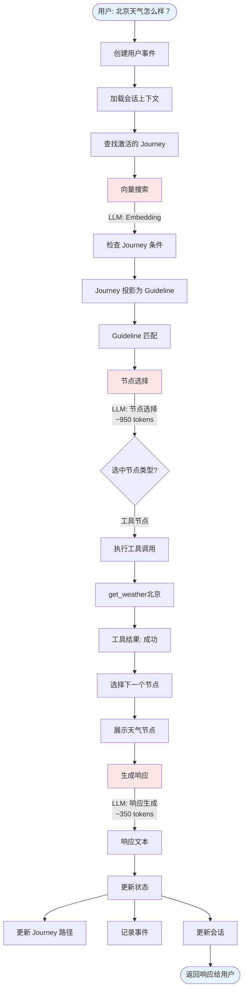

### 场景 2 完整流程图（两轮交互）

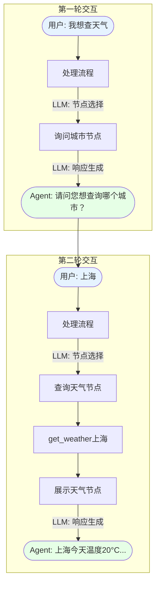

### 数据流图

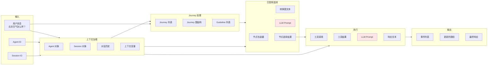

### Journey 状态转换图

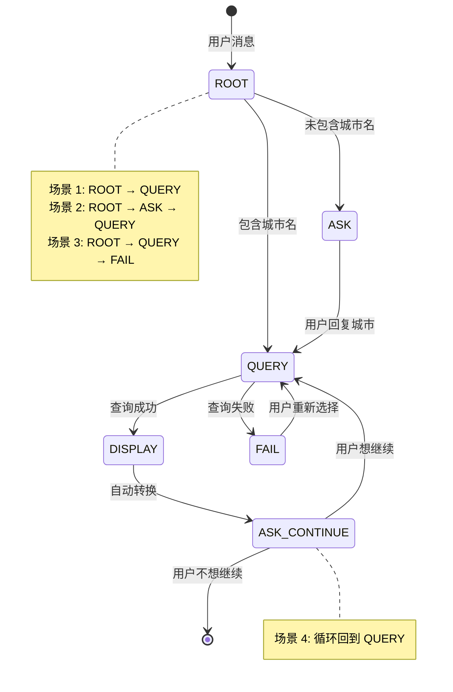

### LLM 调用时序图（场景 1）

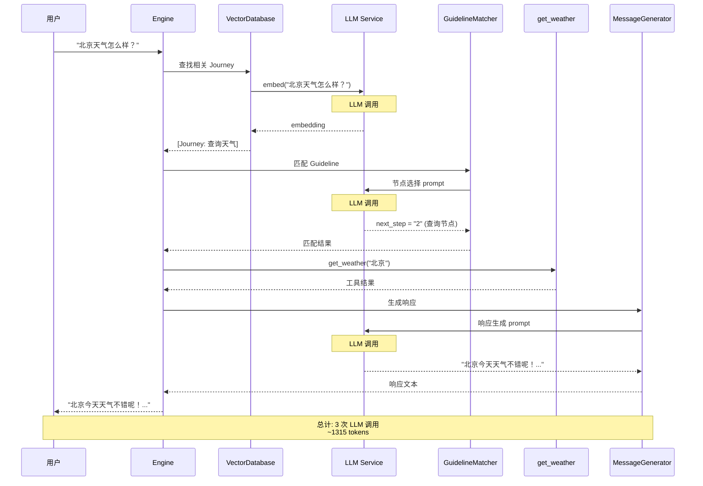

### Token 消耗分布图

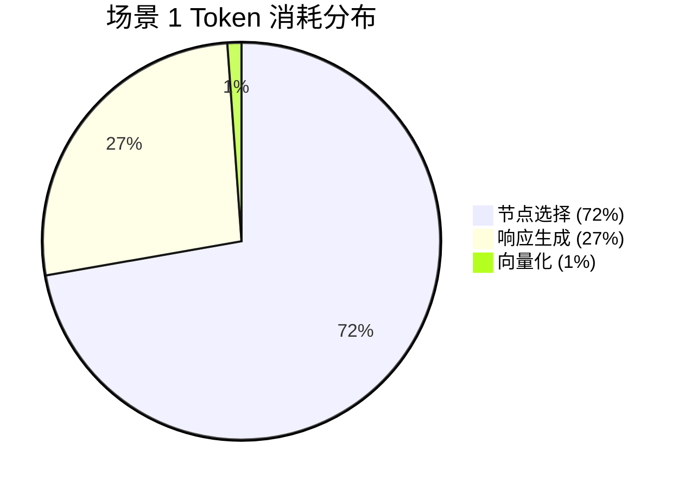

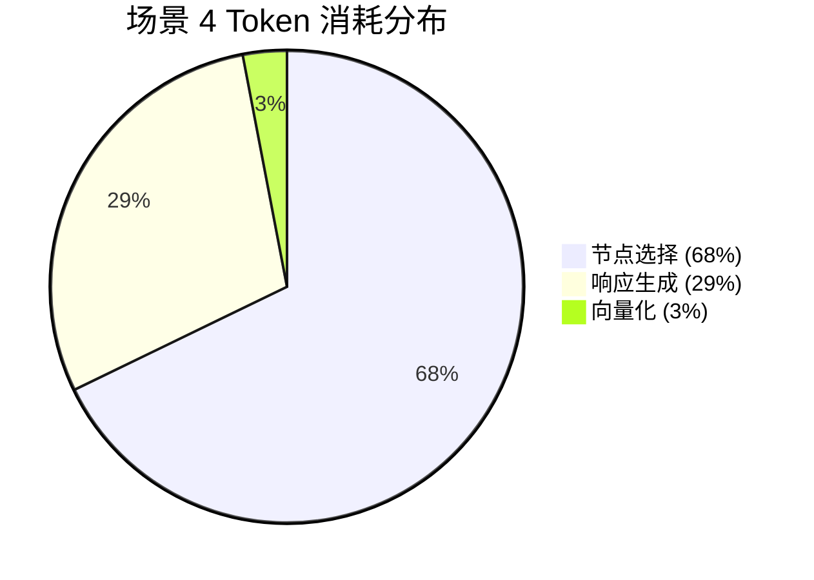

### 场景对比图

#### LLM 调用次数对比

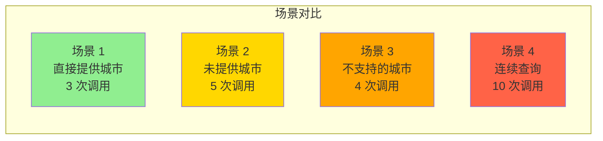

#### Token 消耗对比

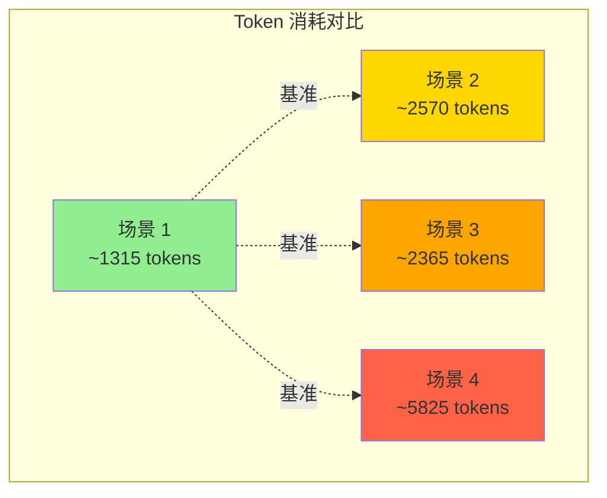

### 性能分析图

#### 耗时分布（场景 1）

```mermaid
gantt
    title 场景 1 请求处理耗时分布
    dateFormat X
    axisFormat %L ms
    
    section 数据库操作
    加载上下文: 0, 50
    更新状态: 2180, 30
    
    section Journey 处理
    查找 Journey: 50, 100
    投影 Guideline: 150, 20
    
    section LLM 调用
    节点选择: 170, 1200
    响应生成: 1380, 800
    
    section 工具调用
    get_weather: 1370, 10
```

#### 优化前后对比

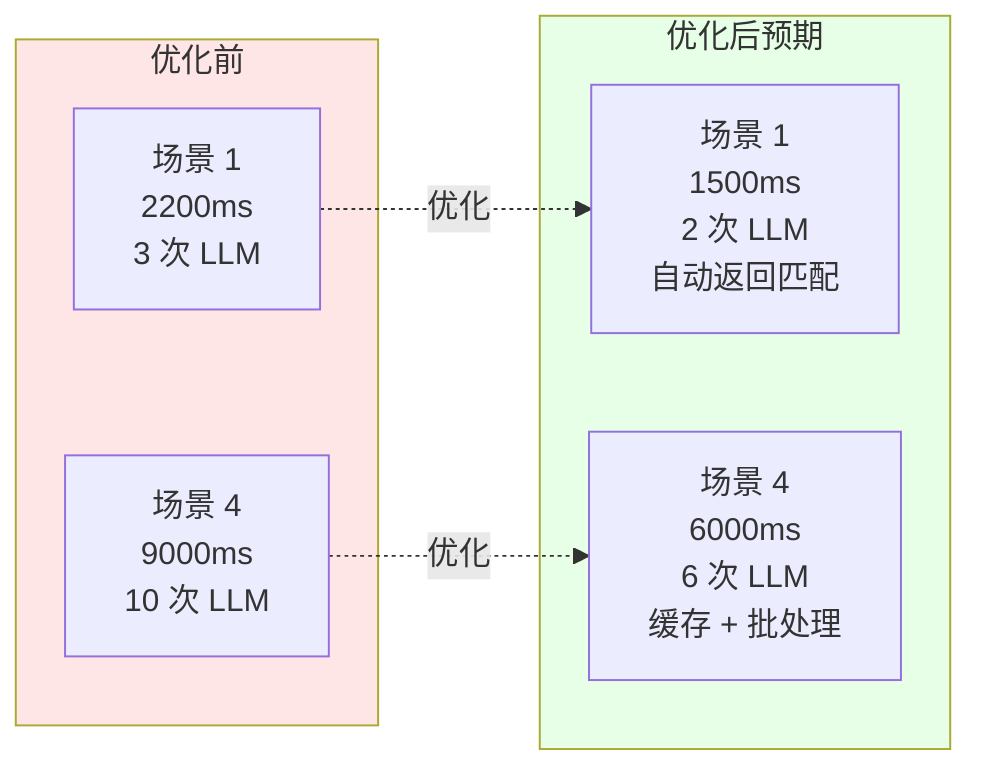

### 数据库操作图

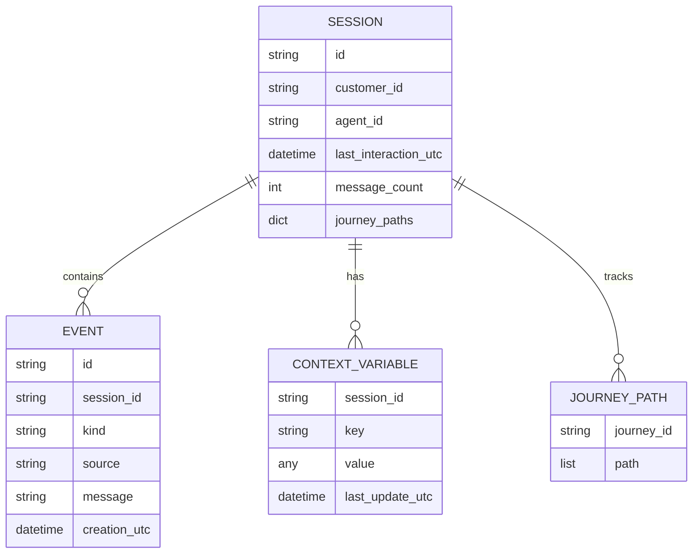

### 完整系统架构图

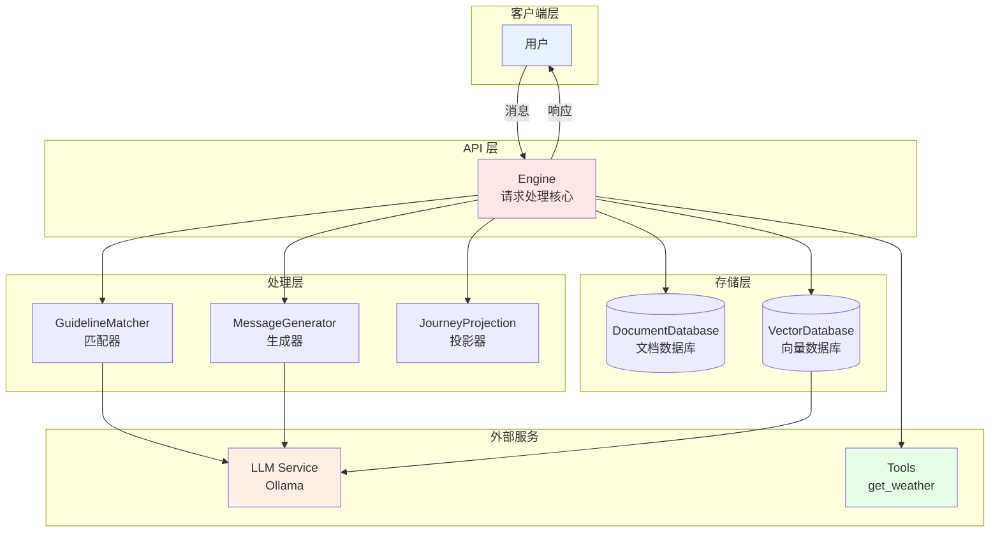

### 关键路径高亮图

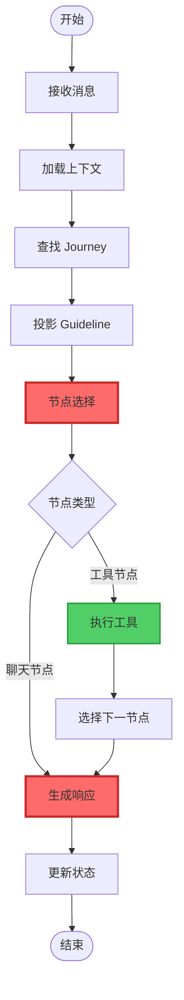

**图例**:
- 🔴 红色（粗边框）: LLM 调用点（关键路径）
- 🟢 绿色（中边框）: 工具调用点
- ⚪ 白色（细边框）: 常规处理步骤

### 优化机会标注图

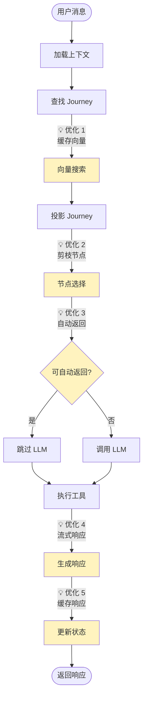

**优化点说明**:
1. **缓存向量**: 缓存用户消息的嵌入向量
2. **剪枝节点**: 减少传递给 LLM 的节点数量
3. **自动返回**: 工具节点只有一个出边时跳过 LLM
4. **流式响应**: 使用流式 API 边生成边返回
5. **缓存响应**: 缓存常见的响应模式

## 总结

本文档详细分析了 Weather Agent 的请求处理流程，涵盖了 4 个典型场景：

1. **场景 1（直接提供城市）**: 最简单的场景，2 次 LLM 调用，~1315 tokens
2. **场景 2（未提供城市）**: 需要两轮交互，4 次 LLM 调用，~2570 tokens
3. **场景 3（不支持的城市）**: 需要处理失败情况，3 次 LLM 调用，~2365 tokens
4. **场景 4（连续查询）**: 最复杂的场景，8 次 LLM 调用，~5825 tokens

### 关键发现

1. **LLM 调用是性能瓶颈**: 占总耗时的 90%+
2. **节点选择最耗 token**: 每次约 800-1200 tokens
3. **场景复杂度影响显著**: 场景 4 的 token 消耗是场景 1 的 4.4 倍
4. **优化空间大**: 通过缓存、自动返回等策略可减少 30-50% 的 LLM 调用

### 优化建议

1. **短期优化**:
   - 实现自动返回匹配（工具节点只有一个出边时）
   - 缓存节点选择结果
   - 使用流式响应

2. **中期优化**:
   - 批量处理多个 Journey 的节点选择
   - 优化转换图文本生成（减少 token）
   - 实现响应模板系统

3. **长期优化**:
   - 训练专门的节点选择模型（替代通用 LLM）
   - 实现智能缓存系统（基于语义相似度）
   - 优化 Journey 设计（减少不必要的节点）

### 相关文档

- [11-weather-agent-startup-flow.md](./11-weather-agent-startup-flow.md): 启动流程详解
- [13-llm-invocation-analysis.md](./13-llm-invocation-analysis.md): LLM 调用详细分析
- [14-method-call-chains.md](./14-method-call-chains.md): 方法调用链详解
- [07-engine-integration.md](./07-engine-integration.md): 引擎集成分析
- [06-journey-guideline-projection.md](./06-journey-guideline-projection.md): Journey 投影机制
- [08-complete-flow.md](./08-complete-flow.md): 完整流程概览
- [02-core-models.md](./02-core-models.md): 核心数据模型
- [03-storage-layer.md](./03-storage-layer.md): 存储层实现

