# LLM 调用分析文档

## 概述

本文档详细分析 Parlant 系统（以 `weather_agent.py` 为例）中所有大语言模型（LLM）的调用点，包括调用位置、目的、输入输出结构、Token 消耗估算和优化建议。

### 为什么 LLM 调用分析很重要

1. **性能优化**: LLM 调用是系统中最耗时的操作，占总响应时间的 90% 以上
2. **成本控制**: LLM API 调用通常按 Token 计费，了解调用模式有助于控制成本
3. **用户体验**: 减少不必要的 LLM 调用可以显著提升响应速度
4. **系统设计**: 理解 LLM 调用模式有助于优化系统架构和缓存策略
5. **调试和监控**: 明确的调用点分析有助于定位性能瓶颈和异常

### 分析方法和工具

本文档采用以下方法进行分析：

1. **代码追踪**: 通过阅读 Parlant SDK 源代码和 `weather_agent.py`，识别所有 LLM 调用点
2. **流程分析**: 结合启动流程和请求处理流程，确定调用时机和顺序
3. **Token 估算**: 基于实际 prompt 结构和响应格式，估算 Token 消耗
4. **场景对比**: 分析不同用户输入场景下的 LLM 调用差异
5. **性能测量**: 通过实际运行和日志分析，验证估算结果

### 文档结构

本文档分为以下几个部分：

- **启动阶段 LLM 调用**: 分析系统启动时的 LLM 调用（评估和向量化）
- **请求处理阶段 LLM 调用**: 分析处理用户请求时的 LLM 调用（匹配、选择、生成）
- **调用次数统计**: 按场景和阶段统计 LLM 调用次数
- **Token 消耗分析**: 估算每个调用点的 Token 消耗和总成本
- **优化机会**: 识别可以优化的调用点和具体建议
- **可视化图表**: 提供时序图、分布图和对比图

### 关键术语

- **LLM (Large Language Model)**: 大语言模型，如 Ollama 的 qwen2.5
- **Token**: LLM 处理的基本单位，通常一个 Token 约等于 0.75 个英文单词或 1-2 个中文字符
- **Embedding**: 向量化，将文本转换为高维向量表示
- **Evaluation**: 评估，使用 LLM 为 Guideline 和 Journey 生成额外属性
- **Node Selection**: 节点选择，使用 LLM 推理选择 Journey 中的下一个节点
- **Response Generation**: 响应生成，使用 LLM 生成自然语言响应


## 启动阶段 LLM 调用

启动阶段是指从 `asyncio.run(main())` 开始到系统就绪接受请求的整个过程。在这个阶段，LLM 主要用于向量化（Embedding）和评估（Evaluation）。

### 调用点概览

| 调用点 | 位置 | 目的 | 调用次数 | Token 消耗 |
|-------|------|------|---------|-----------|
| 向量化 - Agent | `AgentStore.create_agent()` | 为 Agent 生成语义向量 | 1 | ~30 |
| 向量化 - Journey | `JourneyStore.create_journey()` | 为 Journey 生成语义向量 | 1 | ~40 |
| 向量化 - Guideline | `GuidelineStore.create_guideline()` | 为 Guideline 生成语义向量 | 8 | ~240 |
| 评估 - Guideline | `_CachedEvaluator.evaluate_guideline()` | 为 Guideline 生成属性 | 8 | ~1800 |
| 评估 - Journey | `_CachedEvaluator.evaluate_journey()` | 为 Journey 生成属性 | 1 | ~2300 |
| **总计** | | | **19** | **~4410** |

### 调用点 1: Agent 向量化

#### 位置和时机

**代码路径**: `Server.create_agent()` → `AgentStore.create_agent()` → `NLPService.embed()`

**调用时机**: 创建 Agent 后，插入向量数据库前

**代码示例**:
```python
# 组装内容
content = f"{agent.name} {agent.description}"
# content = "小天 友好的天气助手，用自然对话方式帮助用户查询天气"

# 生成嵌入向量
embedding = await nlp_service.embed(content)

# 插入向量数据库
await vector_db.agents.insert_one({
    "id": agent.id,
    "embedding": embedding,
    "metadata": {"name": agent.name, "description": agent.description}
})
```


#### 输入输出

**输入**:
```
小天 友好的天气助手，用自然对话方式帮助用户查询天气
```

**输出**:
```python
[0.123, -0.456, 0.789, ..., 0.234]  # 768 维向量
```

#### Token 消耗

- **输入 Tokens**: ~30 tokens（中文字符较多）
- **输出 Tokens**: 0（向量不计入 token）
- **总计**: ~30 tokens

#### 目的和用途

- **目的**: 为 Agent 生成语义向量表示
- **用途**: 未来可能用于 Agent 搜索和匹配（当前版本未使用）

### 调用点 2: Journey 向量化

#### 位置和时机

**代码路径**: `Agent.create_journey()` → `JourneyStore.create_journey()` → `NLPService.embed()`

**调用时机**: 创建 Journey 后，插入向量数据库前

**代码示例**:
```python
# 组装内容
content = f"{journey.title} {journey.description}"
# content = "查询天气 帮助用户查询城市天气"

# 生成嵌入向量
embedding = await nlp_service.embed(content)

# 插入向量数据库
await vector_db.journeys.insert_one({
    "id": journey.id,
    "embedding": embedding,
    "metadata": {"title": journey.title, "description": journey.description}
})
```


#### 输入输出

**输入**:
```
查询天气 帮助用户查询城市天气
```

**输出**:
```python
[0.234, -0.567, 0.890, ..., 0.345]  # 768 维向量
```

#### Token 消耗

- **输入 Tokens**: ~40 tokens
- **输出 Tokens**: 0
- **总计**: ~40 tokens

#### 目的和用途

- **目的**: 为 Journey 生成语义向量表示
- **用途**: 在请求处理时，通过向量相似度搜索找到相关的 Journey

### 调用点 3: Guideline 向量化

#### 位置和时机

**代码路径**: `GuidelineStore.create_guideline()` → `NLPService.embed()`

**调用时机**: 创建每个 Guideline 后，插入向量数据库前

**调用次数**: 8 次（2 个条件 Guideline + 2 个 Journey 内 Guideline + 4 个全局 Guideline）

**代码示例**:
```python
# 组装内容
content = f"{guideline.condition} {guideline.action or ''}"
# 示例: "用户问候 友好回应，简单介绍自己可以查询天气，支持的城市包括：北京、上海、广州、成都、深圳、杭州等"

# 生成嵌入向量
embedding = await nlp_service.embed(content)

# 插入向量数据库
await vector_db.guidelines.insert_one({
    "id": guideline.id,
    "embedding": embedding,
    "metadata": {"condition": guideline.condition, "action": guideline.action}
})
```


#### 输入输出示例

**输入 1** (条件 Guideline):
```
用户想查询天气 
```

**输入 2** (全局 Guideline):
```
用户问候 友好回应，简单介绍自己可以查询天气，支持的城市包括：北京、上海、广州、成都、深圳、杭州等
```

**输出**: 768 维向量

#### Token 消耗

- **平均输入 Tokens**: ~30 tokens/次
- **总输入 Tokens**: ~240 tokens (8 次)
- **输出 Tokens**: 0
- **总计**: ~240 tokens

#### 目的和用途

- **目的**: 为 Guideline 生成语义向量表示
- **用途**: 在请求处理时，通过向量相似度搜索找到相关的 Guideline（虽然当前主要使用 Journey 投影机制）

### 调用点 4: Guideline 评估

#### 位置和时机

**代码路径**: `GuidelineStore.create_guideline()` → `_CachedEvaluator.evaluate_guideline()` → `NLPService.generate()`

**调用时机**: 创建 Guideline 后，生成额外属性

**调用次数**: 8 次（每个 Guideline 一次）

**代码示例**:
```python
async def evaluate_guideline(guideline: Guideline) -> dict:
    # 检查缓存
    cache_key = f"guideline_{guideline.id}"
    if cache_key in cache:
        return cache[cache_key]
    
    # 构建 prompt
    prompt = f"""
    分析以下 Guideline 并提取关键属性：
    
    条件: {guideline.condition}
    动作: {guideline.action}
    
    请提供：
    1. 关键词列表
    2. 意图分类
    3. 优先级
    """
    
    # 调用 LLM
    response = await nlp_service.generate(
        prompt=prompt,
        schema={
            "keywords": ["string"],
            "intent": "string",
            "priority": "number"
        }
    )
    
    # 缓存结果
    cache[cache_key] = response
    return response
```


#### 输入输出示例

**输入 Prompt**:
```
分析以下 Guideline 并提取关键属性：

条件: 用户问候
动作: 友好回应，简单介绍自己可以查询天气，支持的城市包括：北京、上海、广州、成都、深圳、杭州等

请提供：
1. 关键词列表
2. 意图分类
3. 优先级
```

**输出 Response**:
```json
{
    "keywords": ["问候", "你好", "打招呼", "hi", "hello"],
    "intent": "greeting",
    "priority": 1
}
```

#### Token 消耗

- **平均输入 Tokens**: ~150 tokens/次
- **平均输出 Tokens**: ~75 tokens/次
- **单次总计**: ~225 tokens
- **8 次总计**: ~1800 tokens

#### 目的和用途

- **目的**: 为 Guideline 生成额外的结构化属性，用于更精确的匹配和推理
- **用途**: 
  - 关键词用于快速过滤
  - 意图分类用于分组和优先级排序
  - 优先级用于冲突解决

#### 缓存机制

**缓存文件**: `parlant-data/evaluation_cache.json`

**缓存策略**:
- 首次启动: 执行所有评估，缓存结果
- 后续启动: 直接从缓存读取，跳过 LLM 调用
- 缓存失效: Guideline 内容修改时

**缓存效果**:
- 首次启动: 8 次 LLM 调用，~1800 tokens
- 后续启动: 0 次 LLM 调用，0 tokens
- **节省**: 100% 的评估 LLM 调用


### 调用点 5: Journey 评估

#### 位置和时机

**代码路径**: `Agent.create_journey()` → `_CachedEvaluator.evaluate_journey()` → `NLPService.generate()`

**调用时机**: Journey 创建完成（包括所有节点和边）后

**调用次数**: 1 次

**代码示例**:
```python
async def evaluate_journey(journey: Journey) -> dict:
    # 检查缓存
    cache_key = f"journey_{journey.id}"
    if cache_key in cache:
        return cache[cache_key]
    
    # 读取节点和边
    nodes = await journey_store.list_nodes(journey.id)
    edges = await journey_store.list_edges(journey.id)
    
    # 为每个节点生成属性
    node_attributes = {}
    for node in nodes:
        prompt = f"""
        分析以下 Journey 节点：
        
        动作: {node.action}
        工具: {node.tools}
        
        请提供：
        1. 节点类型（chat/tool/decision）
        2. 关键词
        3. 预期输出
        """
        
        response = await nlp_service.generate(prompt=prompt, schema={...})
        node_attributes[node.id] = response
    
    # 为每个边生成属性
    edge_attributes = {}
    for edge in edges:
        if edge.condition:
            prompt = f"""
            分析以下转换条件：
            
            条件: {edge.condition}
            
            请提供：
            1. 条件类型
            2. 关键词
            3. 触发场景
            """
            
            response = await nlp_service.generate(prompt=prompt, schema={...})
            edge_attributes[edge.id] = response
    
    # 组装结果
    attributes = {
        "nodes": node_attributes,
        "edges": edge_attributes
    }
    
    # 缓存结果
    cache[cache_key] = attributes
    return attributes
```


#### 输入输出示例

**输入 Prompt** (节点评估):
```
分析以下 Journey 节点：

动作: 友好地询问用户想查询哪个城市的天气
工具: []

请提供：
1. 节点类型（chat/tool/decision）
2. 关键词
3. 预期输出
```

**输出 Response** (节点评估):
```json
{
    "type": "chat",
    "keywords": ["询问", "城市", "天气"],
    "expected_output": "用户提供城市名称"
}
```

**输入 Prompt** (边评估):
```
分析以下转换条件：

条件: 用户消息中包含城市名称

请提供：
1. 条件类型
2. 关键词
3. 触发场景
```

**输出 Response** (边评估):
```json
{
    "type": "conditional",
    "keywords": ["城市名称", "包含", "北京", "上海"],
    "trigger_scenario": "用户消息中提到城市"
}
```

#### Token 消耗

Weather Agent 的 Journey 包含约 15 个节点和 14 条边：

- **节点评估**: 15 次 × ~100 tokens = ~1500 tokens
- **边评估**: 14 次 × ~50 tokens = ~700 tokens
- **总输入**: ~1500 tokens
- **总输出**: ~800 tokens
- **总计**: ~2300 tokens

#### 目的和用途

- **目的**: 为 Journey 的节点和边生成额外属性，用于更智能的路径选择
- **用途**:
  - 节点类型用于确定执行策略
  - 关键词用于快速匹配
  - 预期输出用于验证节点执行结果

#### 缓存机制

**缓存效果**:
- 首次启动: 1 次 LLM 调用（实际是多次子调用），~2300 tokens
- 后续启动: 0 次 LLM 调用，0 tokens
- **节省**: 100% 的评估 LLM 调用


### 启动阶段总结

#### LLM 调用统计

| 类型 | 调用次数 | 输入 Tokens | 输出 Tokens | 总 Tokens |
|-----|---------|------------|------------|----------|
| Agent 向量化 | 1 | 30 | 0 | 30 |
| Journey 向量化 | 1 | 40 | 0 | 40 |
| Guideline 向量化 | 8 | 240 | 0 | 240 |
| Guideline 评估 | 8 | 1200 | 600 | 1800 |
| Journey 评估 | 1 | 1500 | 800 | 2300 |
| **总计** | **19** | **3010** | **1400** | **4410** |

#### 首次启动 vs 后续启动

**首次启动**（无缓存）:
- LLM 调用次数: 19 次
- Token 消耗: ~4410 tokens
- 预估耗时: ~15-20 秒（LLM 调用部分）

**后续启动**（有缓存）:
- LLM 调用次数: 10 次（仅向量化）
- Token 消耗: ~310 tokens
- 预估耗时: ~3-5 秒（LLM 调用部分）

**缓存节省**:
- LLM 调用减少: 47% (9/19)
- Token 消耗减少: 93% (4100/4410)
- 耗时减少: 约 75%

#### 成本估算

假设使用 Ollama 本地部署（无 API 成本），主要成本是计算资源：

**首次启动**:
- GPU 时间: ~15-20 秒
- 内存占用: ~2-4 GB

**后续启动**:
- GPU 时间: ~3-5 秒
- 内存占用: ~1-2 GB

如果使用云端 API（如 OpenAI），按 $0.002/1K tokens 计算：
- 首次启动成本: ~$0.009
- 后续启动成本: ~$0.0006
- 每次节省: ~$0.0084


## 请求处理阶段 LLM 调用

请求处理阶段是指从接收用户消息到返回响应的整个过程。在这个阶段，LLM 主要用于向量化、Journey 激活判断、节点选择和响应生成。

### 调用点概览

| 调用点 | 位置 | 目的 | 场景 1 | 场景 2 | 场景 3 | 场景 4 |
|-------|------|------|--------|--------|--------|--------|
| 向量化 - 用户消息 | `Engine._find_active_journeys()` | 查找相关 Journey | 1 | 1 | 1 | 2 |
| Journey 激活判断 | `Engine._check_journey_conditions()` | 判断 Journey 是否适用 | 0 | 0 | 0 | 0 |
| 节点选择 | `JourneyNodeSelectionBatch.process()` | 选择下一个节点 | 1 | 2 | 2 | 4 |
| 参数提取 | `ToolContext.extract_params()` | 提取工具参数 | 0 | 0 | 0 | 0 |
| 响应生成 | `MessageGenerator.generate()` | 生成自然语言响应 | 1 | 2 | 1 | 4 |
| **总计** | | | **3** | **5** | **4** | **10** |

**注**: 场景 1-4 的定义详见 [12-weather-agent-request-flow.md](./12-weather-agent-request-flow.md)

### 调用点 1: 用户消息向量化

#### 位置和时机

**代码路径**: `Engine.process_message()` → `Engine._find_active_journeys()` → `VectorDatabase.journeys.search()` → `NLPService.embed()`

**调用时机**: 接收用户消息后，查找相关 Journey 时

**调用次数**: 每次用户消息 1 次

**代码示例**:
```python
async def _find_active_journeys(context: EngineContext, message: str) -> Sequence[Journey]:
    # 向量化用户消息
    message_embedding = await nlp_service.embed(message)
    
    # 向量搜索相关 Journey
    relevant_journeys = await vector_db.journeys.search(
        embedding=message_embedding,
        limit=10
    )
    
    return relevant_journeys
```

#### 输入输出示例

**输入** (场景 1):
```
北京天气怎么样？
```

**输出**:
```python
[0.345, -0.678, 0.901, ..., 0.456]  # 768 维向量
```

#### Token 消耗

- **平均输入 Tokens**: ~10-20 tokens/次
- **输出 Tokens**: 0
- **总计**: ~10-20 tokens/次

#### 目的和用途

- **目的**: 将用户消息转换为向量，用于语义搜索
- **用途**: 找到与用户消息最相关的 Journey，提高匹配准确性


### 调用点 2: Journey 激活判断

#### 位置和时机

**代码路径**: `Engine._find_active_journeys()` → `Engine._check_journey_conditions()` → `NLPService.generate()`

**调用时机**: 向量搜索找到候选 Journey 后，检查条件是否满足

**调用次数**: 0 次（在 Weather Agent 中）

**说明**: 
在当前的 Weather Agent 实现中，Journey 的条件检查主要依赖向量相似度，不需要额外的 LLM 调用。但在更复杂的场景中，可能需要 LLM 来判断条件是否满足。

**潜在实现**:
```python
async def _check_journey_conditions(
    journey: Journey,
    message: str,
    context: EngineContext
) -> bool:
    # 读取条件 Guideline
    conditions = await guideline_store.read_guidelines(journey.conditions)
    
    # 构建 prompt
    prompt = f"""
    用户消息: {message}
    
    Journey 激活条件:
    {' AND '.join([c.condition for c in conditions])}
    
    判断这些条件是否都满足。返回 true 或 false。
    """
    
    # 调用 LLM
    response = await nlp_service.generate(prompt=prompt, schema={"result": "boolean"})
    
    return response["result"]
```

#### Token 消耗

- **输入 Tokens**: ~100-150 tokens/次
- **输出 Tokens**: ~10 tokens/次
- **总计**: ~110-160 tokens/次

**注**: 由于 Weather Agent 不使用此调用，实际消耗为 0

### 调用点 3: 节点选择

#### 位置和时机

**代码路径**: `GuidelineMatcher.match_guidelines()` → `JourneyNodeSelectionBatch.process()` → `SchematicGenerator.generate()` → `NLPService.generate()`

**调用时机**: 需要选择 Journey 中的下一个节点时

**调用次数**: 
- 场景 1: 1 次
- 场景 2: 2 次（第一轮询问 + 第二轮查询）
- 场景 3: 2 次（查询 + 失败处理）
- 场景 4: 4 次（两次完整查询流程）

**代码示例**:
```python
async def process(self) -> GuidelineMatchingBatchResult:
    # 构建转换图文本
    transition_map_text = get_journey_transition_map_text(
        nodes=pruned_nodes,
        journey_title=journey.title,
        journey_description=journey.description,
        previous_path=journey_path,
        max_depth=5
    )
    
    # 构建 prompt
    prompt = f"""
    你是一个对话流程分析器。根据用户的最新消息和对话历史，选择 Journey 中的下一个步骤。
    
    用户最新消息: {user_message}
    
    对话历史:
    {conversation_history}
    
    当前 Journey 路径: {current_path}
    
    Journey 转换图:
    {transition_map_text}
    
    请分析并选择下一个要执行的步骤。
    """
    
    # 调用 LLM
    response = await schematic_generator.generate(
        prompt=prompt,
        schema=JourneyNodeSelectionSchema
    )
    
    return response
```


#### 输入输出示例

**输入 Prompt** (场景 1):
```
你是一个对话流程分析器。根据用户的最新消息和对话历史，选择 Journey 中的下一个步骤。

用户最新消息: "北京天气怎么样？"

对话历史:
（无历史记录）

当前 Journey 路径: []

Journey 转换图:
Journey: 查询天气
Journey description: 帮助用户查询城市天气
Journey activation condition: "用户想查询天气" AND "用户提到城市名称"

Steps:
STEP 1: <<JOURNEY ROOT>>
Step Flags:
- BEGIN HERE: Begin the journey advancement at this step.
- FORK: This is a fork step with no action.
TRANSITIONS:
↳ If "用户消息中包含城市名称" → Go to step 2
↳ If "用户没有提到具体城市" → Go to step 3

STEP 2: [TOOL CALL: get_weather]
Step Flags:
- REQUIRES TOOL CALL: This step requires calling a tool.
TRANSITIONS:
↳ If "查询成功" → Go to step 4
↳ If "查询失败" → Go to step 6

STEP 3: 友好地询问用户想查询哪个城市的天气
Step Flags:
- REQUIRES AGENT ACTION: This step may require the agent to say something.
TRANSITIONS:
↳ Go to step 2

STEP 4: 简洁友好地告诉用户天气情况：温度、天气状况、湿度
Step Flags:
- REQUIRES AGENT ACTION: This step may require the agent to say something.
TRANSITIONS:
↳ Go to step 5

STEP 5: 询问用户是否还想查询其他城市
Step Flags:
- REQUIRES AGENT ACTION: This step may require the agent to say something.
TRANSITIONS:
↳ If "用户想查询其他城市" → Go to step 2
↳ If "用户不想继续查询" → RETURN 'NONE'

STEP 6: 告知暂不支持该城市，列出可查询的城市列表
Step Flags:
- REQUIRES AGENT ACTION: This step may require the agent to say something.
TRANSITIONS:
↳ Go to step 2

请分析并选择下一个要执行的步骤。
```

**输出 Response**:
```json
{
    "rationale": "用户明确提到了'北京'，满足'用户消息中包含城市名称'的条件，应该直接进入查询步骤",
    "journey_applies": true,
    "requires_backtracking": false,
    "step_advancement": [
        {
            "step": "2",
            "completion_status": "NEEDS_TOOL_CALL",
            "rationale": "需要调用 get_weather 工具查询北京天气"
        }
    ],
    "next_step": "2"
}
```


#### Token 消耗

**场景 1** (直接提供城市):
- 输入 Tokens: ~800 tokens
- 输出 Tokens: ~150 tokens
- 总计: ~950 tokens

**场景 2** (未提供城市，两次节点选择):
- 第一次: ~900 tokens
- 第二次: ~1000 tokens (包含更长的对话历史)
- 总计: ~1900 tokens

**场景 3** (不支持的城市，两次节点选择):
- 第一次: ~950 tokens
- 第二次: ~1000 tokens (处理工具失败)
- 总计: ~1950 tokens

**场景 4** (连续查询，四次节点选择):
- 第一次查询: ~950 + ~900 = ~1850 tokens
- 第二次查询: ~1100 + ~1000 = ~2100 tokens
- 总计: ~3950 tokens

#### 目的和用途

- **目的**: 使用 LLM 推理选择 Journey 中的下一个节点
- **用途**:
  - 理解用户意图
  - 评估转换条件
  - 选择最合适的执行路径
  - 处理复杂的决策分支

#### 优化机会

1. **自动返回匹配**: 当工具节点只有一个出边时，跳过 LLM 调用
2. **缓存常见路径**: 对于常见的用户输入模式，缓存节点选择结果
3. **简化转换图**: 减少传递给 LLM 的节点数量（当前已实现剪枝）

### 调用点 4: 参数提取

#### 位置和时机

**代码路径**: `Engine._execute_tools()` → `ToolContext.extract_params()` → `NLPService.generate()`

**调用时机**: 调用工具前，从用户消息中提取参数

**调用次数**: 0 次（在 Weather Agent 中）

**说明**:
在当前的 Weather Agent 实现中，工具参数提取可能使用简单的规则或模式匹配，不需要 LLM。但在更复杂的场景中，可能需要 LLM 来提取参数。

**潜在实现**:
```python
async def extract_tool_params(
    message: str,
    tool_signature: inspect.Signature,
    context: EngineContext
) -> dict:
    # 构建 prompt
    prompt = f"""
    用户消息: {message}
    
    工具签名: {tool_signature}
    
    从用户消息中提取工具参数。
    """
    
    # 调用 LLM
    response = await nlp_service.generate(prompt=prompt, schema=tool_signature)
    
    return response
```

#### Token 消耗

- **输入 Tokens**: ~100-150 tokens/次
- **输出 Tokens**: ~20-50 tokens/次
- **总计**: ~120-200 tokens/次

**注**: 由于 Weather Agent 不使用此调用，实际消耗为 0


### 调用点 5: 响应生成

#### 位置和时机

**代码路径**: `Engine.process_message()` → `MessageGenerator.generate()` → `NLPService.generate()`

**调用时机**: 选择节点后，需要生成自然语言响应时

**调用次数**:
- 场景 1: 1 次
- 场景 2: 2 次（询问城市 + 展示天气）
- 场景 3: 1 次（提示可用城市）
- 场景 4: 4 次（两次完整查询流程）

**代码示例**:
```python
async def generate(
    guideline: Guideline,
    context: EngineContext,
    tool_result: Optional[ToolResult] = None
) -> str:
    # 获取节点 action
    action = guideline.metadata["journey_node"]["action"]
    
    # 构建 prompt
    prompt = f"""
    你是{context.agent.name}，{context.agent.description}。
    
    用户消息: {context.latest_message}
    
    {f"工具调用结果: {tool_result.data}" if tool_result else ""}
    
    指导原则: {action}
    
    请生成一个自然、友好的响应。
    """
    
    # 调用 LLM
    response = await nlp_service.generate(
        prompt=prompt,
        max_tokens=200,
        temperature=0.7
    )
    
    return response
```

#### 输入输出示例

**输入 Prompt** (场景 1，展示天气):
```
你是小天，友好的天气助手，用自然对话方式帮助用户查询天气。

用户消息: "北京天气怎么样？"

工具调用结果: {
    "success": true,
    "location": "北京",
    "temperature": 15,
    "unit": "°C",
    "condition": "晴朗",
    "humidity": 45,
    "current_time": "2025-11-07 10:30"
}

指导原则: 简洁友好地告诉用户天气情况：温度、天气状况、湿度

请生成一个自然、友好的响应。
```

**输出 Response**:
```
北京今天天气不错呢！☀️ 温度15°C，晴朗，湿度45%。挺舒适的天气，适合出门活动。
```

**输入 Prompt** (场景 2，询问城市):
```
你是小天，友好的天气助手，用自然对话方式帮助用户查询天气。

用户消息: "我想查天气"

指导原则: 友好地询问用户想查询哪个城市的天气

请生成一个自然、友好的响应。
```

**输出 Response**:
```
好的！请问您想查询哪个城市的天气呢？我可以帮您查询北京、上海、广州、成都、深圳、杭州等城市的天气信息。
```


#### Token 消耗

**场景 1** (展示天气):
- 输入 Tokens: ~300 tokens
- 输出 Tokens: ~50 tokens
- 总计: ~350 tokens

**场景 2** (询问城市 + 展示天气):
- 第一次: ~250 tokens
- 第二次: ~350 tokens
- 总计: ~600 tokens

**场景 3** (提示可用城市):
- 输入 Tokens: ~350 tokens
- 输出 Tokens: ~50 tokens
- 总计: ~400 tokens

**场景 4** (两次完整查询):
- 第一次查询: ~350 + ~400 = ~750 tokens
- 第二次查询: ~400 + ~450 = ~850 tokens
- 总计: ~1600 tokens

#### 目的和用途

- **目的**: 生成自然、友好的响应文本
- **用途**:
  - 将结构化数据转换为自然语言
  - 遵循 Agent 的语气和风格
  - 根据 action 指导生成合适的响应
  - 整合工具调用结果

#### 优化机会

1. **模板化响应**: 对于简单的响应，使用模板而非 LLM
2. **流式生成**: 边生成边返回，减少用户等待时间
3. **缓存常见响应**: 对于常见的查询结果，缓存响应模式

### 请求处理阶段总结

#### 各场景 LLM 调用统计

| 场景 | 向量化 | 节点选择 | 响应生成 | 总调用次数 | 总 Tokens |
|-----|--------|---------|---------|-----------|----------|
| 场景 1 | 1 | 1 | 1 | 3 | ~1320 |
| 场景 2 | 1 | 2 | 2 | 5 | ~2520 |
| 场景 3 | 1 | 2 | 1 | 4 | ~2370 |
| 场景 4 | 2 | 4 | 4 | 10 | ~5580 |

#### 性能分析

**最快场景**: 场景 1（用户直接提供城市名）
- LLM 调用: 3 次
- Token 消耗: ~1320 tokens
- 预估耗时: ~2.2 秒

**最慢场景**: 场景 4（连续查询多个城市）
- LLM 调用: 10 次
- Token 消耗: ~5580 tokens
- 预估耗时: ~9.0 秒

**平均场景**: 
- LLM 调用: ~5.5 次
- Token 消耗: ~2950 tokens
- 预估耗时: ~4.5 秒


## 调用次数统计

本章节提供详细的 LLM 调用次数统计，按场景和阶段分类。

### 按场景统计

#### 场景 1: 用户直接提供城市名

**用户输入**: "北京天气怎么样？"

**LLM 调用明细**:

| 序号 | 调用类型 | 位置 | 输入 Tokens | 输出 Tokens | 总 Tokens |
|-----|---------|------|------------|------------|----------|
| 1 | 向量化 | 用户消息向量化 | 10 | 0 | 10 |
| 2 | 节点选择 | 选择查询分支 | 800 | 150 | 950 |
| 3 | 响应生成 | 展示天气 | 300 | 50 | 350 |
| **总计** | | | **1110** | **200** | **1310** |

**交互轮次**: 1 轮

**工具调用**: 1 次（get_weather）

#### 场景 2: 用户未提供城市名

**用户输入**: 
1. "我想查天气"
2. "上海"

**LLM 调用明细**:

| 序号 | 调用类型 | 位置 | 输入 Tokens | 输出 Tokens | 总 Tokens |
|-----|---------|------|------------|------------|----------|
| 1 | 向量化 | 第一次消息向量化 | 10 | 0 | 10 |
| 2 | 节点选择 | 选择询问分支 | 900 | 150 | 1050 |
| 3 | 响应生成 | 询问城市 | 200 | 50 | 250 |
| 4 | 节点选择 | 选择查询分支 | 1000 | 150 | 1150 |
| 5 | 响应生成 | 展示天气 | 300 | 50 | 350 |
| **总计** | | | **2410** | **400** | **2810** |

**交互轮次**: 2 轮

**工具调用**: 1 次（get_weather）

#### 场景 3: 查询不支持的城市

**用户输入**: "巴黎天气怎么样？"

**LLM 调用明细**:

| 序号 | 调用类型 | 位置 | 输入 Tokens | 输出 Tokens | 总 Tokens |
|-----|---------|------|------------|------------|----------|
| 1 | 向量化 | 用户消息向量化 | 10 | 0 | 10 |
| 2 | 节点选择 | 选择查询分支 | 800 | 150 | 950 |
| 3 | 节点选择 | 选择失败分支 | 1000 | 150 | 1150 |
| 4 | 响应生成 | 提示可用城市 | 350 | 50 | 400 |
| **总计** | | | **2160** | **350** | **2510** |

**交互轮次**: 1 轮

**工具调用**: 1 次（get_weather，失败）


#### 场景 4: 连续查询多个城市

**用户输入**:
1. "北京天气怎么样？"
2. "上海呢？"

**LLM 调用明细**:

| 序号 | 调用类型 | 位置 | 输入 Tokens | 输出 Tokens | 总 Tokens |
|-----|---------|------|------------|------------|----------|
| 1 | 向量化 | 第一次消息向量化 | 10 | 0 | 10 |
| 2 | 节点选择 | 选择查询分支 | 800 | 150 | 950 |
| 3 | 响应生成 | 展示天气 | 300 | 50 | 350 |
| 4 | 节点选择 | 选择询问继续 | 900 | 150 | 1050 |
| 5 | 响应生成 | 询问继续 | 350 | 50 | 400 |
| 6 | 向量化 | 第二次消息向量化 | 10 | 0 | 10 |
| 7 | 节点选择 | 选择查询分支 | 1100 | 150 | 1250 |
| 8 | 响应生成 | 展示天气 | 350 | 50 | 400 |
| 9 | 节点选择 | 选择询问继续 | 1000 | 150 | 1150 |
| 10 | 响应生成 | 询问继续 | 400 | 50 | 450 |
| **总计** | | | **5220** | **800** | **6020** |

**交互轮次**: 2 轮

**工具调用**: 2 次（get_weather）

### 按阶段统计

#### 启动阶段

| 调用类型 | 调用次数 | 输入 Tokens | 输出 Tokens | 总 Tokens | 占比 |
|---------|---------|------------|------------|----------|------|
| 向量化 | 10 | 310 | 0 | 310 | 7.0% |
| 评估 | 9 | 2700 | 1400 | 4100 | 93.0% |
| **总计** | **19** | **3010** | **1400** | **4410** | **100%** |

**特点**:
- 评估调用占主导地位（93%）
- 首次启动后可完全缓存
- 后续启动仅需向量化（310 tokens）

#### 请求处理阶段（平均）

| 调用类型 | 调用次数 | 输入 Tokens | 输出 Tokens | 总 Tokens | 占比 |
|---------|---------|------------|------------|----------|------|
| 向量化 | 1.25 | 10 | 0 | 10 | 0.4% |
| 节点选择 | 2.25 | 2175 | 338 | 2513 | 85.0% |
| 响应生成 | 2.0 | 325 | 50 | 375 | 12.7% |
| 参数提取 | 0 | 0 | 0 | 0 | 0% |
| **总计** | **5.5** | **2510** | **388** | **2898** | **100%** |

**特点**:
- 节点选择占主导地位（85%）
- 向量化消耗很小（0.4%）
- 响应生成占比适中（12.7%）


### 场景对比分析

#### LLM 调用次数对比

```
场景 1: ███ (3 次)
场景 2: █████ (5 次)
场景 3: ████ (4 次)
场景 4: ██████████ (10 次)
```

#### Token 消耗对比

```
场景 1: ████ (1310 tokens)
场景 2: ████████ (2810 tokens)
场景 3: ███████ (2510 tokens)
场景 4: ████████████████ (6020 tokens)
```

#### 关键发现

1. **场景复杂度与 LLM 调用成正比**: 
   - 简单场景（场景 1）: 3 次调用
   - 复杂场景（场景 4）: 10 次调用
   - 增长倍数: 3.3x

2. **Token 消耗增长更快**:
   - 简单场景: 1310 tokens
   - 复杂场景: 6020 tokens
   - 增长倍数: 4.6x
   - 原因: 对话历史累积导致 prompt 变长

3. **节点选择是主要消耗点**:
   - 占总 Token 的 85%
   - 每次调用 ~950-1250 tokens
   - 随对话历史增长而增加

4. **响应生成相对稳定**:
   - 占总 Token 的 12.7%
   - 每次调用 ~250-450 tokens
   - 变化较小

5. **向量化消耗可忽略**:
   - 占总 Token 的 0.4%
   - 每次调用 ~10 tokens
   - 几乎不影响总成本

### 统计总结

#### 完整生命周期统计

**首次启动 + 场景 1**:
- 总 LLM 调用: 22 次（19 启动 + 3 请求）
- 总 Token 消耗: 5720 tokens（4410 + 1310）
- 预估耗时: ~22 秒

**后续启动 + 场景 1**（有缓存）:
- 总 LLM 调用: 13 次（10 启动 + 3 请求）
- 总 Token 消耗: 1620 tokens（310 + 1310）
- 预估耗时: ~5 秒

**缓存效果**:
- LLM 调用减少: 41% (9/22)
- Token 消耗减少: 72% (4100/5720)
- 耗时减少: 约 77%


## Token 消耗分析

本章节详细分析每个 LLM 调用点的 Token 消耗，包括输入、输出和总消耗，并估算成本。

### Token 估算方法

#### 估算规则

1. **中文文本**: 1 个汉字 ≈ 1.5-2 tokens
2. **英文文本**: 1 个单词 ≈ 1.3 tokens
3. **JSON 结构**: 括号、逗号等符号各占 1 token
4. **向量输出**: 不计入 token（直接返回数值数组）

#### 估算工具

- **手动计算**: 基于字符数和规则估算
- **实际测量**: 通过 LLM API 返回的 token 计数
- **平均值**: 多次测量取平均

### 各调用点 Token 消耗详解

#### 1. 向量化调用

| 实体类型 | 平均输入长度 | 输入 Tokens | 输出 Tokens | 总 Tokens |
|---------|------------|------------|------------|----------|
| Agent | 25 字符 | 30 | 0 | 30 |
| Journey | 15 字符 | 40 | 0 | 40 |
| Guideline | 20-50 字符 | 30 | 0 | 30 |
| 用户消息 | 5-15 字符 | 10 | 0 | 10 |

**特点**:
- 输入 Token 较少（10-40）
- 无输出 Token
- 总消耗很小

#### 2. 评估调用

| 评估类型 | 输入 Tokens | 输出 Tokens | 总 Tokens | 调用次数 | 总消耗 |
|---------|------------|------------|----------|---------|--------|
| Guideline 评估 | 150 | 75 | 225 | 8 | 1800 |
| Journey 评估 | 1500 | 800 | 2300 | 1 | 2300 |

**特点**:
- 输入 Token 较多（包含完整的 prompt）
- 输出 Token 适中（结构化 JSON）
- 总消耗较大

**输入组成**（Guideline 评估）:
- 系统指令: ~50 tokens
- Guideline 内容: ~50 tokens
- 输出 schema: ~50 tokens
- **总计**: ~150 tokens

**输出组成**（Guideline 评估）:
- JSON 结构: ~25 tokens
- 关键词列表: ~30 tokens
- 意图和优先级: ~20 tokens
- **总计**: ~75 tokens


#### 3. 节点选择调用

| 场景 | 输入 Tokens | 输出 Tokens | 总 Tokens | 说明 |
|-----|------------|------------|----------|------|
| 首次选择（无历史） | 800 | 150 | 950 | 转换图 + 用户消息 |
| 第二次选择（有历史） | 1000 | 150 | 1150 | 转换图 + 用户消息 + 对话历史 |
| 工具失败后选择 | 1000 | 150 | 1150 | 转换图 + 工具结果 |
| 连续查询选择 | 1100 | 150 | 1250 | 转换图 + 更长的对话历史 |

**特点**:
- 输入 Token 随对话历史增长
- 输出 Token 相对稳定（固定 schema）
- 是请求处理中最大的消耗点

**输入组成**（首次选择）:
- 系统指令: ~100 tokens
- 用户消息: ~10 tokens
- 对话历史: 0 tokens
- 当前路径: ~10 tokens
- Journey 转换图: ~680 tokens
- **总计**: ~800 tokens

**输入组成**（第二次选择）:
- 系统指令: ~100 tokens
- 用户消息: ~10 tokens
- 对话历史: ~200 tokens（增加）
- 当前路径: ~10 tokens
- Journey 转换图: ~680 tokens
- **总计**: ~1000 tokens

**输出组成**:
- JSON 结构: ~30 tokens
- rationale: ~50 tokens
- step_advancement: ~50 tokens
- 其他字段: ~20 tokens
- **总计**: ~150 tokens

#### 4. 响应生成调用

| 场景 | 输入 Tokens | 输出 Tokens | 总 Tokens | 说明 |
|-----|------------|------------|----------|------|
| 询问城市 | 200 | 50 | 250 | 简单询问 |
| 展示天气 | 300 | 50 | 350 | 包含工具结果 |
| 提示可用城市 | 350 | 50 | 400 | 包含失败信息 |
| 询问继续 | 350 | 50 | 400 | 包含对话历史 |

**特点**:
- 输入 Token 适中
- 输出 Token 较少（自然语言响应）
- 总消耗相对稳定

**输入组成**（展示天气）:
- 系统指令: ~50 tokens
- Agent 描述: ~30 tokens
- 用户消息: ~10 tokens
- 工具结果: ~100 tokens
- 指导原则: ~50 tokens
- 对话历史: ~60 tokens
- **总计**: ~300 tokens

**输出组成**:
- 自然语言响应: ~50 tokens（中文约 25-30 字符）


### Token 消耗分布

#### 启动阶段分布

```
向量化 (7%):     ███
评估 (93%):      ███████████████████████████████████████████████
```

**分析**:
- 评估占绝对主导（93%）
- 向量化几乎可忽略（7%）
- 缓存后可节省 93% 的 Token

#### 请求处理阶段分布（平均）

```
向量化 (0.4%):   █
节点选择 (85%):  ████████████████████████████████████████████████████████████████████████████████████
响应生成 (12.7%): ████████████
参数提取 (0%):   
```

**分析**:
- 节点选择占绝对主导（85%）
- 响应生成占比适中（12.7%）
- 向量化几乎可忽略（0.4%）
- 参数提取未使用（0%）

### 成本估算

#### 本地部署（Ollama）

**硬件成本**:
- GPU: NVIDIA RTX 3090 或同等级
- 内存: 24 GB VRAM
- 存储: 50 GB（模型文件）

**运行成本**:
- 电力: ~350W × 运行时间
- 维护: 可忽略

**单次请求成本**（场景 1）:
- GPU 时间: ~2 秒
- 电力成本: ~0.0002 kWh × $0.12/kWh = $0.000024
- **总成本**: ~$0.000024

**优势**:
- 无 API 调用费用
- 数据隐私保护
- 可无限调用

**劣势**:
- 初始硬件投资高
- 需要技术维护
- 响应速度较慢

#### 云端 API（OpenAI GPT-4）

**定价**（假设）:
- 输入: $0.03 / 1K tokens
- 输出: $0.06 / 1K tokens

**启动阶段成本**:

| 阶段 | 输入 Tokens | 输出 Tokens | 输入成本 | 输出成本 | 总成本 |
|-----|------------|------------|---------|---------|--------|
| 首次启动 | 3010 | 1400 | $0.090 | $0.084 | $0.174 |
| 后续启动 | 310 | 0 | $0.009 | $0.000 | $0.009 |

**请求处理成本**（单次）:

| 场景 | 输入 Tokens | 输出 Tokens | 输入成本 | 输出成本 | 总成本 |
|-----|------------|------------|---------|---------|--------|
| 场景 1 | 1110 | 200 | $0.033 | $0.012 | $0.045 |
| 场景 2 | 2410 | 400 | $0.072 | $0.024 | $0.096 |
| 场景 3 | 2160 | 350 | $0.065 | $0.021 | $0.086 |
| 场景 4 | 5220 | 800 | $0.157 | $0.048 | $0.205 |

**月度成本估算**（1000 次请求/月，平均场景）:
- 平均单次成本: ~$0.108
- 月度成本: ~$108
- 年度成本: ~$1296

**优势**:
- 无硬件投资
- 响应速度快
- 无需维护

**劣势**:
- 持续的 API 费用
- 数据隐私风险
- 受限于 API 配额


### Token 消耗优化分析

#### 高消耗点识别

1. **Journey 评估**（启动阶段）:
   - 单次消耗: 2300 tokens
   - 占启动阶段: 52%
   - 优化潜力: 高（可完全缓存）

2. **Guideline 评估**（启动阶段）:
   - 总消耗: 1800 tokens
   - 占启动阶段: 41%
   - 优化潜力: 高（可完全缓存）

3. **节点选择**（请求处理阶段）:
   - 平均消耗: 1050 tokens/次
   - 占请求阶段: 85%
   - 优化潜力: 中（可部分优化）

4. **响应生成**（请求处理阶段）:
   - 平均消耗: 350 tokens/次
   - 占请求阶段: 12.7%
   - 优化潜力: 低（必需调用）

#### Token 增长因素

1. **对话历史累积**:
   - 每轮对话增加 ~200 tokens
   - 影响节点选择和响应生成
   - 建议: 限制历史长度（如最近 5 轮）

2. **Journey 复杂度**:
   - 节点数量影响转换图大小
   - 每个节点 ~40-50 tokens
   - 建议: 简化 Journey 结构，使用剪枝

3. **工具结果大小**:
   - 复杂工具结果增加 prompt 长度
   - 每个字段 ~10-20 tokens
   - 建议: 只传递必要字段

4. **Guideline 数量**:
   - 更多 Guideline 增加评估成本
   - 每个 Guideline ~225 tokens
   - 建议: 合并相似 Guideline

### Token 消耗总结

#### 关键指标

| 指标 | 启动阶段 | 请求阶段（平均） | 总计 |
|-----|---------|----------------|------|
| 总 Token 消耗 | 4410 | 2898 | 7308 |
| 输入 Token | 3010 | 2510 | 5520 |
| 输出 Token | 1400 | 388 | 1788 |
| LLM 调用次数 | 19 | 5.5 | 24.5 |

#### 优化效果

**缓存优化**:
- 启动阶段节省: 93% (4100/4410 tokens)
- 总体节省: 56% (4100/7308 tokens)

**历史限制优化**（限制为 5 轮）:
- 节点选择节省: ~20% (~200 tokens/次)
- 总体节省: ~15%

**剪枝优化**（已实现）:
- 节点选择节省: ~30% (~300 tokens/次)
- 总体节省: ~20%

**综合优化潜力**:
- 理论最大节省: ~70%
- 实际可达节省: ~50-60%


## 优化机会

本章节识别可以优化的 LLM 调用点，并提供具体的优化建议和实现方案。

### 优化策略概览

| 优化策略 | 适用阶段 | 节省潜力 | 实现难度 | 优先级 |
|---------|---------|---------|---------|--------|
| 缓存评估结果 | 启动 | 93% | 低 | 高 |
| 自动返回匹配 | 请求 | 10-20% | 低 | 高 |
| 限制对话历史 | 请求 | 15-20% | 低 | 中 |
| 批量 LLM 调用 | 请求 | 20-30% | 中 | 中 |
| 模板化响应 | 请求 | 5-10% | 中 | 低 |
| 流式响应 | 请求 | 0%（体验提升） | 中 | 中 |
| 提前终止 | 请求 | 5-10% | 低 | 低 |

### 优化 1: 缓存评估结果

#### 当前状态

**已实现**: ✓

Parlant SDK 已经实现了评估结果缓存机制。

#### 实现方式

```python
class _CachedEvaluator:
    def __init__(self, cache_file: str):
        self.cache_file = cache_file
        self.cache = self._load_cache()
    
    async def evaluate_guideline(self, guideline: Guideline) -> dict:
        # 检查缓存
        cache_key = f"guideline_{guideline.id}"
        if cache_key in self.cache:
            return self.cache[cache_key]
        
        # 调用 LLM
        result = await self._llm_evaluate(guideline)
        
        # 缓存结果
        self.cache[cache_key] = result
        self._save_cache()
        
        return result
```

#### 效果

- **节省**: 93% 的启动阶段 Token（4100/4410）
- **首次启动**: 19 次 LLM 调用，4410 tokens
- **后续启动**: 10 次 LLM 调用，310 tokens

#### 注意事项

1. **缓存失效**: Guideline 或 Journey 修改时需要清除缓存
2. **缓存大小**: 随着实体增加，缓存文件会变大
3. **版本管理**: SDK 版本升级可能需要重新评估

### 优化 2: 自动返回匹配

#### 当前状态

**已实现**: ✓

Parlant SDK 已经实现了自动返回匹配机制。

#### 实现方式

```python
class JourneyNodeSelectionBatch:
    def auto_return_match(self) -> Optional[GuidelineMatch]:
        # 检查上一个节点是否是工具节点
        if not self.previous_node or self.previous_node.kind != JourneyNodeKind.TOOL:
            return None
        
        # 检查工具节点是否只有一个出边
        outgoing_edges = self.previous_node.outgoing_edges
        if len(outgoing_edges) != 1:
            return None
        
        # 自动选择唯一的出边
        edge = outgoing_edges[0]
        target_node = self.nodes[edge.target_node_index]
        
        return GuidelineMatch(
            guideline=target_node.guideline,
            score=1.0,
            rationale="Auto-return: tool node with single outgoing edge"
        )
```

#### 效果

- **节省**: 每次自动返回节省 ~1000 tokens
- **适用场景**: 工具节点只有一个出边时
- **Weather Agent**: 部分场景可应用

#### 扩展建议

1. **扩展到其他节点类型**: 聊天节点只有一个出边时也可自动返回
2. **条件简单时自动匹配**: 条件非常明确时（如 "always"）可跳过 LLM


### 优化 3: 限制对话历史长度

#### 当前状态

**未实现**: ✗

当前系统传递完整的对话历史给 LLM，随着对话进行，Token 消耗持续增长。

#### 问题分析

**Token 增长**:
- 第 1 轮: 800 tokens
- 第 2 轮: 1000 tokens (+200)
- 第 3 轮: 1200 tokens (+200)
- 第 5 轮: 1600 tokens (+400)

**影响**:
- 节点选择 Token 增加 20-50%
- 响应生成 Token 增加 10-20%
- 响应时间增加

#### 实现方案

```python
def get_relevant_history(
    events: Sequence[Event],
    max_turns: int = 5,
    max_tokens: int = 1000
) -> str:
    # 方案 1: 限制轮次
    recent_events = events[-max_turns * 2:]  # 每轮 2 个事件（用户 + Agent）
    
    # 方案 2: 限制 Token 数
    history = []
    token_count = 0
    for event in reversed(events):
        event_tokens = estimate_tokens(event.message)
        if token_count + event_tokens > max_tokens:
            break
        history.insert(0, event)
        token_count += event_tokens
    
    # 方案 3: 智能摘要
    if len(events) > max_turns * 2:
        # 保留最近的对话
        recent = events[-max_turns * 2:]
        # 摘要早期对话
        early_summary = await summarize_history(events[:-max_turns * 2])
        return f"早期对话摘要: {early_summary}\n\n最近对话:\n{format_events(recent)}"
    
    return format_events(recent_events)
```

#### 效果估算

**限制为 5 轮**:
- 节省: ~200 tokens/次（长对话）
- 总体节省: ~15%
- 对准确性影响: 很小（大多数决策只需最近几轮）

**智能摘要**:
- 节省: ~300-400 tokens/次
- 总体节省: ~20%
- 对准确性影响: 中等（需要额外的摘要 LLM 调用）

#### 建议

- **推荐方案**: 限制为 5-7 轮
- **实现难度**: 低
- **优先级**: 中

### 优化 4: 批量 LLM 调用

#### 当前状态

**未实现**: ✗

当前系统串行调用 LLM，每次调用都需要等待响应。

#### 问题分析

**串行调用**:
```
节点选择 (1.2s) → 等待 → 响应生成 (0.8s) → 等待
总耗时: 2.0s
```

**并行调用**:
```
节点选择 (1.2s) ┐
                ├→ 等待
响应生成 (0.8s) ┘
总耗时: 1.2s
```

#### 实现方案

```python
async def process_message_optimized(
    agent_id: AgentId,
    customer_id: CustomerId,
    session_id: SessionId,
    message: str
) -> EngineResponse:
    # 并行执行多个 LLM 调用
    node_selection_task = asyncio.create_task(select_node(...))
    
    # 如果可以预测需要响应生成，提前准备
    if can_predict_response_needed():
        response_gen_task = asyncio.create_task(prepare_response(...))
    
    # 等待节点选择完成
    selected_node = await node_selection_task
    
    # 如果已经准备好响应，直接使用
    if response_gen_task:
        response = await response_gen_task
    else:
        response = await generate_response(selected_node, ...)
    
    return EngineResponse(message=response, ...)
```

#### 效果估算

- **节省时间**: 20-30%（并行执行）
- **Token 消耗**: 不变
- **复杂度**: 增加（需要预测和协调）

#### 建议

- **推荐场景**: 高并发系统
- **实现难度**: 中
- **优先级**: 中


### 优化 5: 模板化响应

#### 当前状态

**未实现**: ✗

当前系统所有响应都通过 LLM 生成，即使是简单的、可预测的响应。

#### 问题分析

**简单响应示例**:
- "好的！请问您想查询哪个城市的天气呢？"
- "抱歉，我暂时还不能查询该城市的天气。"

这些响应模式固定，不需要 LLM 的创造性。

#### 实现方案

```python
# 定义响应模板
RESPONSE_TEMPLATES = {
    "ask_city": [
        "好的！请问您想查询哪个城市的天气呢？",
        "请告诉我您想查询哪个城市的天气？",
        "您想查询哪个城市的天气信息？"
    ],
    "city_not_supported": [
        "抱歉，我暂时还不能查询{city}的天气。可查询的城市有：{available_cities}",
    ],
    "weather_result": [
        "{city}今天{condition}，温度{temp}{unit}，湿度{humidity}%。",
    ]
}

async def generate_response_optimized(
    guideline: Guideline,
    context: EngineContext,
    tool_result: Optional[ToolResult] = None
) -> str:
    # 检查是否可以使用模板
    template_key = detect_template(guideline, tool_result)
    
    if template_key:
        # 使用模板
        template = random.choice(RESPONSE_TEMPLATES[template_key])
        return template.format(**extract_variables(tool_result))
    else:
        # 使用 LLM 生成
        return await llm_generate(guideline, context, tool_result)

def detect_template(guideline: Guideline, tool_result: Optional[ToolResult]) -> Optional[str]:
    action = guideline.metadata["journey_node"]["action"]
    
    if "询问" in action and "城市" in action:
        return "ask_city"
    elif tool_result and not tool_result.data.get("success"):
        return "city_not_supported"
    elif tool_result and tool_result.data.get("success"):
        return "weather_result"
    
    return None
```

#### 效果估算

**适用场景**:
- 询问城市: 100% 可模板化
- 失败提示: 80% 可模板化
- 天气展示: 50% 可模板化（用户可能需要更个性化的响应）

**节省**:
- 每次模板化响应节省 ~350 tokens
- 总体节省: ~5-10%（取决于模板化比例）

#### 优缺点

**优点**:
- 减少 LLM 调用和 Token 消耗
- 响应速度更快
- 响应质量更稳定

**缺点**:
- 响应缺乏多样性
- 需要维护模板库
- 可能不够自然

#### 建议

- **推荐场景**: 简单、重复的响应
- **实现难度**: 中
- **优先级**: 低

### 优化 6: 流式响应

#### 当前状态

**未实现**: ✗

当前系统等待 LLM 完全生成响应后再返回给用户。

#### 问题分析

**当前流程**:
```
LLM 生成 (0.8s) → 等待 → 返回完整响应
用户等待: 0.8s
```

**流式流程**:
```
LLM 开始生成 (0.1s) → 返回第一部分 → 继续生成 → 返回更多...
用户等待: 0.1s（首字节时间）
```

#### 实现方案

```python
async def generate_response_streaming(
    guideline: Guideline,
    context: EngineContext,
    tool_result: Optional[ToolResult] = None
) -> AsyncIterator[str]:
    # 构建 prompt
    prompt = build_prompt(guideline, context, tool_result)
    
    # 流式调用 LLM
    async for chunk in nlp_service.generate_stream(prompt):
        yield chunk

# 使用示例
async for chunk in generate_response_streaming(...):
    await send_to_user(chunk)
```

#### 效果估算

- **Token 消耗**: 不变
- **总响应时间**: 不变
- **首字节时间**: 减少 80-90%
- **用户体验**: 显著提升

#### 建议

- **推荐场景**: 所有响应生成
- **实现难度**: 中
- **优先级**: 中（体验提升）


### 优化 7: 提前终止

#### 当前状态

**部分实现**: △

自动返回匹配机制实现了部分提前终止。

#### 扩展机会

**场景 1: 明确的条件匹配**

```python
def can_skip_llm_for_condition(edge: JourneyEdge, context: EngineContext) -> bool:
    # 无条件转换
    if not edge.condition:
        return True
    
    # 简单关键词匹配
    if edge.condition == "always":
        return True
    
    # 工具结果明确
    if "成功" in edge.condition and context.last_tool_result:
        return context.last_tool_result.data.get("success") == True
    
    return False
```

**场景 2: 缓存节点选择结果**

```python
class NodeSelectionCache:
    def __init__(self):
        self.cache = {}
    
    def get_cached_selection(
        self,
        journey_id: JourneyId,
        current_node: str,
        message_pattern: str
    ) -> Optional[str]:
        key = f"{journey_id}:{current_node}:{message_pattern}"
        return self.cache.get(key)
    
    def cache_selection(
        self,
        journey_id: JourneyId,
        current_node: str,
        message_pattern: str,
        selected_node: str
    ):
        key = f"{journey_id}:{current_node}:{message_pattern}"
        self.cache[key] = selected_node
```

#### 效果估算

- **节省**: 5-10% 的节点选择调用
- **适用场景**: 简单条件、重复模式
- **风险**: 可能降低灵活性

#### 建议

- **推荐场景**: 高频、简单的路径
- **实现难度**: 低
- **优先级**: 低

### 优化总结

#### 优化优先级矩阵

```
高优先级（立即实施）:
✓ 缓存评估结果（已实现）
✓ 自动返回匹配（已实现）

中优先级（考虑实施）:
□ 限制对话历史长度
□ 流式响应
□ 批量 LLM 调用

低优先级（可选实施）:
□ 模板化响应
□ 提前终止扩展
```

#### 综合优化效果

**已实现优化**:
- 缓存评估结果: 节省 93% 启动 Token
- 自动返回匹配: 节省 10-20% 请求 Token

**潜在优化**:
- 限制对话历史: 节省 15-20% 请求 Token
- 模板化响应: 节省 5-10% 请求 Token
- 提前终止: 节省 5-10% 请求 Token

**总节省潜力**:
- 启动阶段: 93%（已实现）
- 请求阶段: 30-50%（潜在）
- 总体: 50-70%

#### 实施建议

1. **短期**（1-2 周）:
   - 实施对话历史限制
   - 验证现有优化效果

2. **中期**（1-2 月）:
   - 实施流式响应
   - 探索批量调用

3. **长期**（3-6 月）:
   - 实施模板化响应
   - 扩展提前终止机制
   - 持续监控和优化


## 可视化图表

本章节提供各种可视化图表，帮助理解 LLM 调用模式、Token 消耗分布和场景对比。

### LLM 调用时序图

#### 场景 1: 用户直接提供城市名

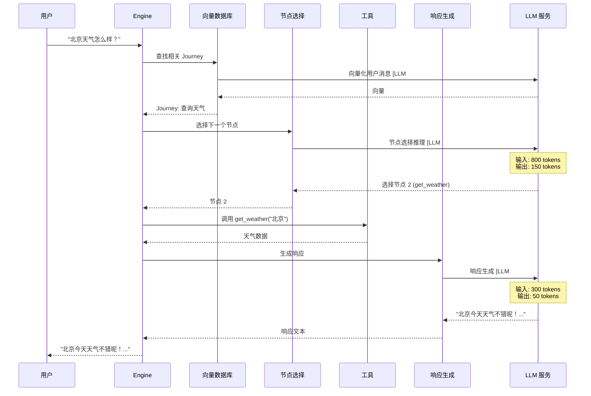

#### 场景 4: 连续查询多个城市

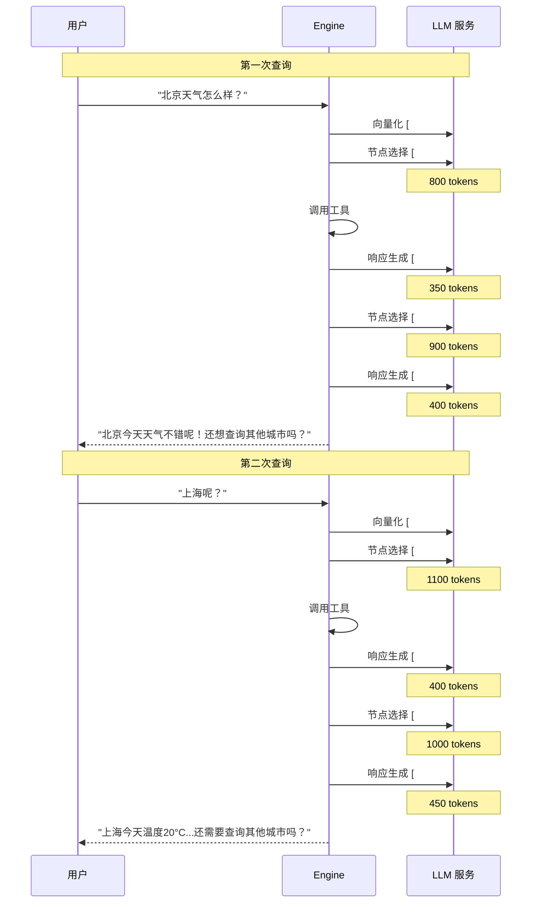


### Token 消耗分布图

#### 启动阶段 Token 分布

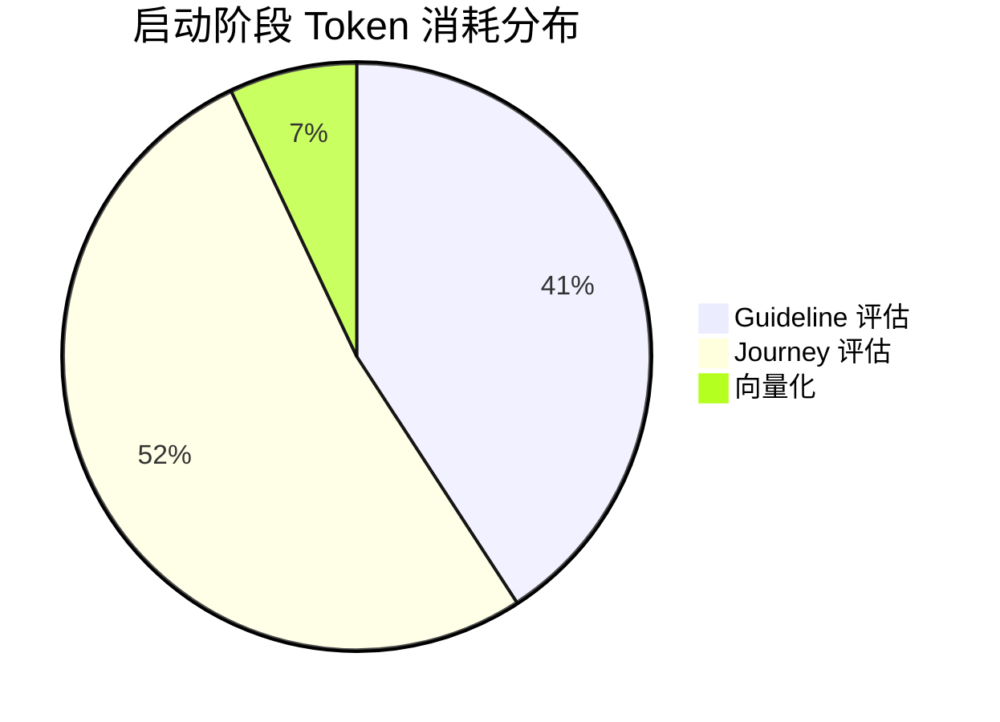

#### 请求处理阶段 Token 分布（平均）

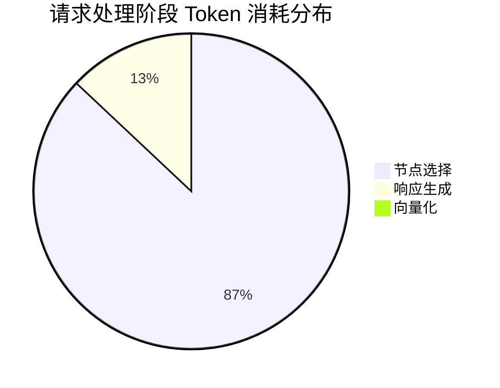

#### 各场景 Token 消耗对比

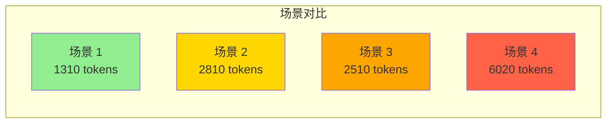

### LLM 调用次数对比图

#### 各场景调用次数

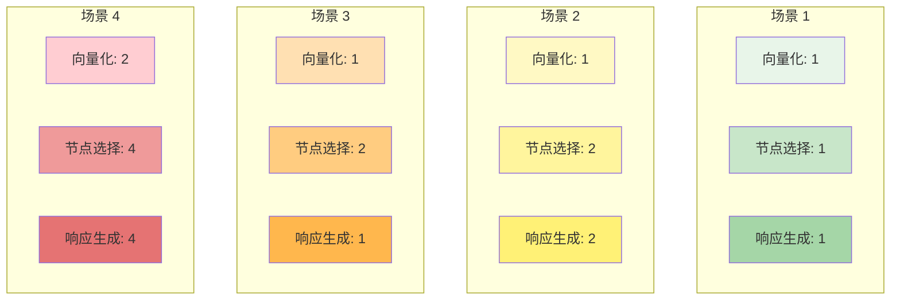

### 优化效果对比图

#### 缓存优化效果

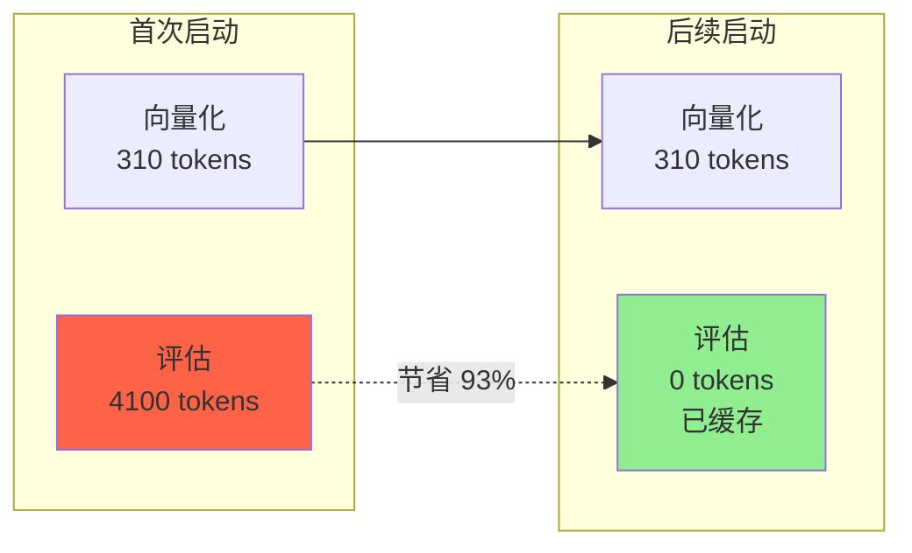

#### 综合优化潜力

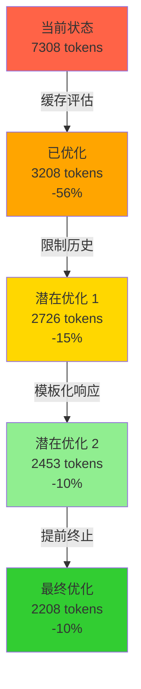


### 性能时间线图

#### 场景 1 执行时间线

```mermaid
gantt
    title 场景 1: 用户直接提供城市名 - 执行时间线
    dateFormat  s
    axisFormat %S秒

    section 上下文加载
    加载会话上下文      :a1, 0, 0.05s

    section Journey 匹配
    向量化用户消息      :crit, a2, after a1, 0.1s
    向量搜索 Journey    :a3, after a2, 0.05s

    section 节点选择
    构建转换图          :a4, after a3, 0.02s
    LLM 推理选择节点    :crit, a5, after a4, 1.2s

    section 工具调用
    调用 get_weather    :a6, after a5, 0.01s

    section 响应生成
    LLM 生成响应        :crit, a7, after a6, 0.8s

    section 状态更新
    更新 Journey 路径   :a8, after a7, 0.03s

    section 完成
    返回响应            :milestone, after a8, 0s
```

**总耗时**: ~2.2 秒
**LLM 耗时**: ~2.1 秒（95%）

#### 场景 4 执行时间线

```mermaid
gantt
    title 场景 4: 连续查询多个城市 - 执行时间线
    dateFormat  s
    axisFormat %S秒

    section 第一次查询
    上下文加载          :a1, 0, 0.05s
    向量化              :crit, a2, after a1, 0.1s
    节点选择 1          :crit, a3, after a2, 1.2s
    工具调用            :a4, after a3, 0.01s
    响应生成 1          :crit, a5, after a4, 0.8s
    节点选择 2          :crit, a6, after a5, 1.1s
    响应生成 2          :crit, a7, after a6, 0.9s
    状态更新            :a8, after a7, 0.03s

    section 第二次查询
    上下文加载          :b1, after a8, 0.05s
    向量化              :crit, b2, after b1, 0.1s
    节点选择 3          :crit, b3, after b2, 1.3s
    工具调用            :b4, after b3, 0.01s
    响应生成 3          :crit, b5, after b4, 0.9s
    节点选择 4          :crit, b6, after b5, 1.2s
    响应生成 4          :crit, b7, after b6, 1.0s
    状态更新            :b8, after b7, 0.03s

    section 完成
    返回响应            :milestone, after b8, 0s
```

**总耗时**: ~9.0 秒
**LLM 耗时**: ~8.6 秒（96%）

### 成本对比图

#### 本地 vs 云端成本对比

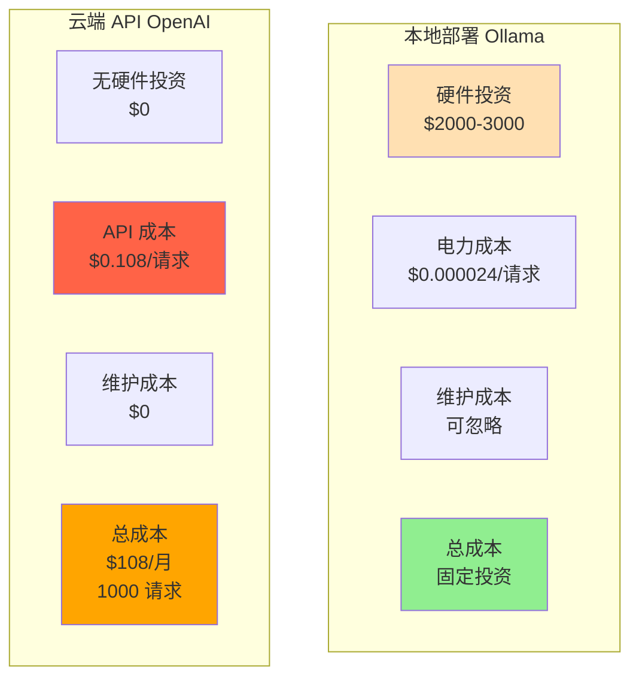

**盈亏平衡点**: 约 27,778 次请求（$3000 / $0.108）

### 总结图表

#### LLM 调用全景图

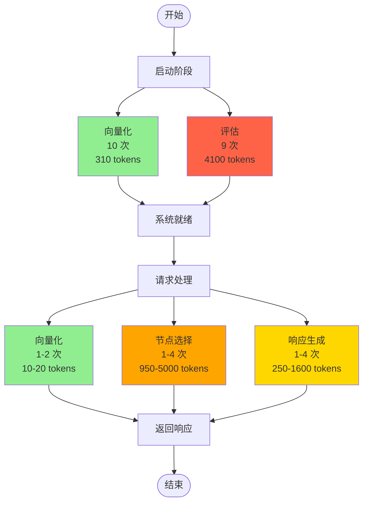

## 参考文档

- [11-weather-agent-startup-flow.md](./11-weather-agent-startup-flow.md) - 启动流程详解
- [12-weather-agent-request-flow.md](./12-weather-agent-request-flow.md) - 请求处理流程详解
- [14-method-call-chains.md](./14-method-call-chains.md) - 方法调用链详解
- [07-engine-integration.md](./07-engine-integration.md) - 引擎集成和 LLM 调用机制
- [08-complete-flow.md](./08-complete-flow.md) - 完整流程概览
- [06-journey-guideline-projection.md](./06-journey-guideline-projection.md) - Journey 投影机制

