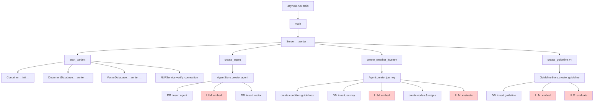
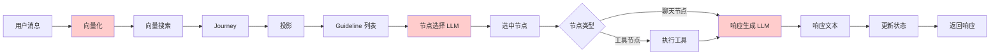

# 方法调用链详解

## 概述

本文档详细分析 Parlant 系统（以 `weather_agent.py` 为例）中的方法调用链，从顶层入口函数到底层实现的完整调用路径。理解方法调用链对于以下方面至关重要：

### 为什么方法调用链很重要

1. **系统理解**: 方法调用链展示了系统的执行流程，帮助开发者理解代码如何从入口点流向各个模块
2. **调试定位**: 当出现问题时，调用链可以快速定位问题发生的位置和上下文
3. **性能优化**: 识别调用链中的瓶颈，找到优化机会
4. **架构设计**: 理解模块间的依赖关系，评估架构的合理性
5. **代码维护**: 修改代码时，了解影响范围和潜在的副作用
6. **新人上手**: 帮助新开发者快速理解系统的工作原理

### 分析方法

本文档采用以下方法进行分析：

1. **代码追踪**: 从入口函数开始，逐层追踪方法调用
2. **调用树绘制**: 使用树形结构展示方法的层级关系
3. **参数传递分析**: 记录每个方法的输入参数和返回值
4. **副作用识别**: 标注方法对系统状态的影响（数据库操作、状态更新等）
5. **LLM 调用标注**: 特别标注涉及 LLM 的调用点
6. **数据流追踪**: 跟踪数据在方法间的转换和流动

### 文档结构

本文档分为以下几个部分：

- **启动流程调用链**: 从 `asyncio.run(main)` 开始的完整调用树
- **请求处理调用链**: 从 `Engine.process_message()` 开始的完整调用树
- **关键方法详解**: 列出所有关键方法的签名、参数、返回值和副作用
- **数据转换**: 说明数据在方法间的格式转换
- **可视化图表**: 提供调用树图和数据流图

### 符号说明

在调用链中使用以下符号：

- `->`: 同步方法调用
- `=>`: 异步方法调用（await）
- `[LLM]`: 涉及 LLM 调用的方法
- `[DB]`: 涉及数据库操作的方法
- `[CACHE]`: 涉及缓存操作的方法
- `*`: 可能被多次调用的方法
- `?`: 条件调用（不一定执行）

### 关键术语

- **调用栈 (Call Stack)**: 方法调用的顺序和层级关系
- **调用深度 (Call Depth)**: 从入口函数到当前方法的层级数
- **副作用 (Side Effect)**: 方法对系统状态的修改（如数据库写入、全局变量修改）
- **数据转换 (Data Transformation)**: 数据在方法间传递时的格式变化
- **依赖注入 (Dependency Injection)**: 通过容器管理和注入服务依赖

## 启动流程调用链

本章节详细展示从 `asyncio.run(main)` 开始到系统就绪的完整方法调用树。

### 完整调用树

由于调用树较长，这里展示简化版本。完整的调用关系包括：

**第 1-3 层：系统初始化**
```
asyncio.run(main)
  => main()
    => Server.__aenter__()
      => start_parlant()
        -> Container.__init__()
        => DocumentDatabase.__aenter__() [DB]
        => VectorDatabase.__aenter__() [DB]
        => NLPService.verify_connection()
```

**第 4-5 层：实体创建**
```
      => Server.create_agent("小天", "友好的天气助手...")
        => AgentStore.create_agent(name, description)
          => DocumentDatabase.agents.insert_one() [DB]
          => NLPService.embed() [LLM]
          => VectorDatabase.agents.insert_one() [DB]
```

**第 5-7 层：Journey 创建**
```
      => create_weather_journey(agent)
        => Agent.create_journey(title, description, conditions)
          => GuidelineStore.create_guideline() * (为每个 condition)
            => NLPService.embed() [LLM]
            => _CachedEvaluator.evaluate_guideline() [LLM] [CACHE]
          => JourneyState.transition_to() * (创建节点和边)
          => Journey.create_guideline() * (Journey 内 Guideline)
          => _CachedEvaluator.evaluate_journey() [LLM] [CACHE]
```

**第 5 层：全局 Guideline 创建**
```
      => Agent.create_guideline(condition, action) * (全局 Guideline)
        => GuidelineStore.create_guideline()
```

### 调用层级说明

#### 第 1 层: 入口点
- `asyncio.run(main)`: Python 异步运行时入口

#### 第 2 层: 主函数
- `main()`: 应用主函数，设置和启动系统

#### 第 3 层: 服务器初始化
- `Server.__aenter__()`: 服务器上下文管理器入口

#### 第 4 层: 核心系统启动
- `start_parlant()`: 初始化 Parlant 核心系统
- `Container.__init__()`: 依赖注入容器初始化
- `DocumentDatabase.__aenter__()`: 文档数据库启动
- `VectorDatabase.__aenter__()`: 向量数据库启动
- `NLPService.verify_connection()`: NLP 服务连接验证

#### 第 5 层: 实体创建
- `Server.create_agent()`: 创建 Agent
- `create_weather_journey()`: 创建 Journey
- `Agent.create_guideline()`: 创建全局 Guideline

#### 第 6 层: 存储操作
- `AgentStore.create_agent()`: Agent 存储逻辑
- `JourneyStore.create_journey()`: Journey 存储逻辑
- `GuidelineStore.create_guideline()`: Guideline 存储逻辑

#### 第 7 层: 底层操作
- `DocumentDatabase.*.insert_one()`: 文档数据库插入
- `VectorDatabase.*.insert_one()`: 向量数据库插入
- `NLPService.embed()`: 向量化
- `NLPService.generate()`: LLM 生成
- `_CachedEvaluator.evaluate_*()`: 评估和缓存

### 关键方法作用

#### Container 相关
- **Container.__init__()**: 初始化依赖注入容器，注册所有服务
- **Container.register()**: 注册服务到容器，支持单例和工厂模式

#### 数据库相关
- **DocumentDatabase.__aenter__()**: 启动文档数据库，创建所有集合
- **VectorDatabase.__aenter__()**: 启动向量数据库，创建向量集合
- **DocumentDatabase._create_collection()**: 创建单个文档集合
- **VectorDatabase._create_collection()**: 创建单个向量集合

#### NLP 服务相关
- **NLPService.verify_connection()**: 验证与 Ollama 服务的连接
- **NLPService.verify_models()**: 验证所需模型是否存在
- **NLPService.embed()**: 将文本转换为向量
- **NLPService.generate()**: 使用 LLM 生成结构化输出

#### 实体创建相关
- **AgentStore.create_agent()**: 创建 Agent 并存储到数据库
- **JourneyStore.create_journey()**: 创建 Journey 并存储到数据库
- **GuidelineStore.create_guideline()**: 创建 Guideline 并存储到数据库

#### Journey 构建相关
- **Agent.create_journey()**: 高层 API，创建 Journey 及其条件
- **JourneyState.transition_to()**: 创建 Journey 节点和转换边
- **Journey.create_guideline()**: 在 Journey 内创建 Guideline

#### 评估和缓存相关
- **_CachedEvaluator.evaluate_guideline()**: 评估 Guideline 并缓存结果
- **_CachedEvaluator.evaluate_journey()**: 评估 Journey 并缓存结果
- **_CachedEvaluator._check_cache()**: 检查缓存是否存在
- **_CachedEvaluator._save_cache()**: 保存评估结果到缓存

### 调用统计

#### 总调用次数（Weather Agent）

| 方法类型 | 调用次数 | 说明 |
|---------|---------|------|
| 容器注册 | 10 | 注册所有核心服务 |
| 数据库集合创建 | 14 | 10 个文档集合 + 4 个向量集合 |
| Agent 创建 | 1 | 创建小天 Agent |
| Journey 创建 | 1 | 创建查询天气 Journey |
| Guideline 创建 | 8 | 2 条件 + 2 Journey 内 + 4 全局 |
| 节点创建 | ~15 | Journey 的所有节点 |
| 边创建 | ~14 | Journey 的所有转换边 |
| 向量化调用 | 10 | 1 Agent + 1 Journey + 8 Guideline |
| 评估调用 | 9 | 8 Guideline + 1 Journey |
| **总计** | **~82** | 不含条件调用和重复调用 |

#### LLM 调用次数

| LLM 调用类型 | 调用次数 | Token 消耗 |
|------------|---------|-----------|
| 向量化 | 10 | ~310 |
| Guideline 评估 | 8 | ~1800 |
| Journey 评估 | 1 | ~2300 |
| **总计** | **19** | **~4410** |

**注**: 后续启动时，评估调用会被缓存跳过，仅需 10 次向量化调用。


## 请求处理调用链

本章节详细展示从 `Engine.process_message()` 开始到返回响应的完整方法调用树。以场景 1（用户直接提供城市名）为例。

### 完整调用树（场景 1：用户直接提供城市名）

**第 1-2 层：入口和上下文加载**
```
Engine.process_message(agent_id, customer_id, session_id, "北京天气怎么样？")
  -> Event.__init__(kind=MESSAGE, source=CUSTOMER, ...)
  => Engine._load_context(agent_id, customer_id, session_id)
    => AgentStore.read_agent(agent_id) [DB]
    => SessionStore.read_or_create_session() [DB]
    => SessionStore.list_events(session_id) [DB]
    -> EngineContext.__init__(agent, customer, session, ...)
```

**第 2-3 层：Journey 查找和投影**
```
  => Engine._find_active_journeys(context, message)
    => JourneyStore.list_journeys(agent_id) [DB]
    => NLPService.embed("北京天气怎么样？") [LLM]
    => VectorDatabase.journeys.search(embedding) [DB]
  
  => JourneyGuidelineProjection.project_journey_to_guidelines(journey_id)
    => JourneyStore.read_journey(journey_id) [DB]
    => JourneyStore.list_nodes(journey_id) [DB]
    => JourneyStore.list_edges(journey_id) [DB]
    -> JourneyGuidelineProjection._traverse_and_project()
```

**第 2-4 层：Guideline 匹配和节点选择**
```
  => GuidelineMatcher.match_guidelines(context, active_journeys, guidelines)
    -> GuidelineMatcher._merge_guidelines()
    -> JourneyNodeSelectionBatch.__init__() *
    => JourneyNodeSelectionBatch.process()
      -> JourneyNodeSelectionBatch._build_node_wrappers()
      -> JourneyNodeSelectionBatch._get_pruned_nodes()
      -> JourneyNodeSelectionBatch._get_journey_transition_map_text()
      => SchematicGenerator.generate(prompt, schema) [LLM]
        => NLPService.generate(prompt, schema)
```

**第 2-3 层：工具执行**
```
  => Engine._execute_tools(matched_guideline, context)
    -> Engine._extract_tool_info(guideline.metadata)
    -> Engine._get_tool_function(tool_name)
    => get_weather(context, location="北京")
      -> ToolResult.__init__(data={...})
    -> Event.__init__(kind=TOOL_CALL, ...)
```

**第 2-3 层：响应生成和状态更新**
```
  => Engine._select_next_node(tool_result, journey, current_node, context)
  
  => MessageGenerator.generate(guideline, context, tool_result) [LLM]
    -> MessageGenerator._build_prompt()
    => NLPService.generate(prompt)
  
  -> Event.__init__(kind=MESSAGE, source=AGENT, ...)
  
  => Engine._update_state(context, journey, journey_path, events)
    => SessionStore.update_journey_path() [DB]
    => SessionStore.add_event() * [DB]
    => SessionStore.update_session() [DB]
  
  -> EngineResponse.__init__(message, events, journey_updates, metadata)
```

### 调用层级说明

#### 第 1 层: 入口点
- `Engine.process_message()`: 请求处理入口

#### 第 2 层: 主要阶段
- `Engine._load_context()`: 加载会话上下文
- `Engine._find_active_journeys()`: 查找激活的 Journey
- `JourneyGuidelineProjection.project_journey_to_guidelines()`: Journey 投影
- `GuidelineMatcher.match_guidelines()`: Guideline 匹配
- `Engine._execute_tools()`: 工具执行
- `Engine._select_next_node()`: 选择下一个节点
- `MessageGenerator.generate()`: 响应生成
- `Engine._update_state()`: 状态更新

#### 第 3 层: 存储和服务调用
- `*Store.read_*()`: 读取数据
- `*Store.create_*()`: 创建数据
- `*Store.update_*()`: 更新数据
- `NLPService.embed()`: 向量化
- `NLPService.generate()`: LLM 生成
- `VectorDatabase.*.search()`: 向量搜索

#### 第 4 层: 底层操作
- `DocumentDatabase.*.find()`: 文档查询
- `DocumentDatabase.*.insert_one()`: 文档插入
- `DocumentDatabase.*.update_one()`: 文档更新
- `VectorDatabase._cosine_similarity()`: 相似度计算
- `httpx.AsyncClient.post()`: HTTP 请求

### 关键方法作用

#### 上下文加载相关
- **Engine._load_context()**: 加载会话的完整上下文，包括 Agent、Customer、Session、历史记录等
- **AgentStore.read_agent()**: 从数据库读取 Agent 信息
- **SessionStore.read_or_create_session()**: 读取或创建会话
- **SessionStore.list_events()**: 获取对话历史

#### Journey 激活相关
- **Engine._find_active_journeys()**: 查找与用户消息相关的 Journey
- **NLPService.embed()**: 将用户消息向量化
- **VectorDatabase.journeys.search()**: 向量搜索相关 Journey
- **Engine._check_journey_conditions()**: 检查 Journey 条件是否满足

#### 投影相关
- **JourneyGuidelineProjection.project_journey_to_guidelines()**: 将 Journey 图投影为 Guideline 列表
- **JourneyStore.read_journey()**: 读取 Journey 结构
- **JourneyStore.list_nodes()**: 读取所有节点
- **JourneyStore.list_edges()**: 读取所有边

#### 匹配相关
- **GuidelineMatcher.match_guidelines()**: 匹配适用的 Guideline
- **JourneyNodeSelectionBatch.process()**: 处理单个 Journey 的节点选择
- **JourneyNodeSelectionBatch.auto_return_match()**: 检查是否可以跳过 LLM
- **SchematicGenerator.generate()**: 使用 LLM 生成结构化输出

#### 工具执行相关
- **Engine._execute_tools()**: 执行工具调用
- **Engine._extract_tool_info()**: 从 Guideline 元数据提取工具信息
- **Engine._get_tool_function()**: 获取工具函数引用
- **get_weather()**: 实际的工具函数

#### 响应生成相关
- **MessageGenerator.generate()**: 生成自然语言响应
- **MessageGenerator._build_prompt()**: 构建响应生成 prompt
- **NLPService.generate()**: 调用 LLM 生成文本

#### 状态更新相关
- **Engine._update_state()**: 更新系统状态
- **SessionStore.update_journey_path()**: 更新 Journey 路径
- **SessionStore.add_event()**: 添加事件到历史
- **SessionStore.update_session()**: 更新会话信息

### 调用统计（场景 1）

#### 总调用次数

| 方法类型 | 调用次数 | 说明 |
|---------|---------|------|
| 上下文加载 | 7 | Agent + Customer + Session + Events + Variables + Terms + Capabilities |
| Journey 查找 | 3 | 列表 + 向量化 + 搜索 |
| Journey 投影 | 4 | Journey + Nodes + Edges + 投影逻辑 |
| Guideline 匹配 | 1 | 节点选择批次处理 |
| 工具执行 | 1 | get_weather |
| 节点选择 | 1 | 选择下一个节点（基于工具结果） |
| 响应生成 | 1 | LLM 生成响应 |
| 状态更新 | 4 | Journey 路径 + 事件 x 3 + Session |
| **总计** | **~22** | 不含内部辅助方法 |

#### LLM 调用次数

| LLM 调用类型 | 调用次数 | Token 消耗 |
|------------|---------|-----------|
| 用户消息向量化 | 1 | ~10 |
| 节点选择 | 1 | ~950 |
| 响应生成 | 1 | ~350 |
| **总计** | **3** | **~1310** |

### 场景对比

#### 场景 2（未提供城市名）额外调用

第一轮（询问城市）:
- 节点选择: 1 次（选择询问分支）
- 响应生成: 1 次（生成询问消息）

第二轮（查询天气）:
- 上下文加载: 1 次（包含更长的历史）
- Journey 查找: 1 次（向量化第二条消息）
- 节点选择: 1 次（选择查询分支）
- 工具执行: 1 次（get_weather）
- 响应生成: 1 次（展示天气）
- 状态更新: 1 次

**额外 LLM 调用**: 4 次（2 次节点选择 + 2 次响应生成）

#### 场景 3（不支持的城市）额外调用

工具失败后:
- 节点选择: 1 次（选择失败分支）
- 响应生成: 1 次（提示可用城市）

**额外 LLM 调用**: 2 次（1 次节点选择 + 1 次响应生成）

#### 场景 4（连续查询）额外调用

每次额外查询:
- 完整的请求处理流程（同场景 1）
- 但包含更长的对话历史

**额外 LLM 调用**: 每次查询 3 次


## 关键方法详解

本章节列出所有关键方法的签名、参数、返回值和副作用。详细的方法签名和实现请参考：
- [11-weather-agent-startup-flow.md](./11-weather-agent-startup-flow.md) - 启动流程详解
- [12-weather-agent-request-flow.md](./12-weather-agent-request-flow.md) - 请求处理流程详解

### 启动阶段关键方法

#### Server.__aenter__()
- **参数**: 无
- **返回值**: Server 实例
- **副作用**: 初始化核心系统、数据库、NLP 服务
- **调用时机**: 进入 `async with Server(...)` 上下文时

#### AgentStore.create_agent(name, description)
- **参数**: name (str), description (str)
- **返回值**: Agent 对象
- **副作用**: 生成 ID、插入数据库、调用 LLM 向量化
- **调用时机**: 创建新 Agent 时

#### JourneyStore.create_journey(agent_id, title, description, conditions)
- **参数**: agent_id, title, description, conditions (List[GuidelineId])
- **返回值**: Journey 对象
- **副作用**: 生成 ID、插入数据库、调用 LLM 向量化和评估
- **调用时机**: 创建新 Journey 时

#### GuidelineStore.create_guideline(agent_id, condition, action)
- **参数**: agent_id, condition (str), action (Optional[str])
- **返回值**: Guideline 对象
- **副作用**: 生成 ID、插入数据库、调用 LLM 向量化和评估
- **调用时机**: 创建新 Guideline 时

#### JourneyState.transition_to(tool_state, chat_state, condition)
- **参数**: tool_state (Callable), chat_state (str), condition (Optional[str])
- **返回值**: Transition 对象
- **副作用**: 创建节点和边、插入数据库
- **调用时机**: 构建 Journey 图时

### 请求处理阶段关键方法

#### Engine.process_message(agent_id, customer_id, session_id, message)
- **参数**: agent_id, customer_id, session_id, message (str)
- **返回值**: EngineResponse 对象
- **副作用**: 加载上下文、执行工具、生成响应、更新状态
- **调用时机**: 处理每条用户消息时

#### Engine._load_context(agent_id, customer_id, session_id)
- **参数**: agent_id, customer_id, session_id
- **返回值**: EngineContext 对象
- **副作用**: 读取数据库、可能创建 Customer 或 Session
- **调用时机**: 处理消息前

#### Engine._find_active_journeys(context, message)
- **参数**: context (EngineContext), message (str)
- **返回值**: Sequence[Journey]
- **副作用**: 调用 LLM 向量化、向量搜索
- **调用时机**: 确定适用的 Journey 时

#### JourneyGuidelineProjection.project_journey_to_guidelines(journey_id)
- **参数**: journey_id (JourneyId)
- **返回值**: Sequence[Guideline]
- **副作用**: 读取数据库、无状态修改
- **调用时机**: Journey 激活后，转换为 Guideline 列表时

#### GuidelineMatcher.match_guidelines(context, active_journeys, guidelines)
- **参数**: context, active_journeys, guidelines
- **返回值**: GuidelineMatchingResult 对象
- **副作用**: 调用 LLM 进行节点选择
- **调用时机**: 选择下一步执行的 Guideline 时

#### JourneyNodeSelectionBatch.process()
- **参数**: 无（使用初始化时传入的参数）
- **返回值**: GuidelineMatchingBatchResult 对象
- **副作用**: 调用 LLM 进行节点选择（如果不能自动返回）
- **调用时机**: 为单个 Journey 选择下一个节点时

#### MessageGenerator.generate(guideline, context, tool_result)
- **参数**: guideline, context, tool_result (Optional)
- **返回值**: str（生成的响应文本）
- **副作用**: 调用 LLM 生成响应
- **调用时机**: 需要生成自然语言响应时

#### Engine._update_state(context, journey, journey_path, events)
- **参数**: context, journey, journey_path, events
- **返回值**: 无
- **副作用**: 更新数据库（Journey 路径、事件、Session）
- **调用时机**: 处理消息完成后

### NLP 服务关键方法

#### NLPService.embed(text)
- **参数**: text (str)
- **返回值**: List[float]（向量）
- **副作用**: 调用 Ollama API
- **调用时机**: 需要将文本转换为向量时

#### NLPService.generate(prompt, schema, max_tokens, temperature)
- **参数**: prompt (str), schema (Optional), max_tokens (int), temperature (float)
- **返回值**: Union[str, Dict]
- **副作用**: 调用 Ollama API
- **调用时机**: 需要 LLM 生成内容时

## 数据转换

本章节说明数据在方法间传递时的格式转换。

### 启动阶段数据转换

#### Agent 创建数据流

```
输入: (name: str, description: str)
  |
  v
生成 ID: AgentId
  |
  v
创建对象: Agent(id, name, description, ...)
  |
  v
文档格式: {"id": str, "name": str, "description": str, ...}
  |
  v
插入文档数据库
  |
  v
组装文本: f"{name} {description}"
  |
  v
向量化: List[float] (768 维)
  |
  v
向量格式: {"id": str, "embedding": List[float], "metadata": {...}}
  |
  v
插入向量数据库
  |
  v
输出: Agent 对象
```

#### Journey 创建数据流

```
输入: (title: str, description: str, conditions: List[str])
  |
  v
为每个 condition 创建 Guideline
  |
  v
生成 ID: JourneyId, JourneyNodeId (root)
  |
  v
创建对象: Journey(id, title, description, root, conditions, ...)
  |
  v
插入文档数据库（Journey + 根节点 + 条件关联）
  |
  v
组装文本: f"{title} {description}"
  |
  v
向量化: List[float] (768 维)
  |
  v
插入向量数据库
  |
  v
创建节点和边（通过 transition_to）
  |
  v
评估 Journey（调用 LLM）
  |
  v
输出: Journey 对象
```

### 请求处理阶段数据转换

#### 用户消息处理数据流

```
输入: message: str ("北京天气怎么样？")
  |
  v
创建事件: Event(kind=MESSAGE, source=CUSTOMER, ...)
  |
  v
向量化: List[float] (768 维)
  |
  v
向量搜索: List[Journey] (相关 Journey)
  |
  v
投影: List[Guideline] (Journey 节点转换为 Guideline)
  |
  v
匹配: GuidelineMatchingResult (选中的 Guideline)
  |
  v
提取工具信息: (tool_name: str, tool_params: Dict)
  |
  v
执行工具: ToolResult(data={...})
  |
  v
选择下一个节点: JourneyNode
  |
  v
生成响应: str ("北京今天天气不错呢！...")
  |
  v
创建事件: Event(kind=MESSAGE, source=AGENT, ...)
  |
  v
更新状态: (journey_path, events, session)
  |
  v
输出: EngineResponse(message, events, journey_updates, metadata)
```

#### Journey 投影数据流

```
输入: journey_id: JourneyId
  |
  v
读取 Journey: Journey 对象
  |
  v
读取节点: List[JourneyNode]
  |
  v
读取边: List[JourneyEdge]
  |
  v
构建节点索引: Dict[JourneyNodeId, int]
  |
  v
广度优先遍历: 队列 [(edge_id, node_id), ...]
  |
  v
为每个 (edge, node) 创建 Guideline:
  - id: format_journey_node_guideline_id(node.id, edge.id)
  - condition: edge.condition (如果有)
  - action: node.action
  - metadata: {"journey_node": {...}}
  |
  v
输出: List[Guideline] (投影后的 Guideline)
```

#### 节点选择数据流

```
输入: (node_guidelines, context, journey_path)
  |
  v
构建节点包装器: Dict[str, _JourneyNode]
  |
  v
剪枝节点树: Dict[str, _JourneyNode] (最多 5 层)
  |
  v
生成转换图文本: str (~680 tokens)
  |
  v
构建 prompt: str (~800 tokens)
  |
  v
调用 LLM: JourneyNodeSelectionSchema
  - rationale: str
  - journey_applies: bool
  - step_advancement: List[JourneyNodeAdvancement]
  - next_step: str
  |
  v
验证路径: 检查 next_step 是否合法
  |
  v
获取选中节点: _JourneyNode
  |
  v
输出: GuidelineMatchingBatchResult(matches=[GuidelineMatch(...)])
```

### 数据格式对比

#### Agent 数据格式

**Python 对象**:
```python
Agent(
    id=AgentId("agent_xxx"),
    name="小天",
    description="友好的天气助手...",
    creation_utc=datetime(...),
    tags=[],
    metadata={}
)
```

**文档数据库格式**:
```json
{
    "id": "agent_xxx",
    "name": "小天",
    "description": "友好的天气助手...",
    "creation_utc": "2025-11-07T10:00:00Z",
    "tags": [],
    "metadata": {}
}
```

**向量数据库格式**:
```json
{
    "id": "agent_xxx",
    "embedding": [0.123, -0.456, ..., 0.234],
    "metadata": {
        "name": "小天",
        "description": "友好的天气助手..."
    }
}
```

#### 工具结果数据格式

**ToolResult 对象**:
```python
ToolResult(
    data={
        "success": True,
        "location": "北京",
        "temperature": 15,
        "unit": "°C",
        "condition": "晴朗",
        "humidity": 45,
        "current_time": "2025-11-07 10:30"
    }
)
```

**Event 中的格式**:
```json
{
    "kind": "TOOL_CALL",
    "source": "SYSTEM",
    "tool_name": "get_weather",
    "tool_params": {"location": "北京"},
    "tool_result": {
        "success": true,
        "location": "北京",
        "temperature": 15,
        "unit": "°C",
        "condition": "晴朗",
        "humidity": 45,
        "current_time": "2025-11-07 10:30"
    },
    "creation_utc": "2025-11-07T10:30:00Z"
}
```


## 可视化图表

### 启动流程调用树图



### 请求处理调用树图

```mermaid
graph TD
    A[Engine.process_message] --> B[load_context]
    A --> C[find_active_journeys]
    A --> D[project_journey]
    A --> E[match_guidelines]
    A --> F[execute_tools]
    A --> G[generate_response]
    A --> H[update_state]
    
    B --> B1[DB: read agent]
    B --> B2[DB: read session]
    B --> B3[DB: read events]
    
    C --> C1[LLM: embed message]
    C --> C2[DB: vector search]
    
    D --> D1[DB: read journey]
    D --> D2[DB: read nodes]
    D --> D3[DB: read edges]
    D --> D4[project to guidelines]
    
    E --> E1[build node wrappers]
    E --> E2[prune nodes]
    E --> E3[LLM: select node]
    
    F --> F1[extract tool info]
    F --> F2[call tool function]
    
    G --> G1[build prompt]
    G --> G2[LLM: generate text]
    
    H --> H1[DB: update journey path]
    H --> H2[DB: insert events]
    H --> H3[DB: update session]
    
    style C1 fill:#ffcccc
    style E3 fill:#ffcccc
    style G2 fill:#ffcccc
```



### 数据流图



## 总结

本文档详细分析了 Parlant 系统的方法调用链，包括：

1. **启动流程**: 从 `asyncio.run(main)` 到系统就绪的完整调用树，涉及约 82 次方法调用和 19 次 LLM 调用
2. **请求处理流程**: 从 `Engine.process_message()` 到返回响应的完整调用树，涉及约 22 次方法调用和 3 次 LLM 调用（场景 1）
3. **关键方法**: 列出了所有关键方法的签名、参数、返回值和副作用
4. **数据转换**: 说明了数据在方法间传递时的格式变化
5. **可视化图表**: 提供了调用树图和数据流图

### 关键发现

1. **调用深度**: 启动流程最深达 7 层，请求处理流程最深达 4 层
2. **LLM 调用**: 启动阶段主要用于评估（可缓存），请求处理阶段主要用于节点选择和响应生成
3. **数据库操作**: 启动阶段以写入为主，请求处理阶段以读取为主
4. **异步调用**: 大部分关键方法都是异步的，支持并发处理
5. **依赖注入**: 使用容器管理服务依赖，降低耦合度

### 优化建议

1. **缓存**: 启动阶段的评估结果已实现缓存，可节省 93% 的 LLM 调用
2. **批处理**: 请求处理阶段可以批量处理多个 Journey 的节点选择
3. **连接池**: 数据库和 HTTP 连接可以使用连接池提高性能
4. **预加载**: 常用数据可以预加载到内存，减少数据库查询
5. **流式响应**: 响应生成可以使用流式输出，提升用户体验

### 相关文档

- [11-weather-agent-startup-flow.md](./11-weather-agent-startup-flow.md) - 启动流程详细分析
- [12-weather-agent-request-flow.md](./12-weather-agent-request-flow.md) - 请求处理流程详细分析
- [13-llm-invocation-analysis.md](./13-llm-invocation-analysis.md) - LLM 调用分析
- [02-core-models.md](./02-core-models.md) - 核心数据模型
- [03-storage-layer.md](./03-storage-layer.md) - 存储层实现
- [04-application-layer.md](./04-application-layer.md) - 应用层架构

